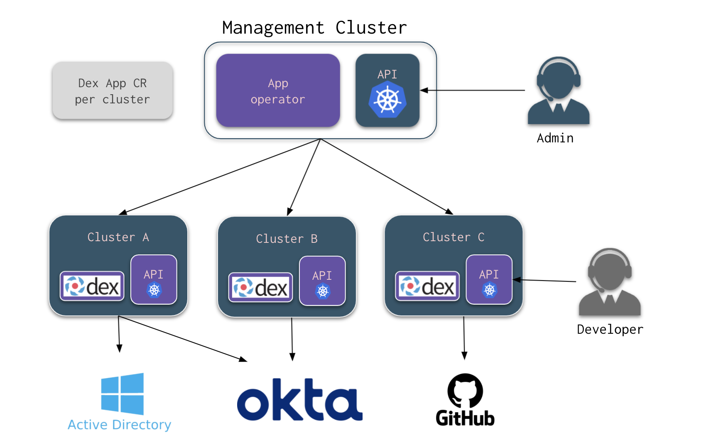

## Introduction

At Giant Swarm, we automatically configure Dex in management clusters to allow you to authenticate using your own identity providers, towards allowing you to manage your infrastructure using the management cluster's Kubernetes API.

For workload clusters - where you run your applications - we do not enforce any specific OpenID Connect (OIDC) tool to enable single sign-on (SSO). Here, we're going to detail how to configure [Dex](https://dexidp.io/) in those clusters, to provide SSO using OIDC.


<!-- Source: https://drive.google.com/file/d/12Li9z2cqS8uWo1f9bGk6nwV6PLgty9g_ -->

## Why Dex

There are other projects that help to configure OIDC to access Kubernetes clusters, but we consider [Dex](https://dexidp.io/) to be the most feature-rich. First of all, it is not tied to Kubernetes, so you can use Dex to handle authentication and authorization for your own apps as well. Secondly, Dex can act like an identity provider hub, where you can plug in different providers via different connectors, and choose between them when you want to log in.

## OIDC in Kubernetes

The Kubernetes API allows users to authenticate using the OIDC protocol, making it possible to enforce multi-factor authentication (MFA) or password policies by delegating to your identity provider. The API will use the field named `id_token` from the response as a bearer token to authenticate users.

## Configure the OIDC values on the cluster resource

We need to set values for the OIDC Issuer URL and Client ID. You can define those values in the cluster custom resource. These values will then be set as flags on the Kubernetes API Server (specifically, `--oidc-issuer-url` and `--oidc-client-id`).




```yaml
apiVersion: cluster.x-k8s.io/v1alpha3
kind: Cluster
metadata:
  annotations:
    oidc.giantswarm.io/client-id: dex-k8s-authenticator
    oidc.giantswarm.io/issuer-url: https://dex.CLUSTER_NAME.BASE_DOMAIN
    oidc.giantswarm.io/group-claim: groups
    oidc.giantswarm.io/username-claim: email
  ...
```




```yaml
apiVersion: infrastructure.giantswarm.io/v1alpha2
kind: AWSCluster
spec:
  cluster:
    ...
    oidc:
      claims:
        groups: groups
        username: email
      clientID: dex-k8s-authenticator
      issuerURL: https://dex.CLUSTER_NAME.BASE_DOMAIN
```




```yaml
apiVersion: controlplane.cluster.x-k8s.io/v1beta1
kind: KubeadmControlPlaneTemplate
spec:
  template:
    spec:
      kubeadmConfigSpec:
        clusterConfiguration:
          apiServer:
            extraArgs:
              oidc-issuer-url: https://dex.CLUSTER_NAME.BASE_DOMAIN
              oidc-client-id: dex-k8s-authenticator
              oidc-username-claim: email
              oidc-groups-claim: groups
```




```yaml
# Config map with values for the Workload Cluster app
apiVersion: v1
kind: ConfigMap
data:
  values: |
    ...
    oidc:
      issuerUrl: https://dex.CLUSTER_NAME.BASE_DOMAIN
      clientId: dex-k8s-authenticator
      usernameClaim: email
      groupsClaim: groups
```




__Note__: In the above snippets you need to replace the `CLUSTER_NAME` and `BASE_DOMAIN` placeholder with the correct values, which is the name of the workload cluster you are configuring, and the base domain that you use for your installation. You can also derive them from the workload cluster's Kubernetes API endpoint, which has a URL in the format of `https://api.CLUSTER_NAME.BASE_DOMAIN`.

## Deploy the app to your cluster

In this guide, we will use a single app deployment for each cluster that you want to authenticate towards. There are different ways to set up how you authenticate towards your Kubernetes API with Dex, but in our opinion, using a single deployment per cluster is more resilient than having a common Dex deployment for all your workload clusters.

We'll use the [app platform]() to deploy the app, as it allows us to deploy apps across workload clusters using a single API endpoint. In this example, we create an `App` custom resource (CR) with the parameters to install our [`dex-app`](https://github.com/giantswarm/dex-app) in the desired cluster, and a `Secret` with the configuration values. The app platform also supports providing the configuration values in a `ConfigMap`, but in case of Dex some configuration values are credentials, therefore using a `Secret` is the preferred method. It is also possible to split the configuration values, provide the public part in a `ConfigMap` and the credentials in a `Secret`, but in this example we will provide the entire configuration in a `Secret`:

```yaml
apiVersion: v1
kind: Secret
metadata:
  name: dex-app-user-values
  namespace: CLUSTER_NAMESPACE_NAME
data:
  values: ... # base64 encoded connector config
```

The format of the `connector config` content can look different depending on the oidc provider you want to use. Some examples can be found below.
Details on all connectors and their respective configuration is available in the [Dex documentation](https://dexidp.io/docs/connectors/).




```yaml
isWorkloadCluster: true
oidc:
  expiry:
    signingKeys: 6h
    idTokens: 30m
  customer:
    enabled: true
    connectors:
    - id: customer
      connectorName: test
      connectorType: oidc
      connectorConfig: >-
        clientID: CLIENT_ID
        clientSecret: CLIENT_SECRET
        insecureEnableGroups: true
        scopes:
        - email
        - groups
        - profile
        issuer: https://KEYCLOAK_HOST/auth/realms/master
        redirectURI: https://dex.CLUSTER_NAME.BASE_DOMAIN/callback
```

The values for `CLIENT_ID` and `CLIENT_SECRET` are created/defined in the Keycloak OIDC client configuration. `KEYCLOAK_HOST` is the fully qualified host name of your Keycloak instance.




```yaml
isWorkloadCluster: true
oidc:
  expiry:
    signingKeys: 6h
    idTokens: 30m
  customer:
    enabled: true
    connectors:
    - id: customer
      connectorName: test
      connectorType: github
      connectorConfig: >-
        clientID: CLIENT_ID
        clientSecret: CLIENT_SECRET
        loadAllGroups: false
        teamNameField: slug
        redirectURI: https://dex.CLUSTER_NAME.BASE_DOMAIN/callback
        orgs:
        - name: GITHUB_ORGANIZATION
          teams:
          - GITHUB_TEAM_SLUG
```

The value for `CLIENT_ID` is automatically generated by GitHub after creation of an OAuth app. Please also generate a client secret for that app and replace `CLIENT_SECRET` with the contents of that secret.

In the above example we show how to configure access for a certain GitHub team (named `GITHUB_TEAM_SLUG`, belonging to the `GITHUB_ORGANIZATION` organization). To restrict access in this way, make sure to list the team's _slug_ as it appears in the handle and team URL. For example, for a team named `Team Infra`, the handle my be `@my-organization/team-infra` and the slug to be used here would be `team-infra`.

Specifying `teams` enables Dex's [group filtering]().




```yaml
isWorkloadCluster: true
oidc:
  expiry:
    signingKeys: 6h
    idTokens: 30m
  customer:
    enabled: true
    connectors:
    - id: customer
      connectorName: test
      connectorType: microsoft
      connectorConfig: >-
        clientID: CLIENT_ID
        clientSecret: CLIENT_SECRET
        tenant: TENANT
        redirectURI: https://dex.CLUSTER_NAME.BASE_DOMAIN/callback
        useGroupsAsWhitelist: true
        groups:
          - AD_GROUP_NAME
```

The values to be filled in as `CLIENT_ID` and `CLIENT_SECRET` are obtained when creating a client application in Active Directory. Please replace `TENANT` with your Azure AD tenant ID.

Specifying `groups` and `useGroupsAsWhitelist` enables Dex's [group filtering]().




```yaml
isWorkloadCluster: true
oidc:
  expiry:
    signingKeys: 6h
    idTokens: 30m
  customer:
    enabled: true
    connectors:
    - id: customer
      connectorName: test
      connectorType: oidc
      connectorConfig: >-
        clientID: CLIENT_ID
        clientSecret: CLIENT_SECRET
        insecureEnableGroups: true
        getUserInfo: true
        scopes:
        - email
        - groups
        - profile
        issuer: https://OKTA_OIDC_ENDPOINT
        redirectURI: https://dex.CLUSTER_NAME.BASE_DOMAIN/callback
```

The values for `CLIENT_ID` and `CLIENT_SECRET` have to be created in the Okta configuration. `OKTA_OIDC_ENDPOINT` must be replaced using the fully qualified host name of your Okta instance.




__Warning__: With `oidc` connector you might need to add `getUserInfo` in the connector configuration to force a second call to the identity provider in order to get groups. This is required for example by Okta. More info on this can be found in [dexidp/dex#1065](https://github.com/dexidp/dex/issues/1065).

__Note__: In the above snippet you have to replace the `CLUSTER_NAME` variable and select a connector. Here we show examples for Keycloak, Active Directory, and GitHub.
You can use more than one connector, but they need to have a different `id` value. We advice you to use `- id: customer` for your primary connector.

After you have applied the `Secret` manifest to the Management API you have to submit the App custom resource that defines the intent to install the Dex app in the given cluster.
The easiest way to do this is [through our Web-UI]()
Alternatively, you can directly apply it to the Management Cluster.

```yaml
apiVersion: application.giantswarm.io/v1alpha1
kind: App
metadata:
  labels:
    app.kubernetes.io/name: dex-app
  name: dex-app
  namespace: CLUSTER_NAMESPACE_NAME
spec:
  catalog: giantswarm
  kubeConfig:
    context:
      name: CLUSTER_NAME
    secret:
      name: CLUSTER_NAME-kubeconfig
      namespace: CLUSTER_NAMESPACE_NAME
  name: dex-app
  namespace: dex
  userConfig:
    secret:
      name: dex-app-user-values
      namespace: CLUSTER_NAMESPACE_NAME
  version: 1.22.2
```

__Note__: When applying the example in the snippet above, please replace the `CLUSTER_NAME` placeholder with the name of the workload cluster which you are configuring and the `CLUSTER_NAMESPACE_NAME` placeholder with the name of the namespace which contains the cluster.

Then submit the resource to the management API and the App operator will manage it to make the actual installation and configuration. You can log in now into the cluster API with your identity provider using the login endpoint that Dex creates for you. By default, it will be `https://login.CLUSTER_NAME.BASE_DOMAIN`.

__Warning__: It is assumed that you have an [ingress controller and cert-manager]() running in your cluster in order to make Dex available for the callback request made by your identity provider securely. Both of these apps are offered in our managed app catalog. If you supply custom certificates when deploying Dex, then you can skip cert-manager installation.

### Using Dex Group Filtering {#dex-group-filtering}

Group or team filtering is a valuable mechanism that instructs Dex to selectively include only a specific set of groups in the ID tokens' group claims.

We highly recommend utilizing group filtering as the default setting for two compelling reasons:

- Users who are not part of any preconfigured groups will be unable to acquire an ID token, ensuring tighter security.
- Extensive group memberships can result in larger ID tokens, potentially causing issues such as oversized HTTP headers.

The disadvantage of using group filtering is that each time you want to use a new group, you will have to update the Dex connector config.

### Deploying Dex with custom certificates

Dex gets certificates from the cert-manager by default.
In case the cert-manager is configured to use a custom certification authority, which is not publicly trusted, Dex needs to be configured to trust it.
The custom certification authority needs to be stored in a `Secret` and referenced in the `trustedRootCA` section of the `Secret` or `ConfigMap` with configuration values for the Dex app.

```yaml
trustedRootCA:
  secretName: ... # Name of the secret, which contains the custom CA
  name: ... # Name of the property inside the secret
```

It is also possible to disable retrieving certificates from the cert-manager and supply custom certificates to Dex directly. They can be configured in the `ingress` section of the `Secret` or `ConfigMap` with the configuration values for the Dex app:

```yaml
ingress:
  tls:
    letsencrypt: false
    caPemB64: ...
    crtPemB64: ...
    keyPemB64: ...
```

### Running Dex in a private workload cluster

When deploying Dex to a private workload cluster, it is required to specify a proxy configuration in order to ensure that Dex has access to the outside network.
Proxy setup can be provided in the `cluster.proxy` section of the `Secret` or `ConfigMap` with configuration values for the Dex app.
It is required to specify the URL of the HTTPS proxy in the `https` property and exclude Kubernetes API from running through the proxy by adding its IP address or network to the `noProxy` property.

```yaml
cluster:
  proxy:
    http: ... # HTTP proxy URL
    https: ... # HTTPS proxy URL
    noProxy: ... # Hostnames or networks/IP ranges excluded from going through the proxy

```

## Dex Observability

To get an overview on the authentication success and error rates of your Dex instances, we offer a Grafana dashboard named "Dex" as part of our [observability setup]().

## Logging into your workload cluster via `kubectl gs` with `Athena`

Once Dex is set up in your workload cluster, you can enable access via OIDC through our `kubectl` plugin [kubectl gs]().

In order to communicate with the API, `kubectl gs` needs the clusters CA certificate as well as some cluster specific information, such as the management cluster name and the dex issuer URL.
On all Giant Swarm management clusters we use a public service called `Athena` to expose the CA certificate and some information on the installation to the client.
For easy integration with `kubectl gs` you can install [Athena](https://github.com/giantswarm/athena) on your workload cluster via the [app platform]().

Other than the app itself, you will need to provide a `values.yaml` configuration.

The management cluster name is needed as minimal configuration for `Athena`.

```yaml
managementCluster:
  name: test
```

It is also possible to override the api and issuer addresses, CA as well as the cluster name and provider in case it is needed:

```yaml
managementCluster:
  name: test
clusterID: example
provider:
  kind: aws
kubernetes:
  caPem: |
    -----BEGIN CERTIFICATE-----
    M...=
    -----END CERTIFICATE-----
  api:
    address: https://api.test.example.io
oidc:
  issuerAddress: https://dex.test.example.io
```

Access to Athena can be restricted to certain CIDRs.

```yaml
security:
  subnet:
    customer:
      public: x.x.x.x/x,x.x.x.x/x
      private: x.x.x.x/x
    restrictAccess:
      gsAPI: true
```

Athena also supports custom certificates, same as the Dex app.
The certificates need to be provided in the `ingress` section of the configuration:

```yaml
ingress:
  tls:
    letsencrypt: false
    caPemB64: ...
    crtPemB64: ...
    keyPemB64: ...
```

If both `Dex` and `Athena` are configured correctly and you have installed `kubectl gs` on your machine, you should be able to create a kubectl context using the management API URL.

```sh
kubectl gs login https://api.test.example.io
```

## Further reading

- [Authenticating with Microsoft Azure Active Directory]()
- [App platform overview]()
- [kubectl gs]()
