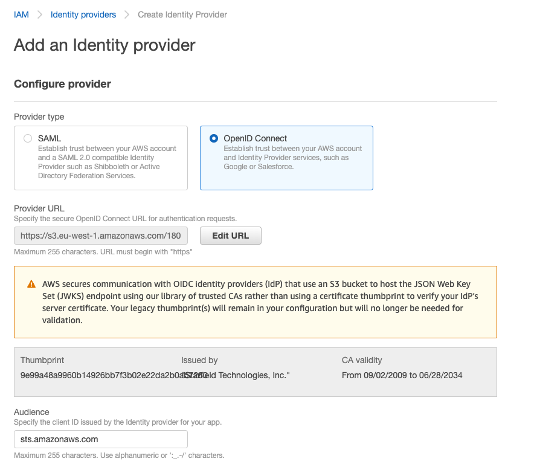



You can associate an IAM role with a Kubernetes service account. This service account can then provide AWS permissions to the containers in any pod that uses that service account. With this feature, you no longer need to provide extended permissions to the Giant Swarm node IAM role so that pods on that node can call AWS APIs.

Applications must sign their AWS API requests with AWS credentials. This feature provides a strategy for managing credentials for your applications, similar to the way that Amazon EC2 instance profiles provide credentials to Amazon EC2 instances. Instead of creating and distributing your AWS credentials to the containers or using the Amazon EC2 instance’s role, you can associate an IAM role with a Kubernetes service account. The applications in the pod’s containers can then use an AWS SDK or the AWS CLI to make API requests to authorized AWS services.

The official documentation from AWS: [IAM roles for service accounts](https://docs.aws.amazon.com/eks/latest/userguide/iam-roles-for-service-accounts.html).

## Additional IAM role permissions on `GiantSwarmAWSOperator` needed

Please first ensure having the following permissions added on the [`GiantSwarmAWSOperator` IAM role]():

```json
...
  {
      "Effect": "Allow",
      "Action": [
          "iam:CreateOpenIDConnectProvider",
          "iam:DeleteOpenIDConnectProvider",
          "iam:ListOpenIDConnectProviderTags",
          "iam:TagOpenIDConnectProvider",
          "iam:UntagOpenIDConnectProvider"
      ],
      "Resource": "*"
  },
  {
      "Effect": "Allow",
      "Action": [
          "s3:PutObjectAcl"
      ],
      "Resource": "arn:aws:s3:::*-g8s-*"
  },
  {
      "Effect": "Allow",
      "Action": [
          "acm:ListCertificates",
          "acm:RequestCertificate",
          "acm:AddTagsToCertificate",
          "acm:DescribeCertificate"
      ],
      "Resource": "*"
  },
  {
      "Effect": "Allow",
      "Action": [
          "cloudfront:TagResource",
          "cloudfront:UntagResource",
          "cloudfront:GetCloudFrontOriginAccessIdentity",
          "cloudfront:CreateCloudFrontOriginAccessIdentity",
          "cloudfront:DeleteCloudFrontOriginAccessIdentity",
          "cloudfront:GetDistribution",
          "cloudfront:CreateDistribution",
          "cloudfront:UpdateDistribution",
          "cloudfront:DeleteDistribution"
          "cloudfront:ListDistributions"

      ],
      "Resource": "*"
},
...
```

## Enable the feature on your cluster
This is an alpha feature that has to be enabled by setting an annotation on the  [`AWSCluster`]() resource.

Make sure the resource has the `alpha.aws.giantswarm.io/iam-roles-for-service-accounts` annotation **only right before** applying a new cluster or **just before** upgrading to the latest AWS release. **This is important** to remember as the lingering annotation without the activation can cause troubles in external-dns that also uses IRSA. The value can be anything you like, as only the presence of that annotation is checked. Here is an example:

```yaml
apiVersion: infrastructure.giantswarm.io/v1alpha3
kind: AWSCluster
metadata:
  annotations:
    alpha.aws.giantswarm.io/iam-roles-for-service-accounts: ""
  labels:
    ...
  name: abcl0
  namespace: myorg
spec:
  ...
```

Alternatively you can use `kubectl` to annotate the CR like shown below:

```nohighlight
kubectl annotate \
   awsclusters.infrastructure.giantswarm.io \
   abcl0 \
   alpha.aws.giantswarm.io/iam-roles-for-service-accounts=""
```

In order to apply the changes, rolling of the master nodes is required. Rolling of the nodes can be triggered either by an update or manually by terminating each node. Unfortunately manual application of the changes will also result in a neccessity of rolling worker nodes. Thus we **highly** recommend to apply changes **only** prior to upgrading clusters. For more details please talk with your Account Engineer or ask in support channel.

If you have deployed additional ExternalDNS you have to make sure the role's **trusted entities** are prepared beforehand or it will stop working due to the switch to IRSA. If you want to continue using KIAM until release 19 you can set the value `aws.irsa=false` in the user values configmap.

## Using IAM roles for service accounts

### IAM role

#### AWS Release v17.x.x or China regions

To use the IAM role with a service account you need to create new or modify an existing AWS role and configure **trusted entities** with following statement:

```json
{
    "Version": "2012-10-17",
    "Statement": [
        {
            "Effect": "Allow",
            "Principal": {
                "Federated": "arn:aws:iam::AWS_ACCOUNT:oidc-provider/s3.REGION.amazonaws.com/AWS_ACCOUNT-g8s-CLUSTER_ID-oidc-pod-identity"
            },
            "Action": "sts:AssumeRoleWithWebIdentity",
            "Condition": {
                "StringEquals": {
                    "s3.REGION.amazonaws.com/AWS_ACCOUNT-g8s-CLUSTER_ID-oidc-pod-identity:sub": "system:serviceaccount:NAMESPACE:SA_NAME"
                }
            }
        }
    ]
}
```

You need to fill real values for these placeholders:
* `AWS_ACCOUNT` - aws account id, where is the cluster running
* `CLUSTER_ID` - cluster id
* `NAMESPACE` - Kubernetes namespace in cluster, where the pod and service account be used.
* `SA_NAME` - Name of the Kubernetes Service Account which wil be using by the pod.
* `REGION` - AWS region the OIDC provider is located in.

#### AWS Release v18.x.x or higher for non-China regions

To use the IAM role with a service account you need to create new or modify an existing AWS role and configure **trusted entities** with following statement:

```json
{
    "Version": "2012-10-17",
    "Statement": [
        {
            "Effect": "Allow",
            "Principal": {
                "Federated": "arn:aws:iam::AWS_ACCOUNT:oidc-provider/CLOUDFRONT_DOMAIN"
            },
            "Action": "sts:AssumeRoleWithWebIdentity",
            "Condition": {
                "StringEquals": {
                    "CLOUDFRONT_DOMAIN:sub": "system:serviceaccount:NAMESPACE:SA_NAME"
                }
            }
        }
    ]
}
```

You need to fill real values for these placeholders:
* `AWS_ACCOUNT` - aws account id, where is the cluster running
* `CLOUDFRONT_DOMAIN` - cloudfront domain of the cluster, you can find the information in the ConfigMap `clusterID-irsa-cloudfront` in the organization namespace inside the management cluster or via AWS console in `Cloudfront`

### Service account
The service account has to be annotated with a full ARN of the IAM role. You can get the ARN of the role in the AWS console, when you check role details.
The annotation key has to be `eks.amazonaws.com/role-arn`.

```yaml
apiVersion: v1
kind: ServiceAccount
metadata:
  annotations:
    eks.amazonaws.com/role-arn: arn:aws:iam::$AWS_ACCOUNT:role/$IAM_ROLE_NAME
  name: s3-access
  namespace: default
```

## Cross Account Roles

### IAM role cross account

In order to assume roles cross AWS accounts you will need to create a new AWS Identity Provider (OpenID Connect) in the AWS account where the IAM role is located.



Login into the AWS on the account where the cluster is running:
- Grab the URL of the Identity Provider in your current cluster `IAM > Identity Providers`. It will look like `https://s3.REGION.amazonaws.com/AWS_ACCOUNT-g8s-CLUSTER_ID-oidc-pod-identity` or `https://CLOUDFRONT_ID.cloudfront.net`.

Login into the account where the IAM role is located and create an Identity Provider in `IAM > Identity Providers`:
- Set `Provider URL` to the previously gathered URL and click the `Get thumbprint` to import the certificate.
- Set the `audience` to `sts.amazonaws.com` OR `sts.amazonaws.com.cn` for China regions.


#### AWS Release v17.x.x or China regions

To use the IAM role on a different account than your cluster you need to create new or modify an existing AWS role and configure **trusted entities** with following statement:

```json
{
    "Version": "2012-10-17",
    "Statement": [
        {
            "Effect": "Allow",
            "Principal": {
                "Federated": "arn:aws:iam::ROLE_AWSACCOUNT:oidc-provider/s3.ROLE_REGION.amazonaws.com/CLUSTER_AWS_ACCOUNT-g8s-CLUSTER_ID-oidc-pod-identity"
            },
            "Action": "sts:AssumeRoleWithWebIdentity",
            "Condition": {
                "StringEquals": {
                    "s3.CLUSTER_REGION.amazonaws.com/CLUSTER_AWS_ACCOUNT-g8s-CLUSTER_ID-oidc-pod-identity:aud": "sts.amazonaws.com"
                }
            }
        }
    ]
}
```

You need to fill real values for these placeholders:
* `CLUSTER_AWS_ACCOUNT` - AWS account id, where is the cluster running
* `CLUSTER_ID` - cluster id
* `CLUSTER_REGION` - AWS region where the cluster is located
* `ROLE_REGION` - AWS region of the role
* `ROLE_AWSACCOUNT` - AWS account where the role is located

#### AWS Release v18.x.x or higher for non-China regions

To use the IAM role on a different account than your cluster you need to create new or modify an existing AWS role and configure **trusted entities** with following statement:

```json
{
    "Version": "2012-10-17",
    "Statement": [
        {
            "Effect": "Allow",
            "Principal": {
                "Federated": "arn:aws:iam::ROLE_AWSACCOUNT:oidc-provider/CLOUDFRONT_DOMAIN"
            },
            "Action": "sts:AssumeRoleWithWebIdentity",
            "Condition": {
                "StringEquals": {
                    "CLOUDFRONT_DOMAIN:aud": "sts.amazonaws.com"
                }
            }
        }
    ]
}
```

You need to fill real values for these placeholders:
* `ROLE_AWSACCOUNT` - AWS account where the role is located
* `CLOUDFRONT_DOMAIN` - cloudfront domain of the cluster, you can find the information in the ConfigMap `clusterID-irsa-cloudfront` in the organization namespace inside the management cluster or via AWS console in `Cloudfront`


## Verify your configuration is correct
Once your pod is running with the configured service account, you should see a file in the pod called `/var/run/secrets/eks.amazonaws.com/serviceaccount/token`, which containts a JWT token with details of the role.

The pod should also have configured enviroment variables `AWS_WEB_IDENTITY_TOKEN_FILE` and `AWS_ROLE_ARN`.

Check the pod using command `kubectl -n NAMESPACE get pod POD_NAME -o yaml` and search for the enviroment variables or for the volume mounts.

## Migration from kiam to IAM roles for service accounts

If you have followed the steps above you can switch from kiam to IAM roles for service accounts by following the steps:

- Remove the all the kiam annotation `iam.amazonaws.com/role` from your deployment and set the `eks.amazonaws.com/role-arn` on the service account. **Important** - you need set the whole ARN of the role, not just the name of the role, see the service account example above.

- Verify that your application is working correctly.

In case your application is not working you can always remove the annotation on the service account and add the kiam annotation on your deployment again.
