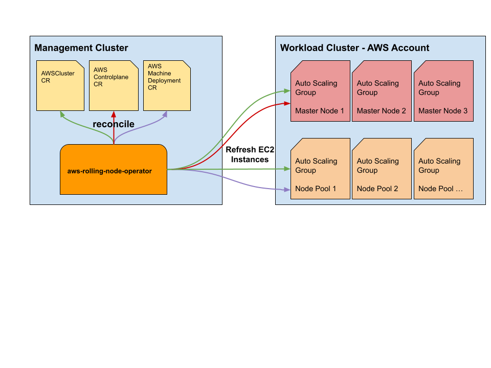

## How to roll (refresh) nodes on AWS

The `aws-rolling-node-operator` runs in every AWS management cluster in `giantswarm` namespace. It reconciles on `AWSCluster`, `AWSControlplane` and `AWSMachineDeployment` Custom Resources to trigger an EC2 instance refresh (terminate and start new EC2 instance) on the given Auto Scaling groups, which contain either Controlplane or Node pool nodes. 



Setting the annotation `alpha.giantswarm.io/instance-refresh: true` will refresh (terminate and start new EC2 instances) EC2 instances based on the Custom Reource:

- `AWSCluster` CR - Refreshes all EC2 instances for the Control Plane and node pools.
- `AWSControlplane` CR - Refreshes all EC2 instances for the Control Plane.
- `AWSMachineDeployment` CR - Refreshes all EC2 instances for a specific node pool.

Once the EC2 instance refresh is finished, the `aws-rolling-node-operator` will remove the annotation from Custom Resource and will send a Kubernetes Event on the Custom Resource, e.g.:

```yaml
Events:
  Type    Reason              Age                     From                                           Message
  ----    ------              ----                    ----                                           -------
  Normal  InstancesRefreshed  10m                     aws-machinedeployment-node-rolling-controller  Refreshed all worker instances.
```

**Note:** Those events will also be send in the corresponding Slack customer channel.

After a Auto scaling group got refreshed the operator won't allow to refresh instances for the next **30** minutes.

### Additional Annotations which can be set

`alpha.giantswarm.io/instance-refresh-min-healhty-percentage` - Sets the amount of capacity which must remain healthy inside the Auto Scaling group. The value is expressed as a percentage of the desired capacity of the Auto Scaling group (rounded up to the nearest integer). The default is 90. Setting the minimum healthy percentage to 100 percent limits the rate of replacement to one instance at a time. In contrast, setting it to 0 percent has the effect of replacing all instances at the same time.

`alpha.giantswarm.io/cancel-instance-refresh` - This will immediately cancel the current instance refresh. It stops replacing nodes which haven't been rolled so far.


