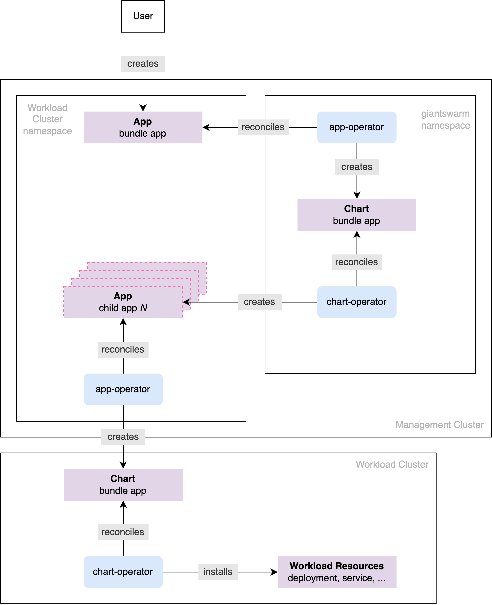

## App Bundle Definition {#app-bundle-definition}

As stated in the [App Platform overview]() all managed apps are
packaged, maintained and offered as Helm Charts and it is no different for the App Bundles. What makes them
special in comparison to solitary apps is that the bundle Helm Chart instead of carrying a regular resources
composing the actual application, it carries the [App CRs]() that, once delivered and consumed by the App Platform, install the
expected applications and their resources. In other words, the App Bundle can be thought of a middleman, not installing anything on its own, but requeting installation of certain pre-defined applications.

This distinction between solitary (on the left side) and bundle (on the right side) apps is depicted in the
figure below.

The `A1` app's Helm Chart consists of end resources user expects on the Workload Cluster after
installing this Helm Chart via the App CR. On the other side is a bundle Helm Chart that solely carries the
`A1-A4` App CRs. Installing it via App CR results in creating these nested App CRs in Management Cluster, which
are then picked up and installed by the App Platform what results in creating end resources in the Workload
Cluster.

As already briefly hinted above, the direct consequence of nesting App CRs inside a Helm Chart is how the app is
installed. Installing a solitary app for the Workload Cluster does not result in creating anything in the
Management Cluster, while the bundle app is in fact first installed in the Management Cluster and it creates
App CRs there, which only then are installed for the Workload Cluster. More about this in the [App Bundle
installation](#app-bundle-installation).

## App Bundle Installation {#app-bundle-installation}

### High Overview

The solitary app installation process has been already well depicted in the [App Platform Overview](). The bundle installation process is very similar,
except it involves one extra layer, and hence extra controllers, before the bundle's child apps are installed in
the usual fashion. This layer be the Management Cluster's App and Chart Operators. It shouldn't come as a
surprise that Management Clusters, same as the Workload Clusters, run their own App and Chart Operators that let
the Giantswarm staff to install the applications, and now are also laveraged for installing the App Bundles.

The figure below depicts the process briefly. Note however, some parts present in the [App Platform Overview]() figure, like pulling the Helm Chart tarball archive, have been omitted for
brevity.

When App CR for the bundle is created within the Management Cluster, it is first picked up by the Management
Cluster's App Operator which we call, by convention, `unique`. It lives under the protected `giantwarm` namespace,
but in principle operates the same way the Workload Clusters App Operators do. So it reconciles the App CR by
creating a corresponding [Chart CR]() in the `giantswarm` namespace, which is then picked up by the Management Cluster's Chart Operator also
living in that namespace. It then installs the app resources, which in this case are nested App CRs to be created
in the Workload Cluster namespace. Once delivered, the nested App CRs are installed in the well known way.

<h5><i class="fa fa-help-outlin"></i> Is it possible to install App Bundles without involving the Management
Cluster layer?</h5> No, at least not in the current implementation form. The reason is, App Bundles install App
Custom Resource(s) that are understood only by the Management Clusters. Attempt to install them directly to the
Workload Cluster would result in an error because correponding App CRD is not available there, resulting in the
Kubernetes not understanding the submitted objects.

### Technical Details

#### Configuring App Bundle's App CR for the unique App Operator

#### Configuring target Workload Cluster for nested App CRs
