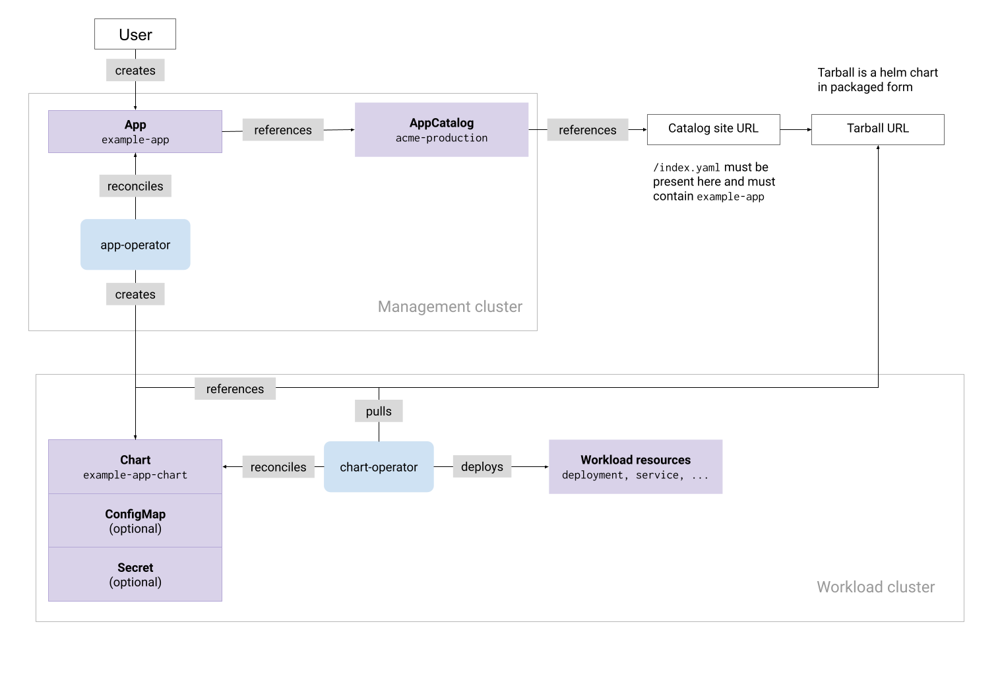

The _Giant Swarm App Platform_ refers to a set of features and concepts that allow
you to browse, install and manage the configurations of apps (such as Prometheus)
from a single place; the management cluster.

We fully support [Helm](https://helm.sh/) as a general tool to deploy your applications as well as for our general App Catalog. Apps are packaged as Helm charts and can be configured with _values_. We provide a recommended
[app configuration]() which you can override to meet your needs.

Using this platform, we are providing a collection of curated _Apps_. These _Apps_ are grouped into _App Catalogs_, which are browsable through our web interface.
We also use app platform to install the apps that are pre-installed in your cluster (such as CoreDNS).

In short: the _Giant Swarm App Platform_ refers to the whole feature, and an _App Catalog_ is a collection of _Apps_.

We provide two _App Catalogs_, the Giant Swarm Catalog and the Giant Swarm Playground. You are able to set up your own [additional catalog(s)]()
to provide for any needs you have at the enterprise level.

### What makes up the Giant Swarm App Platform {#what-makes-up-the-app-platform}

Technically the App Platform is implemented as a set of operators
running on your management cluster and workload clusters. These operators watch various
Custom Resources, some created by us, and others created by you. Together, they make up
the desired state of the App Platform.

For example, this "App" Custom Resource indicates that you want Kong installed
on a specific workload cluster. We [default]()
some additional values for the workload cluster you select.

```yaml
apiVersion: application.giantswarm.io/v1alpha1
kind: App
metadata:
  name: "my-kong"
  namespace: "x7jwz"
spec:
  catalog: "giantswarm"
  config:
    configMap:
      name: "x7jwz-cluster-values"
      namespace: "x7jwz"
  name: "kong-app"
  namespace: "kong"
  version: "0.7.2"
  kubeConfig:
     inCluster: false
  userConfig:
    configMap:
      name: "kong-user-values"
      namespace: "x7jwz"
```

Below you can see a high level overview of the components and resources that work
together to enable the features of the Giant Swarm App Platform:


<!-- Original version: https://docs.google.com/drawings/d/1V3KcUImxRdrrb2v_nIQnkapHiRkRM6t8PoYGCqWebYY/edit -->

### What kind of App Catalogs are there

By default you will have the Giant Swarm Catalog and the Giant Swarm Playground installed
on your management clusters.

#### The Giant Swarm Catalog

This catalog contains our stable, fully managed apps, with SLA (e.g. the NGINX Ingress Controller). It also contain apps that we are developing towards that level of commitment (e.g. Kong, EFK).

Maturity levels of apps in this catalog are expressed through semantic versioning as follows:

- Version with `-alpha` or `-beta` suffix - the application is only at a basic maturity level. There is no stable release. It is supported on a best effort basis,
- Version with `-rc*` suffix - the application is at a preview maturity level. This allows customers to preview a new release of an application and evaluate new features. It is supported on a best effort basis.
- version >= `v1.0.0` with no suffix - the specified version of the application is at a stable maturity level. It is available to our customers as a managed offering with support and SLA.

#### The Giant Swarm Playground

This is our go-to place to create and try out things. Mainly, this contains apps that we have added in order help you with a certain issue. Additionally, you will find some apps that we created for non-commercial purposes (e.g. for a blog post or a workshop).

Bear in mind that we do NOT support these apps and they won’t be worked on with priority. These apps might not ever make it into the Giant Swarm Catalog. What you will get, is an app at a basic maturity level at a specific point in time.

We encourage you to try out this playground catalog and the different apps offered there. As always, feedback is welcome.

### Installing your own App Catalog

It’s possible to create your own App Catalog. This is useful if you want to create a set of apps available to your company. Currently, this functionality is only available through direct access to the Giant Swarm Management API. You can request access from your Account Engineer. Prerequisite for this is a standard Helm chart repository. It should be served through HTTP and accessible to the management cluster and your workload clusters.

### How can I interact with the Giant Swarm App Platform

You can interact with the Giant Swarm App Platform through creating App custom resources using the Management API, our web interface, and our REST API.

- [App CRD reference]()
- [Web Interface Reference: The Giant Swarm App Platform]()
- [Apps and App Configs in the API reference](/api/#tag/apps)

Both our web interface and REST API are used to create (or update) a set of App Custom Resources on your Kubernetes management cluster.

As we are giving you direct access to the Management API you can also interact with the above mentioned resources using `kubectl`, and automate them just as you have been automating other parts of your stack.
And as Kubernetes resources and especially some CRDs require lots of boilerplate and conventions, we built a [kubectl plugin]() to help you with that.
