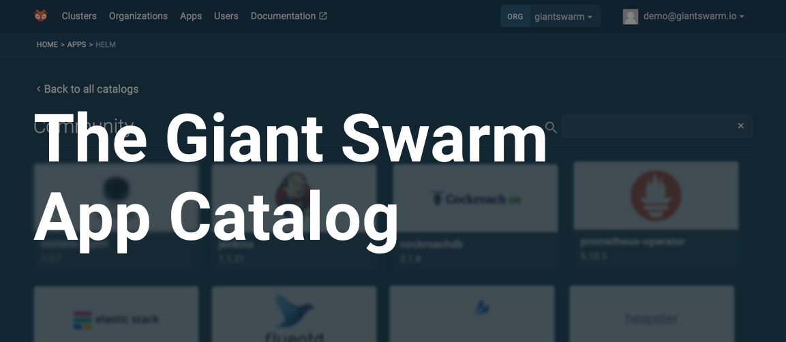
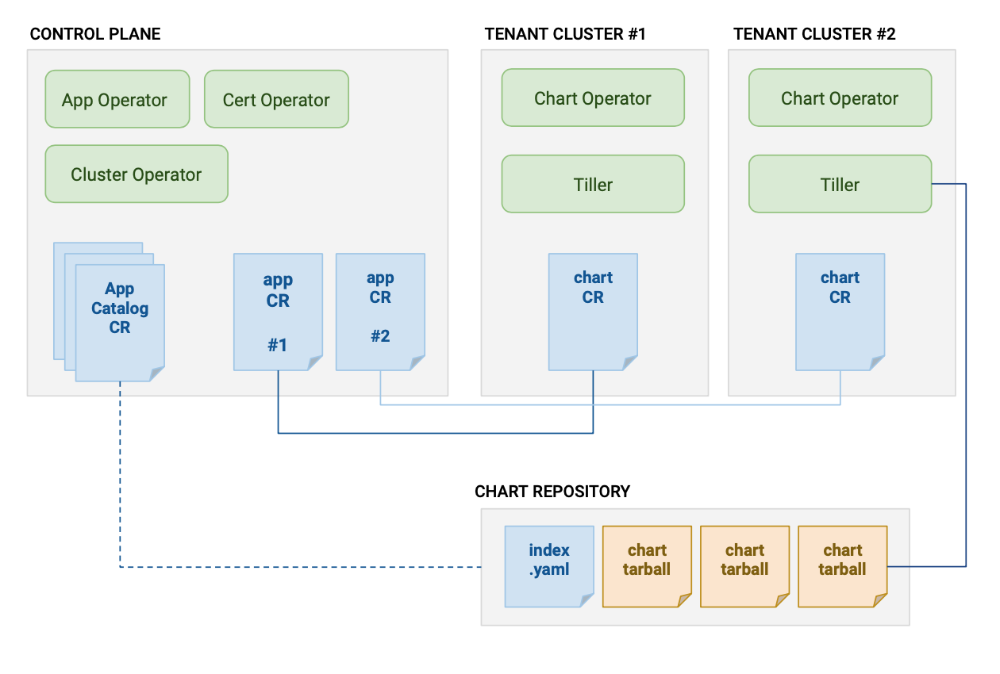

+++
title = "The Giant Swarm App Catalog"
description = "Overview of the Giant Swarm App Catalog, how it works and what to expect."
date = "2019-02-11"
weight = 90
type = "page"
categories = ["basics"]
+++



The _Giant Swarm App Catalog_ refers to a set of features and concepts that allow
you to browse, install and manage the configurations of apps (such as prometheus)
from a single place; the Control Plane.

Through this we are also providing you a list of curated _Managed Apps_.
In the near future you might also see _Apps_ provided by our partners.

These collections of _Apps_ are grouped in _App Catalogs_, which in turn are
browseable through our web interface.

So to clarify a bit: the _Giant Swarm App Catalog_ refers to the whole feature,
and an _App Catalog_ is a collection of _Apps_.

We'll provide some _App Catalogs_, but so will our partners, and you too can set
up your own internal catalog(s) for your whole company to use.

### What makes up the Giant Swarm App Catalog?

Technically the Giant Swarm App Catalog is implemented as a set of operators
running on your Control Plane and tenant clusters. These operators watch various
Custom Resources, some created by us, and others created by you, which make up
the desired state of the Giant Swarm App Catalog.

For example, this "App" Custom Resource indicates that you want Instana installed
on a specific tenant cluster.

```
apiVersion: application.giantswarm.io/v1alpha1
kind: App
metadata:
  name: "instana-agent"
  namespace: "x7jwz"
  labels:
    app-operator.giantswarm.io/version: "1.0.0"
spec:
  catalog: "community"
  name: "instana-agent"
  namespace: "instana-agent"
  version: "1.0.6"
  kubeConfig:
    secret:
      name: "x7jwz-kubeconfig"
      namespace: "x7jwz"
  userConfig:
    configMap:
      name: "instana-agent-user-values"
      namespace: "x7jwz"
```

Below you can see a high level overview of the components and resources that work
together to enable the features of the Giant Swarm App Catalog:




### What kind of App Catalogs are there?

By default you will have the Incubator and the Community App Catalogs installed
on your Control Planes.

### The Giant Swarm Incubator App Catalog

The Giant Swarm Incubator App Catalog contains apps that we would like to provide as
a Managed App at some point in the future. When you install an app from the
Giant Swarm Incubator App Catalog you are being brave and helping us get things
right before we offer the SLA on that app.

Feedback and collaboration are valued here! There is no guarantee or SLA on these
apps, but we offer support on a best-effort basis.

### The Giant Swarm Managed App Catalog and Managed Apps

Managed Apps are provided by Giant Swarm and have an SLA associated with
them. When you install one of our Managed Apps, we make sure that it stays
running and even get paged if something goes wrong.

Managed Apps can be found in the Giant Swarm Managed _App Catalog_. In our web
interface they are indicated by the orange "Managed" badge.

Details on the SLA are still being discussed and fleshed out, however watch this
space for a link to a more in depth explanation of our SLA on our Managed Apps.

### The Helm Stable App Catalog

The Helm Stable App Catalog contains all the Apps you'd find in the upstream
[helm stable repository](https://github.com/helm/charts/tree/master/stable).
There is no guarantee or SLA here. Install Apps from this
catalog at your own risk.

### Installing your own App Catalog

It's possible to create your own App Catalog. This is useful if you want to make
a set of Apps available to your company. Currently there is no API endpoint
or way to add the App Catalog yourself, but once you've created the necessary
repo, we can add it to your installation upon request.

### What are Helm Chart Repositories?

The App Catalog CR is an abstraction, it's purpose is to point to _something_
that contains a list of Apps and the storage location of where to get those Apps.

Currently the only supported format for App Catalogs are
[Helm Chart Repositories](https://github.com/helm/helm/blob/master/docs/chart_repository.md),
however in the future we might support other ways of offering your Apps to the
Giant Swarm App Catalog.

We've created some automation and best practices around hosting a
Helm Chart Repository on Github, see github.com/giantswarm/sample-catalog
for more information.

### How can I interact with the Giant Swarm App Catalog?

You can interact with the Giant Swarm App Catalog through our API and
our web interface.

- [Web Interface Reference: The Giant Swarm App Catalog](/reference/web-interface/app-catalog/)
- [Apps and App Configs in the API reference](https://docs.giantswarm.io/api/#tag/apps)

Support for the App Catalog is coming to our CLI (gsctl) next.

Lastly, at the end of the day, what our interfaces do, is create (or update)
a set of Custom Resources on your Control Plane.

Our intention is to eventually grant you full access to the Control Plane
API, and all of these resources, so that you can interact with them using
`kubectl` (think `kubectl create app`), and automate them just as you have been
automating other parts of your stack.

