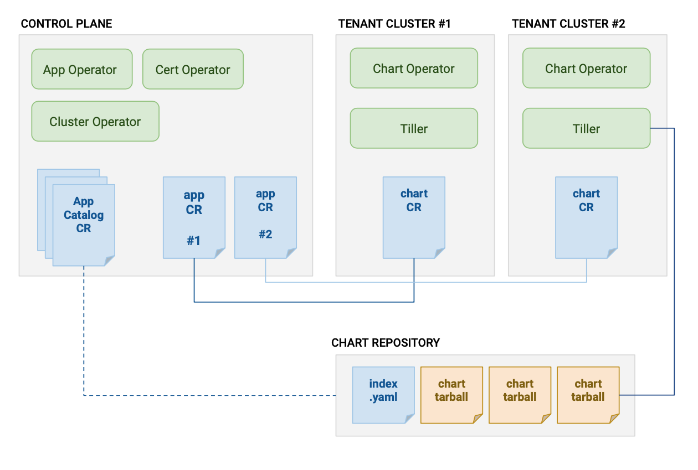

The _Giant Swarm App Platform_ refers to a set of features and concepts that allow
you to browse, install and manage the configurations of apps (such as Prometheus)
from a single place; the Control Plane.

Using this platform we will provide a collection of curated _Apps_. These _Apps_ are grouped into _App Catalogs_, which are browsable through our web interface.

In short: the _Giant Swarm App Platform_ refers to the whole feature, and an _App Catalog_ is a collection of _Apps_.

We provide two _App Catalogs_. You will be able to set up your own additional catalog(s) to provide for any needs you have at the enterprise level.

### What makes up the Giant Swarm App Platform

Technically the App Platform is implemented as a set of operators
running on your Control Plane and tenant clusters. These operators watch various
Custom Resources, some created by us, and others created by you. Together, they make up
the desired state of the App Platform.

For example, this "App" Custom Resource indicates that you want Kong installed
on a specific tenant cluster.

```yaml
apiVersion: application.giantswarm.io/v1alpha1
kind: App
metadata:
  name: "my-kong"
  namespace: "x7jwz"
  labels:
    app-operator.giantswarm.io/version: "1.0.0"
spec:
  catalog: "giantswarm"
  name: "kong-app"
  namespace: "kong"
  version: "0.7.2"
  config:
    configMap:
      name: "x7jwz-cluster-values"
      namespace: "x7jwz"
  kubeConfig:
    context:
      name: "x7jwz"
     inCluster: false
     secret:
      name: "x7jwz-kubeconfig"
      namespace: "x7jwz"
  userConfig:
    configMap:
      name: "kong-user-values"
      namespace: "x7jwz"
```

Below you can see a high level overview of the components and resources that work
together to enable the features of the Giant Swarm App Platform:



### What kind of App Catalogs are there

By default you will have the Giant Swarm Catalog and the Giant Swarm Playground installed
on your Control Planes.

### The Giant Swarm Catalog

This catalog will contain our stable, fully managed apps, with SLA (e.g. the NGINX Ingress Controller). It will also contain apps that we are developing towards that level of commitment (e.g. Kong, EFK).

Maturity levels of apps in this catalog are expressed through semantic versioning as follows:

- Version with `-alpha` or `-beta` suffix - the application is only at a basic maturity level. There is no stable release. It is supported on a best effort basis,
- Version with `-rc*` suffix - the application is at a preview maturity level. This allows customers to preview a new release of an application and evaluate new features. It is supported on a best effort basis.
- version >= `v1.0.0` with no suffix - the specified version of the application is at a stable maturity level. It is available to our customers as a managed offering with support and SLA.

### The Giant Swarm Playground

This is our go-to place to create and try out things. Mainly, this contains apps that we have added in order help you with a certain issue. Additionally, you will find some apps that we created for non-commercial purposes (e.g. for a blog post or a workshop).

Bear in mind that we do NOT support these apps and they won’t be worked on with priority. These apps might not ever make it into the Giant Swarm Catalog. What you will get, is an app at a basic maturity level at a specific point in time.

We encourage you to try out this playground catalog and the different apps offered there. As always, feedback is welcome.

### The Helm Stable Catalog

The Helm Stable Catalog contains all the Apps you'd find in the upstream
[helm stable repository](https://github.com/helm/charts/tree/master/stable).
There is no guarantee or SLA here. Install Apps from this
catalog at your own risk.

### Installing your own App Catalog

It’s possible to create your own App Catalog. This is useful if you want to create a set of apps available to your company. Currently, this functionality is only available through direct access to the Giant Swarm Control Plane Kubernetes API. You can request access from your Solution Engineer. Prerequisite for this is a standard Helm chart repository. It should be served through HTTP and accessible to the Control Plane and your Tenant Clusters.

### How can I interact with the Giant Swarm App Platform

You can interact with the Giant Swarm App Platform through our API and
our web interface.

- [Web Interface Reference: The Giant Swarm App Platform](/reference/web-interface/app-platform/)
- [Apps and App Configs in the API reference](/api/#tag/apps)

Lastly, at the end of the day, what our interfaces do, is create (or update)
a set of Custom Resources on your Control Plane Kubernetes.

As we are giving you direct access to the Control Plane Kubernetes API you can also interact with the above mentioned resources using `kubectl`, and automate them just as you have been automating other parts of your stack.
And as Kubernetes resources and especially some CRDs require lots of boilerplate and conventions, we built a kubectl plugin to help you with that.
