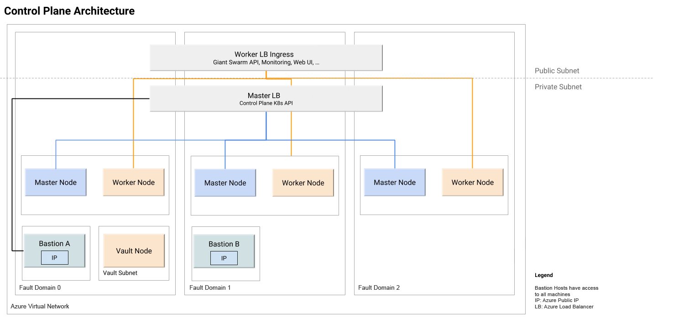
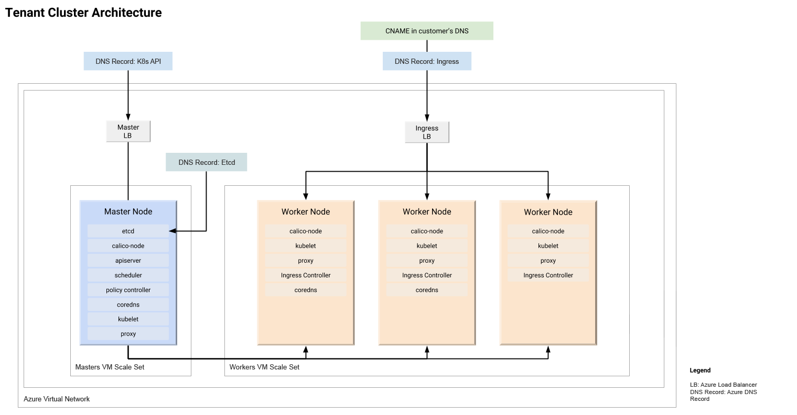
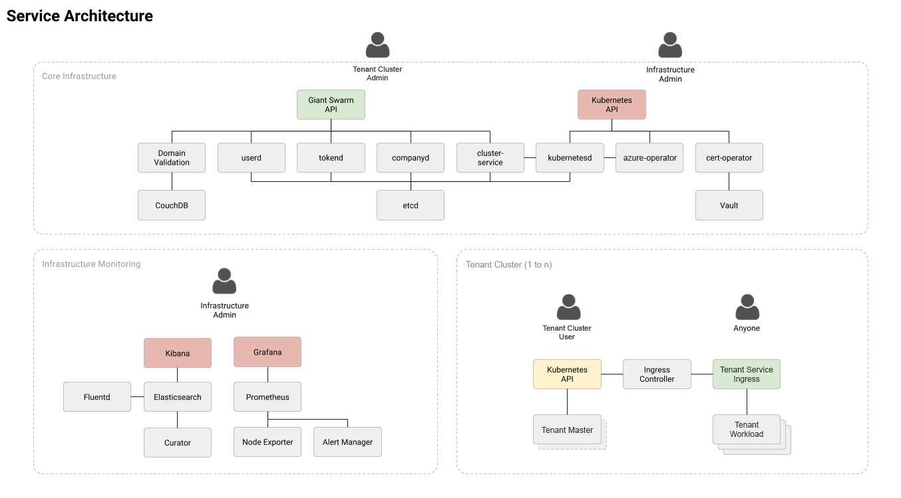

+++
title = "The Giant Swarm Azure Architecture"
description = "Architecture Overview showing how Giant Swarm is set up on Microsoft Azure"
date = "2019-11-21"
weight = 60
type = "page"
categories = ["basics"]
last_review_date = "2019-11-26"
+++

# The Giant Swarm Azure Architecture

Giant Swarm's Architecture is split into two logical parts, one being the Control Plane and the other being multiple Tenant Clusters. Among other services (for details see Service Architecture below), the control plane runs our [Azure Operator](https://github.com/giantswarm/azure-operator), which handles the full lifecycle management of Tenant Clusters.

## Giant Swarm control plane

The above diagram shows our control plane setup running with two bastion hosts in different availability zones. All instances are in a private subnet and only accessible through the bastion hosts. Bastions hosts are available via Azure VPN connection only.

The cluster has several APIs and Interfaces. The Kubernetes API of the Control Plane is only available to Giant Swarm operations personnel and only through the Bastion hosts.

The Giant Swarm API, Monitoring and Alerting frontends as well as our Web User Interface, are exposed through the Control Plane Ingress Controller, which sits behind a public Load Balancer.

## Giant Swarm tenant cluster

Via the Giant Swarm API, our [CLI](https://github.com/giantswarm/gsctl), or our web interface, you can start Tenant Clusters of different sizes. There's a selection of recommended Azure instance types, which can be adjusted if needed.

Each cluster resides in its own Virtual Network. All Azure machines are in their own private subnet ([Networking Deepdive](https://blog.giantswarm.io/deep-dive-into-kubernetes-networking-in-azure/)). There are two possible access routes into the cluster.

One is the Kubernetes API that can be connected to your Identity Management System using OIDC. The other is the Ingress Controller (exposed through a public Load Balancer), with which you can expose services running inside your cluster publicly. The services will be mapped to domains handled through Azure DNS. For the final URL, you can point a CNAME to the Ingress URL.

## Service architecture

To make your life easier, we have developed a lot of different services within our Control Plane that allow both our operations team and you as, users of our API and interfaces to easily manage Kubernetes clusters. Most of these services should be self explanatory, due to the level of granularity we maintain.

We have three main parts:

* Core Infrastructure Services
* Infrastructure Monitoring (used by Giant Swarm)
* Tenant Clusters

All of these are geared towards enabling you to run multiple projects independently and consistently across multiple Azure regions.
