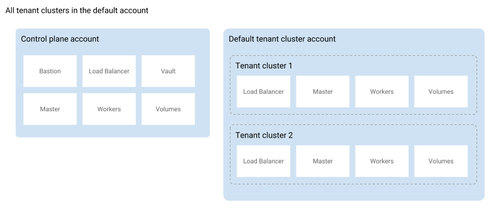

+++
title = "Bring Your Own Cloud"
description = "By default, all your tenant clusters run in the same cloud provider account. With BYOC (Bring Your Own Cloud) for AWS and Azure, you can define a specific cloud provider account to use per organization."
date = "2018-11-16"
weight = 50
type = "page"
categories = ["basics"]
+++

# Bring Your Own Cloud (BYOC)

The Giant Swarm architecture distinguishes between the control plane and tenant clusters, with the control plane enabling the creation and operation of tenant clusters and tenant clusters running your Kubernetes workloads.

## What BYOC is good for {#benefits}

Both on AWS and Azure, tenant cluster resources exist in an account (or in Azure terms: a subscription) separate from the one hosting the control plane resources. We configure a default account to use for all tenant clusters in an installation. Both accounts, the one for the control plane and the default one for tenant clusters, are in the customer's jurisdiction.

With BYOC you can have more fine-grained control over the accounts used by tenant clusters. Each Giant Swarm organization in an installation can have an individual configuration of which cloud provider account to use.

The following two schemas illustrate the difference:

This enables use cases such as

- Several teams, business units, or profit centers sharing an installation, where many or all of them run tenant clusters in their own cloud provider account, separate from each other.

- An ISV, being the Giant Swarm customer, creating and giving access to tenant clusters in the name of a third party, in the third party's cloud provider account. The third party in this scenario has no relationship with Giant Swarm and needs no access to the Giant Swarm API or control plane.

In both cases, customers benefit from simpler usage and cost allocation, plus a higher level of security through isolation. It can also help to make use of credits available in certain accounts.

## Provider-specific mechanisms {#provider-specific}

Details of the implementation differ between AWS and Azure.

- On AWS, Giant Swarms uses two separate IAM roles to assume in order to act in the tenant cluster account: one for use by automation, one for technical support staff. Details on the exact permissions required are found in our guide on [preparing an AWS account to run Giant Swarm tenant clusters](/guides/prepare-aws-account-for-tenant-clusters/).

- On Azure, one service principal is configured for Giant Swarm, used by automation and technical support staff. Detais are found in our guide on [preparing an Azure subscription to run Giant Swarm tenant clusters](/guides/prepare-azure-subscription-for-tenant-clusters/).

## Details you should know about {#details}

- Cloud provider account/subscription credentials are specified on the (Giant Swarm) **organization level**.

- Cloud provider credentials are **immutible**. Once specified on an organization, cloud provider credentials cannot be modified or deleted. In order to switch to new cloud provider credentials you'll have to create a new organization and migrate to new cluster owned by that organization.

- If an organization does not yet have provider credentials configured and alrready has tenant clusters, these clusters are running in the default tenant cluster account. Setting credentials for this organization does not affect the tenant clusters created before.

## Get started

To create clusters in a new cloud provider account, first you need to provide the credentials to the organization you'd like to use for this purpose. You are free to create a new organization for this purpose if you like. Organizations can be created in the Giant Swarm web UI, also known as happa, or via the [Giant Swarm API](/api/#operation/addOrganization).

To prepare your credentials, either as AWS account roles or as an Azure service principle, please follow our specific guides:

- [Prepare an AWS account to run Giant Swarm tenant clusters](/guides/prepare-aws-account-for-tenant-clusters/)
- [Prepare an Azure subscription to run Giant Swarm tenant clusters](/guides/prepare-azure-subscription-for-tenant-clusters/)

You can then assign the credentials to your organization using several ways:

- In happa via the organization details page
- In `gsctl` using the [`update organization set-credentials`]() command
- Via the [Giant Swarm API](/api/#operation/addCredentials)

All tenant clusters created for that organization will then use the credentials provided to the organization and will reside in the account/subscription associated with them.

When inspecting details of such a cluster, or using the [`gsctl show cluster`](/reference/gsctl/show-cluster/) command, we display cloud provider details in the case the tenant cluster does not reside in the default account.

## Further reading

- [The Giant Swarm AWS Architecture](/basics/aws-architecture/) explains in more detail the setup of Giant Swarm on AWS.
