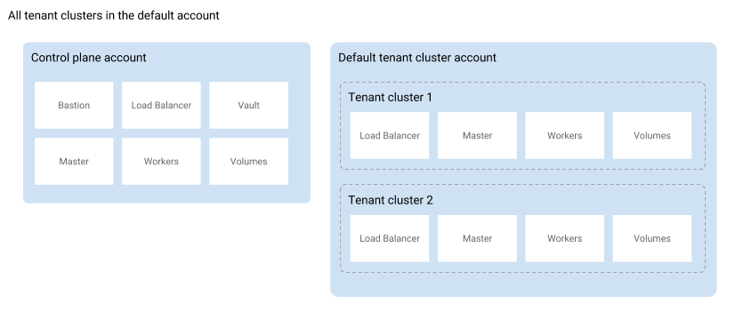

# Multi-Account Support

The Giant Swarm architecture distinguishes between the management cluster and workload clusters. The management cluster enables the creation and operation of workload clusters and the workload cluster(s) run your Kubernetes workloads.



## How does multi-account support help? {#benefits}

Both on AWS and Azure, workload cluster resources usually exist in an account (or in Azure terms: a subscription) separate from the one hosting the management cluster resources. We configure a default account to use for all workload clusters in an installation. Both accounts, the one for the management cluster and the default one for workload clusters, are under the customer's jurisdiction.

**Note:** Some customers use the same account/subscription for both management cluster and workload clusters. This choice does not affect the capabilities described below.

With multi-account support you can have more fine-grained control over the accounts used by workload clusters. Each Giant Swarm organization in an installation can have an individual configuration of which cloud provider account to use.

The following two schemas illustrate the difference:

This enables use cases such as

- Several teams, business units, or profit centers sharing an installation, where many or all of them run workload clusters in their own cloud provider account, separate from each other.

- An ISV, being the Giant Swarm customer, creating and giving access to workload clusters in the name of a third party, in the third party's cloud provider account. The third party in this scenario has no relationship with Giant Swarm and needs no access to the Giant Swarm API or management cluster.

In both cases, customers benefit from simpler usage and cost allocation, plus a higher level of security through isolation. It can also help to make use of credits available in certain accounts.

## Provider-specific mechanisms {#provider-specific}

Details of the implementation differ between AWS and Azure.

- On AWS, Giant Swarms uses two separate IAM roles in order to act in the workload cluster account: one for use by automation, one for technical support staff. Details on the exact permissions required can be found in our guide on [preparing an AWS account to run Giant Swarm workload clusters](/guides/prepare-aws-account/).

- On Azure, one service principal is configured for Giant Swarm, used by automation and technical support staff. Details can be found in our guide on [preparing an Azure subscription to run Giant Swarm workload clusters](/guides/prepare-azure-subscription/).

## Additional information {#details}

- Cloud provider account/subscription credentials are specified on the (Giant Swarm) **organization level**.

- Cloud provider credentials are **immutable**. Once specified on an organization, cloud provider credentials cannot be modified or deleted. In order to switch to new cloud provider credentials you'll have to create a new organization and migrate to new clusters owned by that organization.

- If an organization does not yet have provider credentials configured but already has workload clusters, these clusters are run in the default workload cluster account. Setting credentials for this organization does not affect the workload clusters created already.

## Get started

To create clusters in a new cloud provider account, you first need to provide the credentials to the organization you'd like to use for this purpose. You are free to create a new organization for this purpose if you like. Organizations can be created in the Giant Swarm web UI, or via the [Giant Swarm API](/api/#operation/addOrganization).

To prepare your credentials, either as AWS account roles or as an Azure service principle, please follow our specific guides:

- [Prepare an AWS account to run Giant Swarm workload clusters](/guides/prepare-aws-account/)
- [Prepare an Azure subscription to run Giant Swarm workload clusters](/guides/prepare-azure-subscription/)

You can then assign the credentials to your organization in several ways:

- In the Giant Swarm web UI via the organization details page
- In `gsctl` using the [`update organization set-credentials`](/reference/gsctl/update-org-set-credentials/) command
- Via the [Giant Swarm API](/api/#operation/addCredentials)

All workload clusters created for that organization will then use the credentials provided to the organization and will reside in the account/subscription associated with them.

When inspecting details of such a cluster, or using the [`gsctl show cluster`](/reference/gsctl/show-cluster/) command, we display cloud provider details in the case the workload cluster does not reside in the default account.

## Further reading

- [The Giant Swarm AWS Architecture](/basics/aws-architecture/) explains the setup of Giant Swarm on AWS, in more detail.
- [The Giant Swarm Azure Architecture](/basics/azure-architecture/) explains the setup of Giant Swarm on Azure, in more detail.
