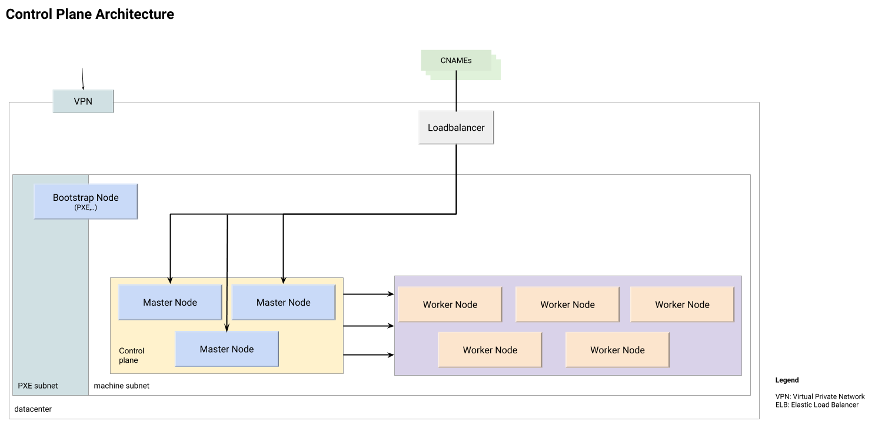

+++
title = "The Giant Swarm On Premises Architecture"
description = "Architecture overview showing how Giant Swarm is set up within a customer data center on bare metal or virtual machines."
date = "2018-08-16"
weight = 70
type = "page"
categories = ["basics"]
+++

# The Giant Swarm On Premises Architecture

Giant Swarm's Architecture is split into two logical parts, one being the Control Plane and the other being multiple Tenant Clusters. We prefer running on bare metal machines, but can also work with virtualized infrastructure (e.g. VMWare) in case nested virtualization is possible.

We require VPN and SSH access to all machines, as well as outbound Internet connectivity from the machines (this can be limited to a few targets), to download images of various forms to automatically build and update the cluster. All machines are to be configured with one PXE Boot network and a production network (separate VLANs). The machines will be started by us via an ILO-Interface, to boot from the PXE Boot Server in the network for bootstrap, and then restart into the production network.

## Giant Swarm On Premises Control Plane

Think of the Control Plane as the Giant Swarm team’s Kubernetes Cluster. The worker nodes are where your Tenant Clusters will end up on, controlled by our [kvm-operator](https://github.com/giantswarm/kvm-operator/) running inside the Control Plane. The above diagram shows our PoC setup in that keeps the Control Plane (including monitoring) on 3 machines. Based on the amount and sizes of Tenant Clusters, we recommend having distinct monitoring machines once we go into production. We further recommend having at least 5 worker machines. Any additional machines will also be set up as worker nodes and made available for Tenant Clusters to be used by end users.

We access all machines, as well as the Kubernetes API of the Control Plane, through VPN (and optionally via a Bastion host). We connect your load balancer for access to the Giant Swarm API, Happa, and our Monitoring, optionally adding your Identity Management System for authentication. Traffic towards all Tenant Clusters is routed via the Control Plane first, as it knows where exactly all the Tenant Clusters are at any point in time.

## Giant Swarm On Premises Tenant Cluster

Via the Giant Swarm API, our [CLI](https://github.com/giantswarm/gsctl), or our Web interface, you can start Tenant Clusters of different sizes. You choose the amount of vCores and RAM you want per Node of your Tenant Cluster and press “Create Cluster”. A few minutes later your cluster will be ready to use. It will be running on the Worker Nodes of the Control Plane, within KVM VMs networked together through a Flannel network. Each Tenant Cluster is separated from the other Tenant Clusters by a flannel VXLAN bridge. Inside of that bridge, the containers are networked with Calico BGP.

Access to the K8s API goes through the Control Plane. We can connect your Load Balancer for Ingress access. This Load Balancer can be either statically configured with healthchecks or controlled via API. Depending on the data center setup, there are different options that need to be evaluated.

## Service architecture

To make your life easier, we have developed a lot of different services within our Control Plane that allow both our operations team and you as users of our API and interfaces to easily manage Kubernetes clusters. Most of these services should be self explanatory.

We have three main parts:

* Core Infrastructure Services
* Infrastructure Monitoring (used by Giant Swarm)
* Tenant Clusters running your application workloads
