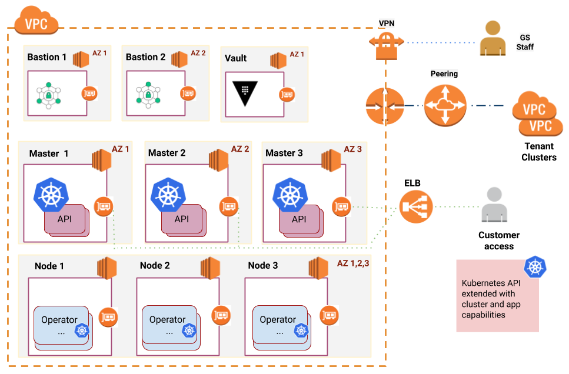
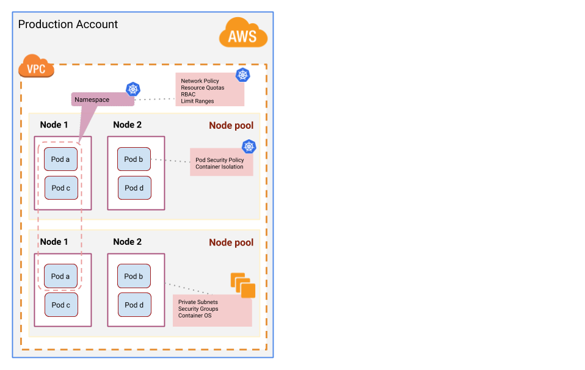
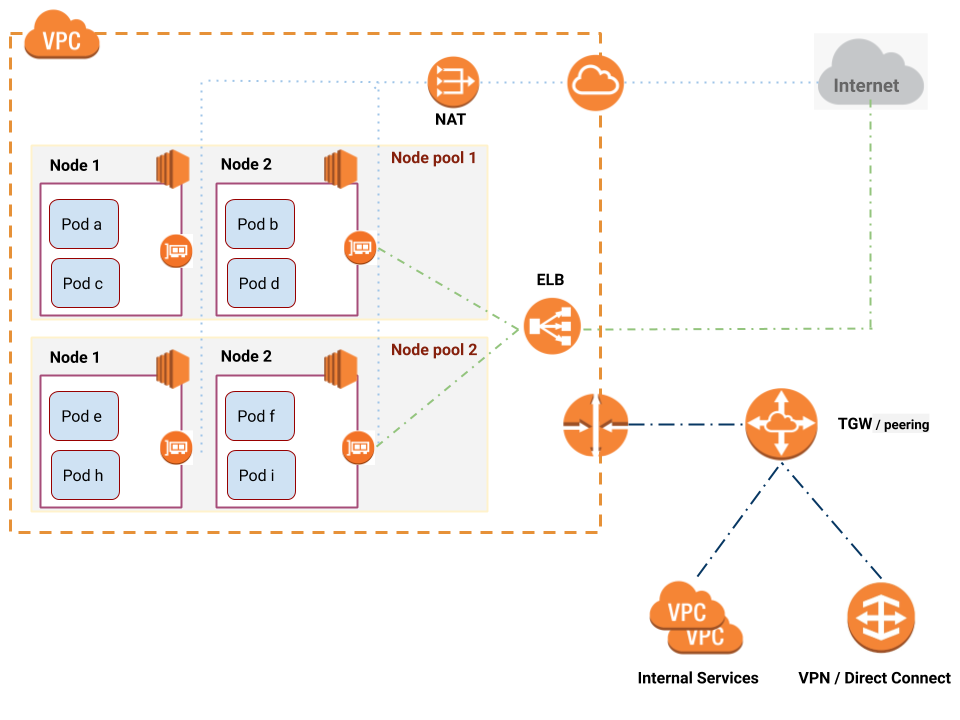

# The Giant Swarm AWS platform

The Giant Swarm Platform consists of various components. They can be categorized into three areas: infrastructure, operations, and applications.

For managing all the infrastructure we run a management cluster per cloud and region where you want run your workloads. From that management cluster you can spin up as many individual Kubernetes clusters, called _workload clusters_, as you want. Our operations team works to keep all cluster components healthy, while we release new versions with new features and patches. On top of that Giant Swarm offers a curated catalog with common Cloud Native tools that helps with monitoring, security or API management. Customers can leverage those while we carry the burden of maintain and keep them up to date.

When it comes to planning and designing your cluster architecture and its adaption to our infrastructure requirements, there are many moving parts to consider. Based on our experience with various customers over the last 6 years, we have gathered best practices and general advice to help with some of the initial critical decisions.

## Management cluster

As we are fully convinced of Kubernetes as a platform for building platforms, we build all our management clusters based on Kubernetes. The initial deployment entails the creation of that management cluster in a defined cloud provider region. After the management cluster is ready we deploy all our automation taking advantage of Kubernetes primitives and using the same philosophy we advocate to our customers.

Giant Swarm leverages the concept of [“Operators"](https://kubernetes.io/docs/concepts/extend-kubernetes/operator/) to control all resources that clusters need as [“Custom Resources”](https://kubernetes.io/docs/concepts/extend-kubernetes/api-extension/custom-resources/). At the same time customers can also use the Kubernetes Control Plane API to [manage their clusters]() and/or [applications]().

## AWS landscape

Giant Swarm's AWS operator is the product of years of work and we continue to apply our learnings and new functionality to it, as they become available. It is in charge of the provisioning and configuration of all resources needed to make a Kubernetes cluster functional on AWS. This operator runs in the management cluster, conveniently in separate accounts, and needs to reach the AWS API where you want to deploy your clusters. Thanks to our [Multi-Account]() support, customers can add different AWS accounts to our platform and our operator will assume an IAM Role to operate the resources accordingly and spawn clusters into these accounts respectively.

Most of our customers rely on additional AWS services like Control Tower, Organizations or Config to help them with the landing, configuration, and audit of their applications on cloud provider resources. Based on our experience, we have crafted an [introductory guide]() on how to configure your AWS accounts, to prepare them for our platform. These include good defaults, which will prevent you from hitting [AWS limits (service quotas)](https://docs.aws.amazon.com/general/latest/gr/aws_service_limits.html) when creating clusters through our platform. Additionally, we continuously monitor the relevant limits. We will notify you, if a cluster approaches one of these limits, so you can focus on building your applications.

Following the principle of least privilege, we continuously refine the permissions needed for our automation to manage the AWS resources and the permissions given to our support engineers to assist when there is a problem. This is an ongoing process, as this is subject to change. We are constantly tweaking this based on our experience and changes introduced in AWS APIs as well as upstream changes in Kubernetes and other community projects. That being said, as infrastructure providers, we need a certain level of access to the cloud providers’ APIs in order to ensure the smooth operation and support of our platform. In some cases, we recommend creating accounts solely for Giant Swarm related resources and keeping other resources in separate accounts. These accounts are only accessed on demand.

## Workload segregation and account model

When starting out with our platform many of our customers are at the beginning of their journey to a distributed and highly resilient micro-service architecture. This is often a radically different approach to organizing and managing computing resources. This is mostly about abstracting the complexity of cluster creation and management. It opens up new possibilities on how to isolate applications and access to the infrastructure. The two most common reasons for customers to segregate applications over different clusters and/or accounts are security and separation of concerns.

Once Kubernetes arrived on the scene, the promise of having all your applications in a single cluster seemed invaluable, as container isolation, namespaces, and other Kubernetes features allow you to isolate the workloads. But as time passed several drawbacks were found that discourage this approach. [Container isolation is not perfect](https://sysdig.com/blog/container-isolation-gone-wrong/), in the end workloads still share a kernel and some cluster components that can affect each other. Though it can be mitigated using [Role-Based Access Control (RBAC)](https://kubernetes.io/docs/reference/access-authn-authz/rbac/),  [Network Policies](https://kubernetes.io/docs/concepts/services-networking/network-policies/) or [Pod Security Policies](https://kubernetes.io/docs/concepts/policy/pod-security-policy/), it requires expertise and knowledge. At the same time, as you continue to add more and more applications into the cluster, the traffic increases. This potentially affects DNS latency, ingress handling, or the attack surface. In addition, having multiple tenants in the cluster increases the possibility to affect each other when a central component is tuned for a specific scenario. Potentially, it can significantly impact the cluster lifecycle, i.e. upgrades, due to the extra effort in communication and planning across various teams.

All of this is not to say that segregation inside a cluster should be avoided but to emphasize that there are considerations that need to be weighed, before deciding on how to group tenants, applications and technical requirements.

Hence, the key is to find the right balance between the new Cloud Native approach and the old school hard isolation.

Above, we see several isolation layers in one place. Our automation creates a single VPC by cluster, with private subnets for the worker nodes and secure configuration by default. At the same time, the nodes run a container-ready operating system created with security and reliability in mind. Next, our base Kubernetes setup provides [Network Polices](https://kubernetes.io/docs/concepts/services-networking/network-policies/) and [Pod Security Policies](https://kubernetes.io/docs/concepts/policy/pod-security-policy/) to restrict communication to core components accompanying with a very strict policy to ensure containers do not gain extended privileges unintentionally.

Having said that, there is no general rule to split workloads between AWS accounts, clusters or namespaces. It highly depends on the customers policies in effect and access requirements among others. However, we can give some advice on where to start.

- Use AWS accounts (and other AWS tools) to establish different access models based on environments. You could have an account **A** for production, where users have no rights, and audit policies and logging systems track every single action. And you could have an account **B**, where developers can get access to debug and test their applications or understand the infrastructure that holds it.
- Segregate applications based on responsibility and volume of services included. If a team or department owns a service platform composed of several components, it makes sense to use a single cluster for it. That way, upgrades to the cluster or its shared components, like Ingress Controller or DNS servers, do not interfere with other applications which reduces overall complexity.
- Divide different services of single systems into different [namespaces](https://kubernetes.io/docs/concepts/overview/working-with-objects/namespaces/). It allows to control resources, network communication and access to those in finer granularity.
- Automate and abstract your workload lifecycle. Defining the configuration of applications and the underlying [infrastructure as code](https://en.wikipedia.org/wiki/Infrastructure_as_code) has become the de facto standard to manage complex systems. There are plenty of tools nowadays to declare your application configuration as code, rely on them and discard manual changes. Think about the possibility of having to migrate your application from one cluster to another. Ideally, such a change should imply just a single config line change. Kubernetes helps to define [Cloud Native Applications](https://12factor.net/) but there are some parts that still reside on the developer side.

## Workload Cluster

### Architecture

Our [AWS operator](https://www.giantswarm.io/blog/aws-operator-2-0-creating-kubernetes-clusters-with-cloudformation) creates a single VPC per cluster and a subnet (in fact its two subnets: one public and private) for each node pool defined in the configuration. There is no overlay network in place, so that pods run in the same IP range as nodes. For each private subnet there is a NAT Gateway, which is in charge of routing traffic from nodes or pods to the Internet. Once a workload is exposed to the Internet, an ELB is placed in the public subnet to balance the request over the different backends.

In AWS the [node pool]() concept is mapped to an Autoscaling Group, which defines a launch configuration and scaling properties of the worker nodes located in it.

In order to communicate with your on-premises data center or with other VPCs (other cluster or existing infrastructure) you can leverage a VPN/Direct Connect or a Transit Gateway/peering respectively.

### Worker node size

When it comes to sizing your worker nodes, there should generally be a preference for more, smaller nodes vs less, bigger ones. However, avoid node sizes of less than 4 cores and 8 GB RAM.

To determine the right sizing in terms of cores and RAM, you need to know what kind of workloads will be run on the cluster and how much resources they need. Note that even if average load might be low, you should also account for peak load times as well as startup-peaks (i.e. some apps need a lot of resources just for their startup).

### Control resource assignment

One of the golden rules of Kubernetes is proper resource assignment. This is hard to do, especially for developers which are not used to profiling their applications under different scenarios. But the resource definition is a [key configuration](https://kubernetes.io/docs/concepts/configuration/manage-resources-containers/) part that allows Kubernetes to schedule, limit, control and scale the applications. So our recommendation [is to define resources](https://kubernetes.io/docs/concepts/configuration/manage-resources-containers/) for most of your applications running in the clusters. That said, there is some controversy about defining CPU limits due to how Kernels manage the CPU quota assigned to the containers. There have been some fixes in the latest Kernel versions which improve the situation. To learn more, we encourage you to [check this Kubecon video](https://www.youtube.com/watch?v=UE7QX98-kO0) or talk to your Solution Engineer.

Further, to enforce the definition of resources, [Limit Ranges](https://kubernetes.io/docs/concepts/policy/limit-range/) helps to set the defaults once a user forgets to add those. At the same time, [Resource Quotas](https://kubernetes.io/docs/concepts/policy/resource-quotas/) enables cluster operators to assign a predetermined amount of resources to each namespace. Thus, protecting other workloads.

### Cluster scalability

Our clusters are crafted with the [cluster autoscaling component]() included as a managed app. This means that a users can define the size of the cluster by defining a minimum and maximum number of nodes per node pool. The cluster autoscaling component will scale the node pools up and down based on the capacity needed. Although we manage the component, we also allow for some customization in order to adapt the autoscaling behaviour to your needs.

### Cluster authentication

Giant Swarm configures the clusters in a secure way. [Role-Based Access Control (RBAC)](https://kubernetes.io/docs/reference/access-authn-authz/rbac/) is enabled by default and our customers can create their own roles or use the ones predefined in the cluster to gain access to manage their workloads. The concept of authenticating users and groups does not exist in Kubernetes, so it relies on an external solution to authenticate the users (e.g. via X.509 certificates or [OIDC](https://en.wikipedia.org/wiki/OpenID_Connect)). Although our platform allows users to access the cluster using certificates, we recommend using an OIDC compliant Identity Provider, such as Active Directory, to provide authentication. There are several advantages to using an OIDC provider, such as short lived tokens or taking advantage of existing user and group information. Once authentication is sorted out, the authorization part is handled with RBAC. RBAC, along with namespaces, lets users define granular permissions for each user or group (given by OIDC or certs). This [guide]() will walk you through it.

### Secure your workloads

Within the cluster, Giant Swarm has set up a secure baseline using [Pod Security Policies (PSPs)](https://kubernetes.io/docs/concepts/policy/pod-security-policy/) and [Network Policies](https://kubernetes.io/docs/concepts/services-networking/network-policies/). Pod Security Policies are the Kubernetes resource that configures the sensitive aspects of your applications. By default, users and workloads running in Giant Swarm clusters, are assigned a restrictive policy that disallows running containers as root or mounting host path volumes (these are just two examples). Cluster operators must enable applications to have higher security privileges on a case by case basis. In the aforementioned [guide]() we also explain how to configure tailored PSPs for you applications.

In addition to the security policies, Network Policies define the communication policies to and from the applications in each namespace. All components to run a cluster provided by Giant Swarm come with strict policies by default. Our managed namespaces (“kube-system” and “giantswarm”) block all traffic in general, so only expected and specifically configured routes and ports are enabled. Customers can follow this approach and deny all communications by default in their application namespaces forcing each workload to define which communications are allowed. This [guide]() helps to understand how such a dynamic firewall works.

## Observability

Since we provide a **managed** Kubernetes platform, Giant Swarm has to be aware of state and unexpected events regarding the platform. For that reason our management clusters run a [monitoring stack](https://www.giantswarm.io/blog/monitoring-on-demand-kubernetes-clusters-with-prometheus) to watch all workload clusters and ensure all managed components are healthy. In each workload cluster there are several [exporters](https://prometheus.io/docs/instrumenting/exporters/) that gather and forward the metrics for each component.

Our on-call engineers will be paged in case anything happens to the cluster or its base components and they will respond to the incident based on the run-books we have created based on years of operating Cloud Native systems. In case there is an improvement to be made, a post mortem is created and a solution will be implemented before long. Any patch or fix added to the platform will be released to all customers.

Please note, while this document went into extensive details with regards to how Giant Swarm runs Kubernetes on AWS, we support [Azure]() as well as [Bare Metal](). For more details, please [contact us](https://www.giantswarm.io/contact).

## Further reading

- [Giant Swarm support model]()
- [Giant Swarm operational layers]()
