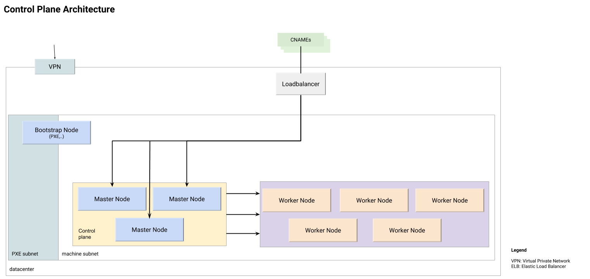
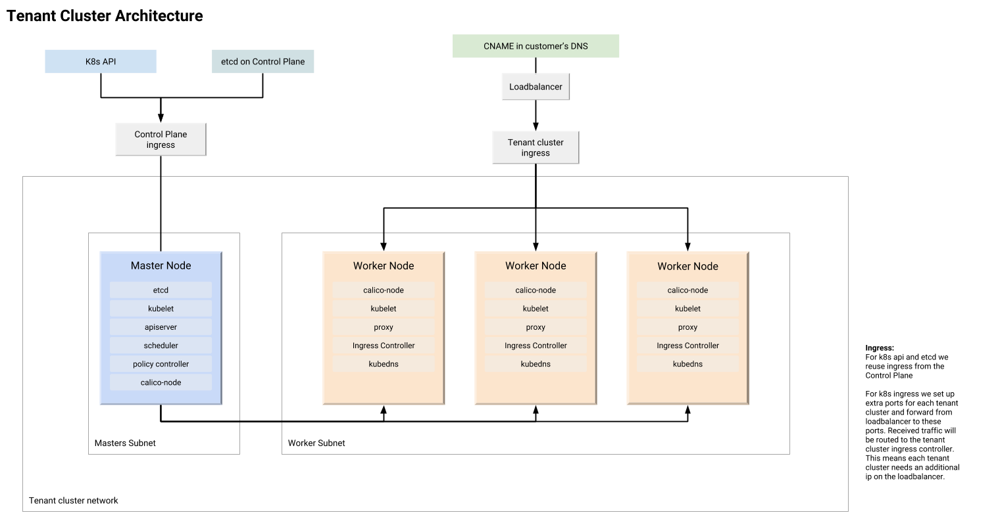
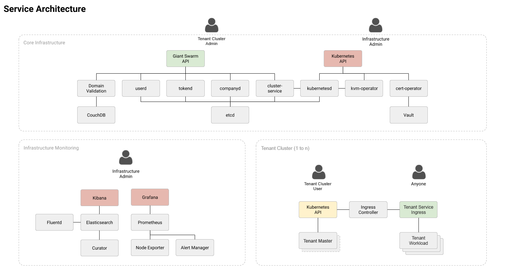

# The Giant Swarm on-premises architecture

Giant Swarm's architecture is split into two logical parts. One describes the management cluster and the other describes one or more workload clusters. We prefer running on bare metal machines, but can also work with virtualized infrastructure (e.g. VMWare) in case nested virtualization is possible.

We require VPN and SSH access to all machines, as well as outbound Internet connectivity from the machines (this can be limited to specific targets), to download images of various forms to automatically build and update the cluster. All machines are to be configured with one PXE Boot network and a production network (separate VLANs). The machines will be started by us via an ILO-Interface, to boot from the PXE Boot Server in the network for bootstrap, and then restarted into the production network.

## Giant Swarm on-premises management cluster

Think of the management cluster as the Giant Swarm team’s Kubernetes cluster. The worker nodes are where your workload clusters will end up on, controlled by our [kvm-operator](https://github.com/giantswarm/kvm-operator/) running inside the management cluster. The diagram above shows our proof-of-concept setup. As such it keeps the management cluster (including monitoring) on 3 machines. Based on the number and sizes of workload clusters, we recommend having distinct monitoring machines once we go into production. We further recommend having at least 5 worker machines. Any additional machines will also be set up as worker nodes and made available for workload clusters to be used by end users.

We access all machines, as well as the Kubernetes API of the management cluster, through VPN (and optionally via a bastion host). We connect your load balancer for access to the Giant Swarm REST API, our Web User Interface, and our Monitoring, optionally adding your Identity Management System for authentication. Traffic towards all workload clusters is routed via the management cluster first, as it knows where exactly all the workload clusters are at any point in time.

## Giant Swarm on-premises workload cluster

Using the Giant Swarm REST API, our [CLI](https://github.com/giantswarm/gsctl), or our Web UI, you can start workload clusters of different sizes. You choose the amount of vCores and RAM you want per Node of your workload cluster and click “Create Cluster”. Moments later your cluster will be ready to use. It will be running on the worker nodes of the management cluster, within KVM VMs networked together through a Flannel network. Each workload cluster is separated from the other workload clusters by a Flannel VXLAN bridge. Inside of that bridge, the containers are networked with Calico BGP.

Access to the Kubernetes API goes through the management cluster. We can connect your load balancer for Ingress access. This load balancer can be either statically configured with health checks or controlled via an API. Depending on the data center setup, there are different options that need to be evaluated.

## Service architecture

To make your life easier, we have developed a lot of different services within our management cluster that allow both our operations team and you as users of our API and interfaces to easily manage Kubernetes clusters. Most of these services should be self explanatory.

We have three main parts:

* Core infrastructure services
* Infrastructure monitoring (used by Giant Swarm)
* Workload clusters running your application workloads

All of these are geared towards enabling you to run multiple projects independently and consistently in your data centers.
