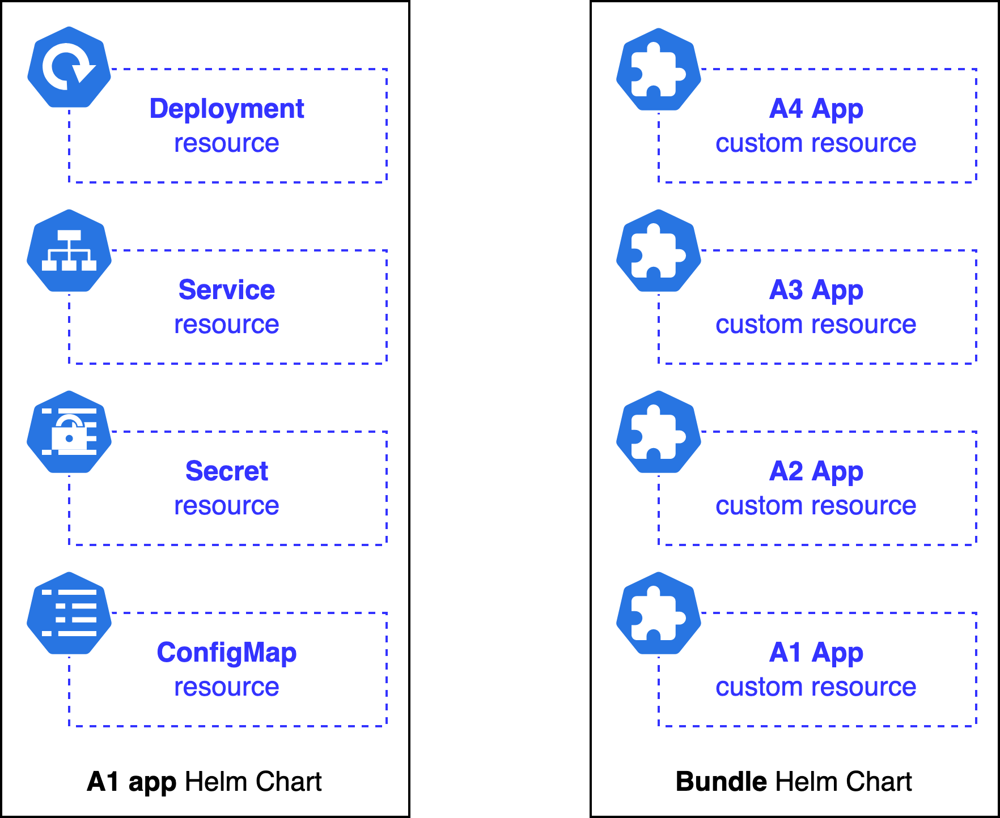

## App Bundle Definition {#app-bundle-definition}

As stated in the [App Platform overview]() all managed apps are
packaged, maintained and offered as Helm Charts and it is no different for the app bundles. What makes them
special in comparison to solitary apps is that the bundle Helm Chart instead of carrying a regular resources
composing the actual application, it carries the [App CRs]() that, once delivered and consumed by the App Platform, install the
expected applications and their resources. In other words, the app bundle can be thought of a middleman, not
installing anything in the Workload Cluster on its own, but requesting installation of certain pre-defined
applications.

This distinction between solitary (on the left side) and bundle (on the right side) apps is depicted in the
figure below.



The `A1` app's Helm Chart consists of end resources representing the actual application. Upon installing this app,
these resource are to be created in the **Workload Cluster directly**. On the other side is a bundle Helm Chart
that solely carries the `A1-A4` App CRs. Installing this bundle results in creating these nested App CRs in a
**Management Cluster**, which are then picked up and reconciled by the App Platform what only then results in
creating end resources in the Workload Cluster.

As already briefly hinted above, the direct consequence of nesting App CRs inside a Helm Chart is how the app is
installed. Installing a solitary app for the Workload Cluster does not result in creating anything in the
Management Cluster, while the bundle app is in fact first installed in the Management Cluster where it creates
its App CRs, which are then, in the second step, installed for the Workload Cluster. More about this in the [App
Bundle installation](#app-bundle-installation).

## App Bundle Installation {#app-bundle-installation}

### High Overview

The solitary app installation process has been already well depicted in the [App Platform Overview](). The bundle installation process is very similar,
except it involves one extra layer, and hence extra controllers. This layer be the Management Cluster's App and   Chart Operators. It shouldn't come as a surprise that Management Clusters, same as the Workload Clusters, run
their own App and Chart Operators that let the Giantswarm staff to install the applications. Now these controllers
can also be laveraged for installing the app bundles.

The figure below depicts the process briefly. Note however, some parts present in the [App Platform Overview]() figure, like pulling the tarball archive, have been omitted for
brevity.


When App CR for the bundle is created within the Management Cluster, it is first picked up by the Management
Cluster's App Operator which we call, by convention, `unique`. It lives under the protected `giantwarm` namespace,
but in principle operates the same way the Workload Clusters App Operators do. So it reconciles the App CR by
creating a corresponding [Chart CR]() in the `giantswarm` namespace, which is then picked up by the Management Cluster's Chart Operator also
living in that namespace. It then installs the app resources, which in this case are nested App CRs to be created
in the Workload Cluster namespace. Once delivered, the nested App CRs are picked up by the Workload Cluster's App Operator and installed in the well known way.

<div class="feedback well">

<h5><i class="fa fa-help-outline"></i> Is it possible to install app bundles without involving the Management
Cluster layer?</h5> No, at least not in the current implementation form. The reason is, app bundles install App
Custom Resource(s) that are understood only by the Management Clusters. Attempt to install them directly to the
Workload Cluster would result in an error because correponding App CRD is not available there, resulting in the
Kubernetes not understanding the submitted objects.

</div>

Now, obviously in order to leverage this Management Cluster layer, the bundle App CR must be configured in a
certain way which is slightly different in comparison to the solitary apps. Find more details in the
[Technical Details paragraph](#technical-details).

### Technical Details {#technical-details}

#### Naming the bundle's App CR

The first, not so obvious, consequence of installing a bundle in a Management Cluster before its nested apps are
installed in the Workload Cluster, is the requirement for name uniqueness. When certain app bundle is to be
installed for more than one Workload Cluster, each App CR instance of this bundle must be given a unique name
within the Management Cluster.

It comes natural for the solitary apps, say the [Hello World app](https://github.com/giantswarm/hello-world-app),
when one needs to install it twice in the Workload Cluster, both App CRs instances must be named uniquelly. It is
natural because both live under the same namespace, but even if we could break them into separate namespaces, this
uniqueness would still be demanded because both apps targets the same Workload Cluster, hence must be
distinguished by its operators.

It is less obvious for the bundle apps, because these are usually scattered across different Workload Clusters
namespaces from the very beginning, hence making an impression they are isolated, which we already know to not be
the truth. Not complying to this rule results in apps competing over certain resources, and hence conflicting.

Let's walk through an example to understand it better. Let's imagine a user has two Workload Clusters created, the
`WC1` and the `WC2`, from his Management Cluster. He then installs, via the App CR called just `bundle`, some App
Bundle for the `WC1` cluster. Everything works perfectly so far, see the figure below.


The flow of actions can be thought of as an unbroken link. The continuity of this link is guarantee of delivering
end resources. Now let's assume user wants to install the same app bundle, but for the `WC2` cluster this time.
He creates App CR in the `WC2` namespace and names it `bundle` as well. This is a problem, because globally, the
`bundle` app is already installed in the Management Cluster, hence corresponding Chart CR of the name `bundle`
already exists. Creating another app of the same name results in unique App Operator to re-assign this Chart CR to
the new instance of the app, effectively breaking the aforementioned link for the old one. See this in the
figure below.


The broken link does not result in removing the first instance. It however results in Chart CR being continuously
switched between apps leading to continuous re-deployments and hence unstability. Due to this it is required the bundle App CRs to be named uniquely, what results in creation of a separate set of corresponding resources and effectively unique deployment link. See the figure below.

<div class="feedback well">

<h5><i class="fa fa-help-outline"></i> How to best make the names unique?</h5> It is a common practice to either prepend or append the Workload Cluster name to the App CR name, creating for example "wc1-bundle" or "bundle-wc1".

</div>


#### Configuring the bundle's App CR for the unique App Operator

Once unique names are ensured, the App CR must be configured to be installed in the Management Cluster by the
unique App Operator. It is done by the means of the `app-operator.giantswarm.io/version: 0.0.0` label and
the `.spec.kubeConfig.inCluster: true` field. See the snippet below, note some fields have been removed for
brevity.

```yaml
apiVersion: application.giantswarm.io/v1alpha1
kind: App
metadata:
  labels:
    app-operator.giantswarm.io/version: 0.0.0
  name: bundle-wc1
  ...
spec:
  ...
  kubeConfig:
    inCluster: true
  name: bundle-app
  ...
```

These two settings ensure this App CR is picked up and reconciled by the unique App Operator. Fortunately, when
the `kubectl-gs` is used then both of these fields are set correctly when templating an app, when the
`--in-cluster` flag is used, see [kubectl gs template app](),
so that there is no need to remember about it.

<div class="feedback well">

<h5><i class="fa fa-help-outline"></i> Can I use it to install any app in the Management Cluster?</h5> No, but it
will work for some apps. The Management Cluster's Chart Operator uses a limited set of permissions when
installing user-requested apps, making it prohibit for him to crate certain cluster-scoped resources, like
"ClusterRole", or to access certain namespaces, like "kube-system". When the app being requested is limited to
the namespace you have access to, and does not go beyond, then installing it within the Management Cluster
should work.

</div>

#### Configuring target Workload Cluster for the nested App CRs

Once the App CR name and configuration for unique App Operator are taken care of, the only thing left is to
configure the bundle so that nested App CRs are placed into correct Workload Cluster namespace, and with the
correct configuration. It requires two steps.

Firstly, the App CR's `.metadata.namespace` and `.spec.namespace` fields must be equal, meaning must reference
the same namespace. Let's consider the snippet from the previous paragraph and enrich it with these settings.

```yaml
apiVersion: application.giantswarm.io/v1alpha1
kind: App
metadata:
  labels:
    app-operator.giantswarm.io/version: 0.0.0
  name: bundle-wc1
  namespace: wc1
spec:
  ...
  kubeConfig:
    inCluster: true
  name: bundle-app
  namespace: wc1
  ...
```

Secondly, each app bundle Helm Chart exposes the `clusterName` and `organization` configuration options in its
`values.yaml` file, see below.

```yaml
clusterName: ""
organization: ""
...
```

It is obligatory, if no further customization is needed, to at minimum fill in these two fields and provide such
`values.yaml` as user configuration to the App CR. Let's get back to the example above and enrich it further.

```yaml
apiVersion: application.giantswarm.io/v1alpha1
kind: App
metadata:
  labels:
    app-operator.giantswarm.io/version: 0.0.0
  name: bundle-wc1
  namespace: wc1
spec:
  ...
  kubeConfig:
    inCluster: true
  name: bundle-app
  namespace: wc1
  userConfig:
    configMap:
      name: bundle-wc1-userconfig
      namespace: wc1
  ...
---
apiVersion: v1
data:
  values: |
    clusterName: wc1
    organization: testorg
kind: ConfigMap
metadata:
  name: bundle-wc1-userconfig
  namespace: wc1
```

Please refer to [App Configuration]() to understand how the
user configuration works, and to the [kubectl gs template app]() reference to understand how you can automate this process.

At this point, the bundle's App CR carries all the information to be successfully installed.
