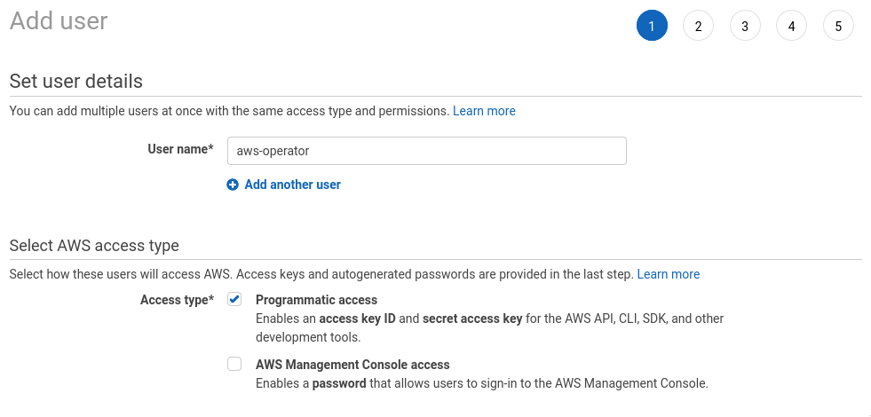
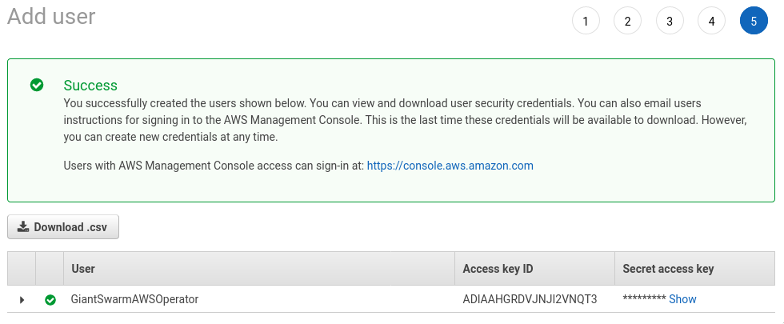
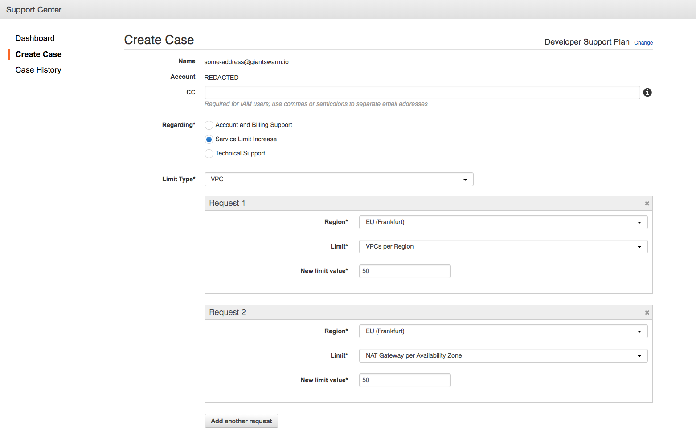
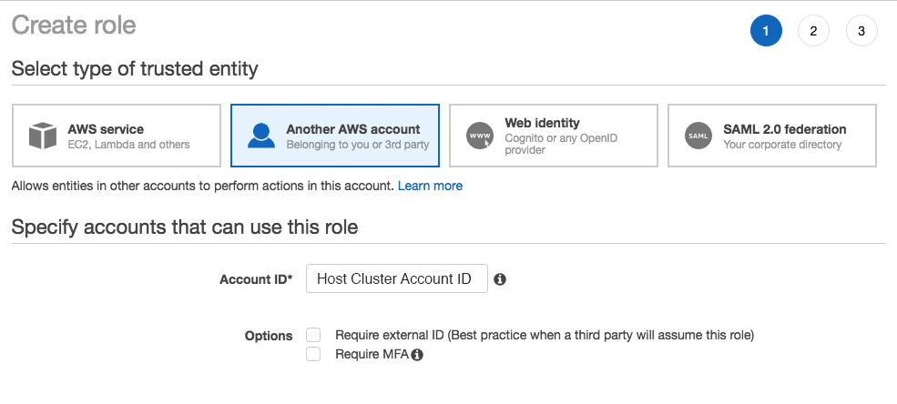
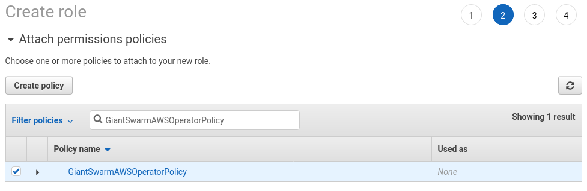
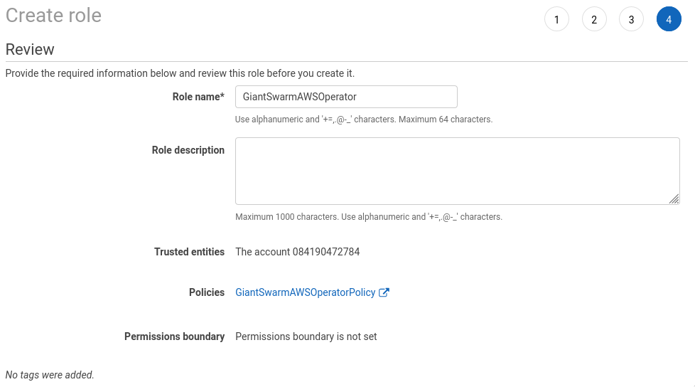

# Prepare an AWS account to run Giant Swarm clusters

As detailed in the [Architecture]() docs,
the workload clusters (the clusters running your Kubernetes workloads) in a Giant
Swarm installation can run in an AWS account separate from the management cluster.
This gives great flexibility depending on requirements and usage
scenarios. For example, it allows the management cluster to be running in an AWS account
dedicated to it, whilst workload clusters operate in separate AWS accounts, depending
on the customer organization using them.

## Overview

In order to run Giant Swarm clusters, the AWS account(s) need to fulfill
these requirements:

- Some AWS account (usually management cluster account):
    - IAM _user_ to be used by our `aws-operator` software.
- All management cluster and workload cluster AWS accounts:
    - Service limits set according to requirements.
    - IAM _role_ to be assumed by our `aws-operator` software.
    - IAM _role_ to be assumed by Giant Swarm staff.

Each Giant Swarm workload cluster belongs to an organization within Giant Swarm.
This organization will later be configured with information about the two
workload cluster IAM roles mentioned above.

We have created a Terraform module to automate the IAM role creation. You can view the code [here](https://github.com/giantswarm/giantswarm-aws-account-prerequisites). You can also use the steps as described in this guide.

## IAM user for aws-operator {#iam-aws-operator-user}

Giant Swarm's service creating and maintaining your workload clusters is
called [aws-operator](https://github.com/giantswarm/aws-operator). It runs in
the management cluster. In order to handle resources in your AWS Tenant
Cluster account, it needs a prepared IAM user allowed to assume IAM roles
created in managed AWS accounts. IAM roles setup is explained in later sections
of this guide. This user is usually created in management cluster AWS account but it
can be created in a different account.

Details of all the required steps to set up this user are explained below:

### 1. Basic user setup {#iam-aws-operator-user-basic}

First, log in to the AWS console for your AWS account. Then open the
[IAM section](https://console.aws.amazon.com/iam/home) of the AWS console and
go to the [Users](https://console.aws.amazon.com/iam/home#/users) subsection.

Now hit the **Add user** button. Enter the user name as `aws-operator` and ensure
only _Programmatic access_ is enabled.



### 2. Review and create user {#iam-aws-operator-user-review}

You should now review the user. Provided everything is correct, hit the *Create*
button. On the following page, you will be presented with an *Access key ID* and
a *Secret access key*. Click the 'show' link to display the access key secret,
and then copy both the key ID and key secret; these will need to be provided to
us later.



## Service limits in AWS accounts {#limits}

A number of limits apply to an AWS account initially, which are described in the
[AWS Service Limits documentation](https://docs.aws.amazon.com/general/latest/gr/aws_service_limits.html).
The following overview lists the limits that have to be adjusted in order to use
the account to operate Giant Swarm workload clusters.

Adjusting a service limit requires a support case in the
[AWS Support Center](https://console.aws.amazon.com/support/home),
where a specific entry form is provided for this type of case. Each limit type
requires a separate case. When creating these, make sure to be logged in to the
AWS account you want to adjust the limits for, and always select the correct
region.

The screenshot below shows the entry form.



These are the limit increases to be requested, grouped by limit type:

- management cluster account:
    - VPC
        - Routes per route table: **200**
- Workload cluster account:
    - VPC
        - VPCs per region: **50**
        - NAT Gateway per Availability Zone per region: **50**
        - IPv4 CIDR blocks per VPC: **50**
    - Elastic IP
        - New VPC Elastic IP Address Limit per region: **50**
    - Elastic Load Balancers
        - Application and Classic Load Balancers per region: **100**
    - Auto Scaling
        - Auto Scaling Groups per region: **250**
        - Launch Configurations per region: **500**
    - EC2 Instances
        - m4.xlarge per region: **250**
        - m4.2xlarge per region: **250**
        - m5.2xlarge per region: **250**
        - other instance types to be used as workers: increase accordingly
    - EC2 Spot Instances
        - For every primary instance type you tend to use spot instances with, set the limit according to your needs.

(Please extend the list of EC2 instances to also contain the types you need frequently.)

When requesting a service limit increase, you will be asked for a description of your use case. You can use this text for the purpose:

> We intend to run multiple Kubernetes clusters in this account, potentially used
by various globally distributed teams. We will be creating and deleting new
clusters frequently.
>
> Each cluster needs its own VPC for security/isolation reasons and its own
Elastic IP address for the NAT gateway.
>
> Each cluster has at least 1 Auto Scaling Group, but can contain multiple ASGs if
multiple instance types are requested as cluster nodes. If we count 50
clusters with up to 5 EC2 instances each, as worker nodes, we need up to 250
ASGs. To update the ASGs in a rolling manner we need to duplicate the ASGs
for a short time during update, hence the 500 Launch Configurations.
>
> The number of EC2 instances used as worker nodes is supposed to be scaled
dynamically based on traffic, hence the high numbers of EC2 instances requested.

## IAM setup in AWS accounts {#iam}

The following steps must all take in the management cluster and workload cluster AWS
accounts.

### Create an IAM role for aws-operator {#iam-aws-operator-role}

A role which can be assumed by `aws-operator` user needs to be created in the
account.

#### 1. Basic role setup {#iam-aws-operator-role-basic}

Open the [IAM section](https://console.aws.amazon.com/iam/home) of the AWS
console and go to the [Roles](https://console.aws.amazon.com/iam/home#/roles)
subsection.

Now hit the **Create role** button. In the following screen, when asked to
_Select type of trusted entity_ chose _Another AWS account_.



The **Account ID** you enter is the ID of the AWS account where `aws-operator`
use is created.

It is important that the **Require external ID** and **Require MFA** options
remain unchecked!

Then proceed to the next step.

#### 2. Permissions setup {#iam-aws-operator-role-permissions}

In the **Attach permissions policies** section, hit the **Create policy** button.

Copy the JSON code with all instances of `${account_id}` and `${arn_prefix}`
replaced from [iam-policy.json] into the JSON editor field and then hit the
**Review policy** button. `${arn_prefix}` is usually `arn:aws`.

In the next step you need to assign a name to the policy. Please use the name

```nohighlight
GiantSwarmAWSOperator
```

#### 3. Attach policy to role {#iam-aws-operator-role-policy}

Enter `GiantSwarmAWSOperator` into the search field to select the policy
you created before. Check the box in the row containing that policy.



Then proceed to the next step.

#### 4. Name the role {#iam-aws-operator-role-name}

The last step of role creation requires you to set a name for the role. Please
set the name to `GiantSwarmAWSOperator`.



You may also set a description for team members to better understand the reasons
for the existence of this role. It could be helpful to also paste a link to this
guide into the field for reference.

### Create an IAM role for Giant Swarm staff {#iam-staff-role}

Finally, we create an IAM role for Giant Swarm support staff to assume in order to
access both AWS accounts. This role must have Giant Swarm's account as a trusted
entity, and we recommend that it enforces multi-factor authentication.

Giant Swarm staff require access to **all** accounts, so **the following steps must
be duplicated in both the management cluster and workload cluster accounts**.

#### 1. Basic role setup {#iam-staff-role-basic}

- Go to the [Roles](https://console.aws.amazon.com/iam/home#/roles)
subsection of the AWS console and select **Create role**. When asked to
**Select type of trusted entity** choose **Another AWS account**.

- In **Account ID** enter the value `084190472784`.

- **Do not** enable **Require external ID**.

- We strongly recommended to check the option **Require MFA** (multi factor
  authentication). This adds an extra authentication step for users to assume the
  role, which increases security.

#### 2. Permission setup {#iam-staff-role-permissions}

Select **Create policy** to create another policy. Use the [admin JSON policy](https://raw.githubusercontent.com/giantswarm/giantswarm-aws-account-prerequisites/master/admin-role/iam-policy.json) file as the policy content. This time, call the policy

```nohighlight
GiantSwarmAdmin
```

#### 3. Attach policy to role {#iam-staff-role-policy}

Attach the new `GiantSwarmAdmin` policy to the role you are creating.

#### 4. Name the role {#iam-staff-role-name}

Name this role:

```nohighlight
GiantSwarmAdmin
```

## Configure the Giant Swarm organization {#configure-org}

In the previous sections, we explained how to create two IAM roles in the
AWS account that's going to run the Giant Swarm workload clusters.

Giant Swarm workload clusters are owned by _organizations_, which allows you to control
access to clusters. Only members of the owner organization have access to
the management functions of a cluster.

In order to run a workload cluster in your AWS account, the organization owning
your cluster has to know about the roles you just created.

If you have direct access to the Giant Swarm REST API, please set the credentials of
your organization with our CLI [gsctl](). Look for the
[`update organization set-credentials`]()/#aws)
command.

In case you are working with a Giant Swarm partner, you might not have
access to the Giant Swarm REST API. In that case, please provide the role ARNs for
the `GiantSwarmAWSOperator` role and the `GiantSwarmAdmin` role to your partner
contact.

After the organization's credentials are set, you can create clusters owned by that
organization. These clusters' resources will be created in your AWS account.

## Further reading

- [Basics and Concepts: Multi Account Support]()
- [gsctl Reference: `update organization set-credentials`]()
- [API: Set credentials](/api/#operation/addCredentials)
- [Giant Swarm Architecture]()
- [Giant Swarm REST API documentation](/api/)
- [AWS Service Limits](https://docs.aws.amazon.com/general/latest/gr/aws_service_limits.html)
- [AWS Support Center](https://console.aws.amazon.com/support/home)

[iam-policy.json]: https://raw.githubusercontent.com/giantswarm/giantswarm-aws-account-prerequisites/master/aws-operator-role/iam-policy.json
