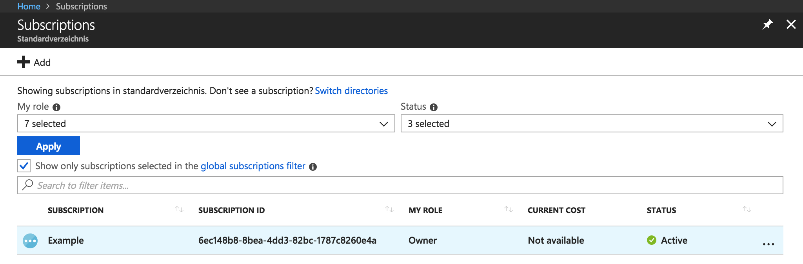

In a Giant Swarm installation the workload clusters (the clusters running your Kubernetes workloads) can run in a separate Azure subscription from the management cluster. This gives greater flexibility depending on the requirements and the use case. For example, it allows the management cluster to be running in one Azure subscription, while workload clusters operate in different Azure subscriptions, depending on the customer entities using them.

Giant Swarm operates workload clusters using a service called `azure-operator` which runs on the management cluster.

## Overview

In order to run Giant Swarm workload clusters, an Azure subscription needs:

- to invite Giant Swarm `azure-operator`'s service principal to the Active Directory your `Subscription` belongs to;
- to assign Giant Swarm `azure-operator`'s service principal an appropriate role on the `Subscription`.

## Procedure

In order to perform necessary actions to deploy and maintain workload clusters in your Azure subscription, `azure-operator`
needs to access the subscription using a Service Principal.
Below we detail the steps necessary to set it up.

### 1. Prerequisites

To create and assign the role to Giant Swarm's Service Principal you need:

- An account with [Owner](https://docs.microsoft.com/en-us/azure/role-based-access-control/built-in-roles#owner) or [User Access Administrator](https://docs.microsoft.com/en-us/azure/role-based-access-control/built-in-roles#user-access-administrator) role.
- [Azure CLI](https://docs.microsoft.com/en-us/cli/azure/install-azure-cli) installed.

### 2. Create the role definition

Download our Role definition template:

```json
{
  "Name": "azure-operator",
  "Description": "Role for github.com/giantswarm/azure-operator",
  "Actions": [
    "*"
  ],
  "NotActions": [
    "Microsoft.Authorization/elevateAccess/Action"
  ],
  "AssignableScopes": [
    "/subscriptions/${SUBSCRIPTION_ID}"
  ]
}
```

Open it and replace `${SUBSCRIPTION_ID}` with your subscription id.

To find out your subscription ID you can use [the Azure portal](https://portal.azure.com/#blade/Microsoft_Azure_Billing/SubscriptionsBlade), as shown in the screenshot below:



Alternatively you can use the Azure CLI as follows:

```nohighlight
$ az account list --output table
Name     CloudName    SubscriptionId                        State    IsDefault
-------  -----------  ------------------------------------  -------  -----------
Example  AzureCloud   6ec148b8-8bea-4dd3-82bc-1787c8260e4a  Enabled  True
```

With the edited role definition in the file `guest.json`, create the role definition using the Azure CLI:

```nohighlight
az role definition create --role-definition @guest.json
```

On success this command prints the created role definition.

### 3. Invite Giant Swarm's service principal to your Active Directory

By visiting the following link you can invite GiantSwarm's Service Principal and authorize it to the Tenant AD on behalf
of your organization. You just need to replace `${TENANT_ID}` with your Tenant ID, and `${SERVICE_PRINCIPAL_ID}` with the
Service Principal ID provided by Giant Swarm.

```nohighlight
https://login.microsoftonline.com/${TENANT_ID}/oauth2/authorize?client_id=${SERVICE_PRINCIPAL_ID}&response_type=code&redirect_uri=https%3A%2F%2Fwww.microsoft.com%2F
```

Please note that the above URL will forward you to the `microsoft.com` home page on success. This is intended.

### 4. Assign the right role to the Giant Swarm service principal

Now you need to give Giant Swarm's Service Principal permission to access resources belonging to your subscription.
In your subscription, go to "Access Control (IAM)" and click the "Add Role" button, then select "Add role assignment".
In the right sidebar that pops up, please select the `azure-operator` role.

If the `Subscription` where the `Management Cluster` is deployed is not the same as the one that will host Workload Clusters,
you also need to give `Network Contributor` role to the Service Principal on the `Management Cluster` subscription.

## Configure Subscription to allow access for Giant Swarm Support

Last step while configuring your Subscription is to grant access for Giant Swarm Ops/Support to your subscription in order to provide 24/7 support. Access to the portal is important part of the provided support, where in some cases manual interventions have to take place.
Easiest way is to use the Azure Lighthouse service, that allows to delegate the management of resources to third parties. While following this part of the guide, you will allow the Giant Swarm Staff group to manage your resources. This is beneficial as you will not have to manage access for each person separately within your subscription, but you will be adding a managed group that is kept up to date with the current active Giant Swarm Staff from our side.

We require a built in role `Contributor` to access the resources that Giant Swarm is deploying and it can be used by default from the [Azure RBAC](https://docs.microsoft.com/en-us/azure/role-based-access-control/built-in-roles).

You can also create your own role assignment with restrictions to access specific Resource Groups, however it needs to be remembered to refresh the role with every newly created cluster so we can provide full support starting from the clusters creation.

When all is set you can simply run this command:

```nohighlight
az deployment create --name <deploymentName (unique by subscription)> \
                     --location <AzureRegion> \
                     --template-file delegatedResourceManagement.json \
                     --parameters delegatedResourceManagement.parameters.json \
                     --verbose
```

You will have to supply a general Delegated Resource Management [template file](https://raw.githubusercontent.com/giantswarm/azure-operator/master/docs/delegatedResourceManagement.json).

The Delegated Resource Management template uses a [parameters file](https://raw.githubusercontent.com/giantswarm/azure-operator/master/docs/delegatedResourceManagement.parameters.json) to supply the needed variables for configuration.
Please remember to change the `roleDefinitionId` in case you would like to use your custom role definition. Moreover ask your Account Engineer so he can provide you the `GiantSwarmPrincipalID` and `GiantSwarmTenantID`

This command should be run for all subscriptions that are used for Giant Swarm workload clusters as well as the management cluster that orchestrates it all.  

## Accept legal terms for deployment of Flatcar image

Giant Swarm deploys [Flatcar](https://www.flatcar-linux.org/) image developed by Kinvolk from Azure Marketplace. In order to be able to run the image, it is required by Azure to accept the legal terms.
Please run the following command prior to creating a cluster on a given subscription:

```nohighlight
az vm image terms accept --offer flatcar-container-linux-free --plan stable --publisher kinvolk
```

This acceptance should be performed once for all subscriptions that are used to run Giant Swarm workload clusters.

## Further reading

- [Basics and Concepts: Multi-Account Support](/basics/multi-account/)
- [Azure Lighthouse](https://docs.microsoft.com/en-us/azure/lighthouse/how-to/onboard-customer)
