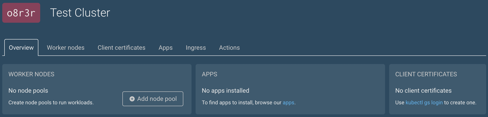
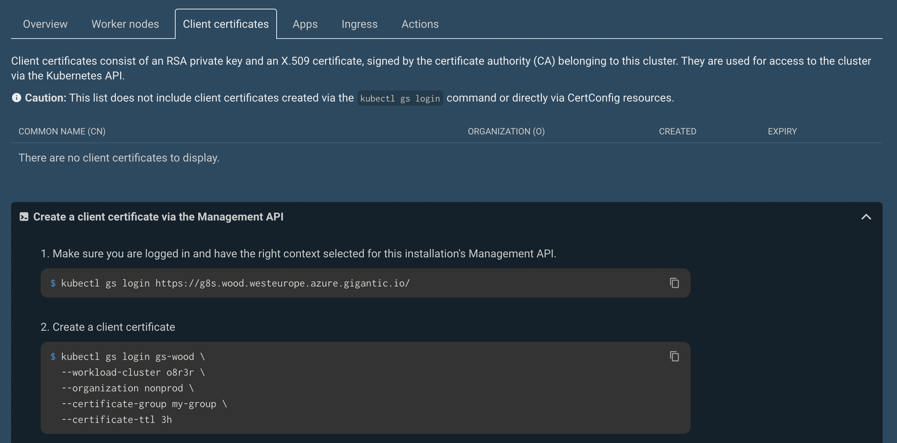
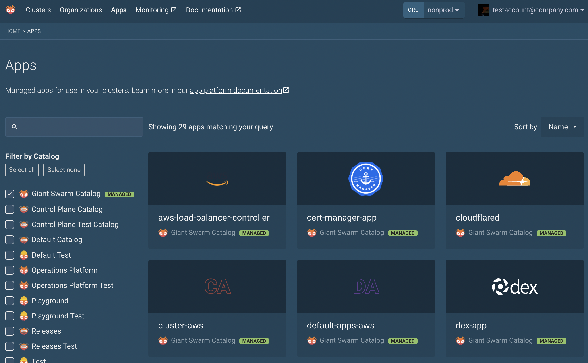
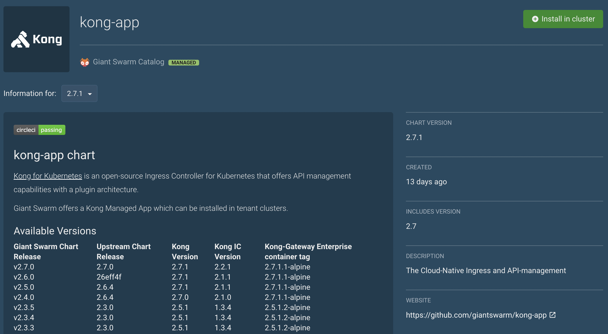

To run your business applications on Kubernetes, you need a workload cluster. The `kubectl-gs` tool ([reference]()), as already installed in the [previous tutorial](), is used to create such clusters.

## Step 1: Log in to the management cluster

Please follow the article [Access to the management cluster](). In short, you need to point kubectl to the management cluster:

```sh
kubectl gs login "https://api.<management cluster domain>/"

# For instance:
kubectl gs login "https://api.wombat.eu-west-1.aws.gigantic.io"
```

We use the management cluster name `wombat` as example in this tutorial.

The commands in this section should be run in the management cluster's kubectl context.

Since you have already logged in the MC, you can choose the context like this:

```sh
kubectl config use-context gs-MC_NAME

# For instance:
kubectl config use-context gs-wombat
```

## Step 2: Template and create the workload cluster

You will now create resources with `kubectl gs`. In particular, this tutorial uses the `kubectl gs template` command to create valid YAML for each resource. Alternatively, the Web UI provides a visual way to create clusters.

First, template a cluster ([command reference]()):




[Choose a release version here](https://docs.giantswarm.io/changes/workload-cluster-releases-for-azure), or use `kubectl gs get releases`, and fill it into this example command:

```sh
# See hint about `--name` below!
kubectl gs template cluster \
  --provider azure \
  --organization testing \
  --release 19.0.1 `# please fill in your desired release version` \
  > cluster.yaml
```




[Choose a release version here](https://docs.giantswarm.io/changes/workload-cluster-releases-for-aws), or use `kubectl gs get releases`, and fill it into this example command:

```sh
# See hint about `--name` below!
kubectl gs template cluster \
  --provider aws \
  --organization testing \
  --release 19.0.0 `# please fill in your desired release version` \
  > cluster.yaml
```




This will automatically use the latest release of the relevant Helm charts [cluster-aws](https://github.com/giantswarm/cluster-aws/blob/master/CHANGELOG.md) and [default-apps-aws](https://github.com/giantswarm/default-apps-aws/blob/master/CHANGELOG.md) (bundle of default apps):

```sh
# See hint about `--name` below!
kubectl gs template cluster \
  --provider capa \
  --organization testing \
  > cluster.yaml
```




This will automatically use the latest release of the relevant Helm charts [cluster-azure](https://github.com/giantswarm/cluster-azure/blob/master/CHANGELOG.md) and [default-apps-azure](https://github.com/giantswarm/default-apps-azure/blob/master/CHANGELOG.md) (bundle of default apps):

```sh
# See hint about `--name` below!
kubectl gs template cluster \
  --provider capz \
  --organization testing \
  --region westeurope \
  --azure-subscription-id 00000000-0000-0000-0000-000000000000 `# fill in your subscription ID` \
  > cluster.yaml
```




If no name is specified for a workload cluster, a random one like `rfjh2` will be generated. We recommend you choose a naming scheme suiting your organization, and then stick to it. Add the `--name` parameter to specify the cluster name.

This will create a `cluster.yaml` file containing all the Custom Resources (CRs) necessary to create the cluster.

For the CAPI product family, you will notice that clusters are templated exactly like managed apps (i.e. as `App` resource), with `kubectl-gs` filling certain default values into the configuration. This is different from vintage products.

In the vintage product family, no worker node pool is created by default, so you should attach one:




```sh
kubectl gs template nodepool \
  --provider azure \
  --cluster-name "<please fill in the cluster name from cluster.yaml>" \
  --description "Worker node pool for workload cluster" \
  --organization testing \
  --release 19.0.1 `# please fill in your desired release version` \
  > nodepool.yaml
```

This will create a `nodepool.yaml` file with all the CRs needed for attaching a node pool to the cluster created in the previous step.




This is not needed for CAPI. The `nodePools` value in the cluster app has a default. For example, see [nodePools configuration for cluster-aws](https://github.com/giantswarm/cluster-aws/blob/master/helm/cluster-aws/README.md#node-pools) when using the CAPA-based product (AWS cloud).




Templating these and other resources as YAML files is reasonable if you prefer deployments using GitOps (YAML manifests committed and deployed from a Git control repository) or want to develop/deploy using scripts or the command line, without manual steps in the web interface. We recommend running `kubectl gs template [...] --help` and the online [reference]() to see available parameters. For clusters and node pools, you probably want to choose a different instance size (varies in CPU, memory, pricing), maximum number of nodes, cloud provider region, or IP CIDRs. Instead of the kubectl-gs command line, you can also manually edit the YAML file with the help of our documentation for cluster configuration options (example: [configuration options for cluster-aws](https://github.com/giantswarm/cluster-aws/blob/master/helm/cluster-aws/README.md)).

To _actually_ create the resources – the workload cluster and (only for vintage product family) worker node pool – you need to apply the manifests. Ensure you are still pointing to the management cluster's kubectl context and run:

```sh
kubectl apply -f cluster.yaml

# Only for vintage product family:
kubectl apply -f nodepool.yaml
```

Deletion works in the same way: run `kubectl delete -f FILENAME.yaml` and the operators in the management cluster will delete the resources in a few minutes. Please do not directly delete the CAPI custom resources (such as `Cluster`, `AWSCluster` or `MachineDeployment`) since this may leave resources behind or even lead to inadvertently recreating the cluster once the `App` is reconciled again. Deletion should be done exactly like the creation, using the original manifests. For the CAPI product family, our example output file `cluster.yaml` contains 2 `App` and 2 `ConfigMap` manifests.

### Private workload clusters

By default, the created Kubernetes cluster API endpoint is public. See [Private clusters]() if you want to limit networking to/from the cluster.

## Step 3: Watch the status of workload clusters

In the Web UI, click on the cluster's name to see its details. The workload cluster's name is shown on the top-left (in the screenshot: `o8r3r`).



For the vintage product family, if you did not yet attach a node pool to the WC as shown above, you can now add one by clicking the "Add node pool" button.

Using the command line, you can also watch the creation and status of the workload cluster:




```sh
kubectl gs get clusters -A

kubectl gs get nodepools -A
```




Either use kubectl-gs:

```sh
kubectl gs get clusters -A
```

Or use other kubectl tooling to display the relations and status of the CAPI manifests:

```sh
kubectl describe clusters.cluster.x-k8s.io -n org-testing name-of-workload-cluster

# Using CAPI's clusterctl tool (https://cluster-api.sigs.k8s.io/clusterctl/overview.html)
clusterctl describe cluster -n org-testing name-of-workload-cluster --show-conditions all

# Using kubectl-tree plugin (https://github.com/ahmetb/kubectl-tree)
kubectl krew install tree
kubectl tree clusters.cluster.x-k8s.io -n org-testing name-of-workload-cluster
```

Note how our example commands use the fully-qualified CRD name `clusters.cluster.x-k8s.io`. The shorthands `cluster` or `clusters` also work as long as there are no CRDs with a conflicting name installed.




## Step 4: Log in to the workload cluster

Using the Web UI, click on the workload cluster and then the _Client certificates_ tab. Copy the command suggested at the _Create a client certificate_ step. As value for `--certificate-group`, you can use `system:masters`. More information about group certificates can be found in [Kubernetes RBAC: Default roles and role bindings](https://kubernetes.io/docs/reference/access-authn-authz/rbac/#default-roles-and-role-bindings).



In our example, therefore, we will run

```sh
kubectl gs login gs-wombat \
  --workload-cluster o8r3r \
  --organization giantswarm \
  --certificate-group system:masters \
  --certificate-ttl 3h
```

At this point, you are logged in to the workload cluster, with full access. Try `kubectl get pod -A`, for example, to take a look into the cluster.

Some of the custom resource definitions (CRDs) available in the management cluster are not available in the WC because those concepts do not exist in workload clusters. For instance, if we try to get the organizations, we get an error, because they are a concept that makes sense in the MC but not in the WC:

```text
$ kubectl get orgs
error: the server doesn't have a resource type "organizations"
```

The WCs are where the "actual" work happens, i.e. where Giant Swarm-supported managed apps and your business applications are deployed. The easiest way to check whether an application is running is `kubectl get pods -A | grep APPLICATION_NAME`, for instance: `kubectl get pods -A | grep kong`.

## Step 5: Template and deploy managed apps

In addition to workload clusters, you can also template applications. Apps belong to catalogs. While you can define your own catalogs, we already provide two: `giantswarm` (_Giant Swarm Catalog_) contains applications that we know how to manage; `giantswarm-playground` (_Playground_) contains applications that we have integrated but are not managed by us. Other catalogs such as the _Giant Swarm Cluster Catalog_ are used for templating of clusters (which you did above).

You can easily surf catalogs from the _Apps_ section in the Web UI:



Let's assume you want to install the Kong app. By clicking on it, we can see its details:



With the web interface, you can configure and deploy the app by clicking _Install in this cluster_. In this tutorial, we show how to template the app into a YAML manifest. The command can be seen on the bottom of the Web UI app overview, for instance:

```sh
kubectl gs template app \
  --catalog giantswarm \
  --name kong-app \
  --target-namespace test-namespace \
  --cluster-name o8r3r \
  --version 3.3.0 \
  > kong-app.yaml
```

This writes the `App` CR to the file `kong-app.yaml`.

To deploy the app, deploy it, again using the management cluster context:

```sh
kubectl apply -f kong-app.yaml
```

Notice that by running `kubectl gs template app --help` you can list all the options that can be useful when templating an app. For instance, the `--user-configmap` and `--user-secret` options allow for adding YAML files containing useful configuration or secrets.

Here is an example which disables the config flag `proxy.enabled` for Kong:

```sh
cat > kong-config.yaml <<EOF
proxy:
  enabled: false
EOF

kubectl gs template app \
  --catalog giantswarm \
  --name kong-app \
  --target-namespace test-namespace \
  --cluster-name o8r3r \
  --version 3.3.0 \
  --user-configmap kong-config.yaml \
  > kong-app.yaml
```

In general, whenever templating and/or installing an application, please read its documentation page on the Web UI to be sure you are configuring everything correctly.

## Step 6: Updates of workload clusters and managed apps

### Updating an application

Updating an application can either be done in the Web UI, or by using `kubectl gs`.

Beware: before performing any updates, verify that there are no breaking changes! If there are breaking changes, prepare for the upgrade accordingly. We document breaking and other changes in the repository's `CHANGELOG.md` (example: [changelog for Kong app](https://github.com/giantswarm/kong-app/blob/main/CHANGELOG.md)). Mind that the upstream project can also introduce major changes, so looking at their changelog is also reasonable.

You can update (or roll back) an application by running the following command in the management cluster:

```sh
kubectl gs update app \
  --name APP_NAME \
  --namespace NAMESPACE \
  --version NEW_VERSION
```

For instance:

```sh
kubectl gs update app \
  --name kong \
  --namespace test-namespace \
  --version 3.3.0
```

### Updating a cluster

Cluster updates can be easily performed straight away or scheduled for a specific moment in time. The latter is a feature in the vintage product family that many customers find very useful because it allows them to schedule updates without the need to physically be there to "press the button".

More information on updating a cluster can be found [in the kubectl-gs reference]().
