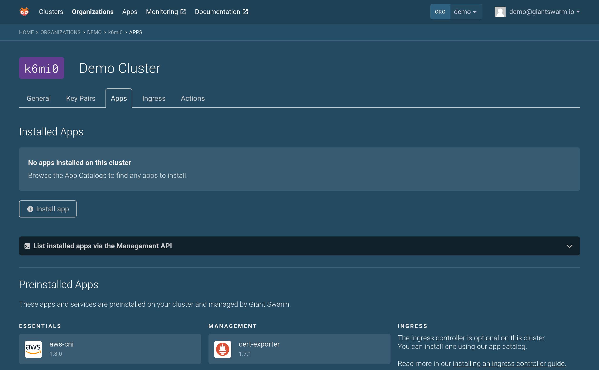
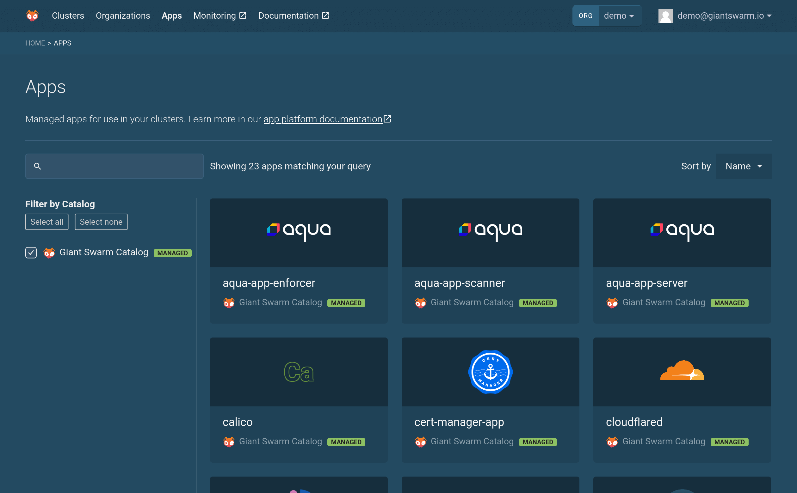
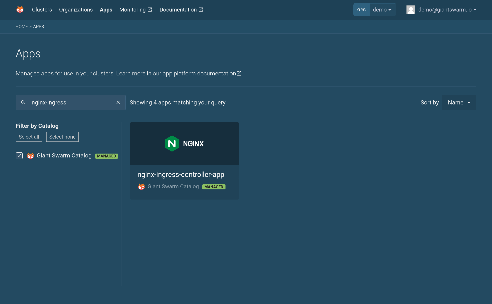
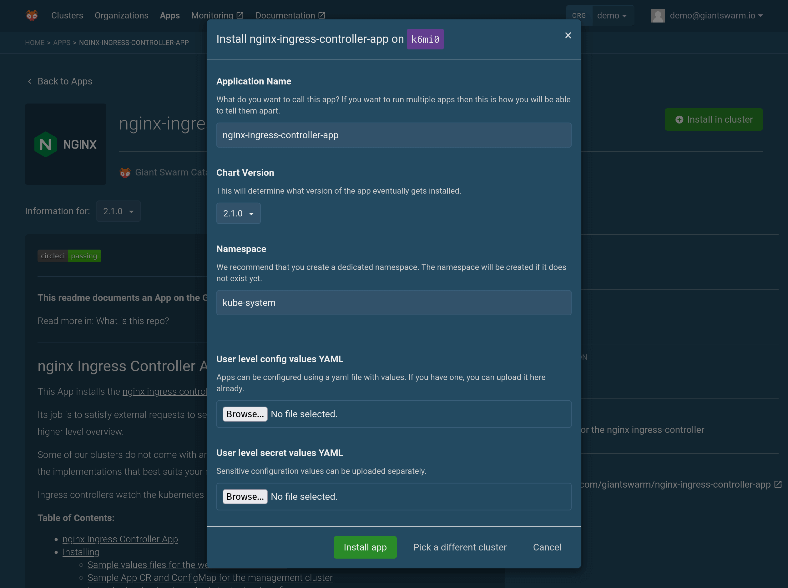

An ingress controller helps you expose your services to the outside world.

## How do I Install my own ingress controller

Using our Web UI you can install an Ingress NGINX Controller using our App Catalog.

1. Click "Install app" from the "Apps" tab when viewing your cluster
  

2. Search for "ingress-nginx" in the list of apps
  

3. Select "ingress-nginx" from the "Giant Swarm Catalog"
  

4. Click "Install in cluster"

5. Click "Install app" (In case you want any special configuration, this is where you can also provide a 'values.yaml' with your customized settings)
  

After a few moments, the Ingress NGINX Controller should be running on your cluster.

More information about the Ingress NGINX Controller can be found in the [ingress-nginx-app](https://github.com/giantswarm/ingress-nginx-app) repository.

## Further reading

- [Accessing pods and services from the outside]()
- [Running multiple Ingress NGINX Controllers]()
- [Advanced ingress configuration]()
