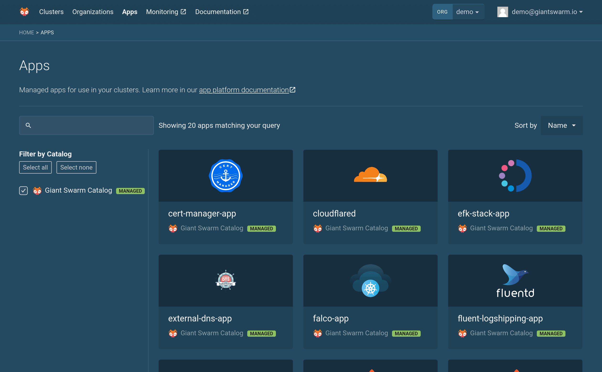

# Installing an ingress controller

An ingress controller helps you expose your services to the outside world.

## Which workload cluster releases do not ship with an ingress controller

Clusters on our AWS, Azure, and KVM (On-premises) installations that have a workload cluster release version newer than `10.0.0` (AWS), `12.0.0` (Azure), and `12.2.0` (KVM) ship without an ingress controller by default. (Related: [Preinstalled and optional apps in workload clusters]())

That allows you full control to choose which and how many ingress controllers you
want to run on your cluster.

## How do I Install my own ingress controller

Using our Web UI you can install an NGINX ingress controller using our App Catalog.

1. Click "Install App" from the "Apps" tab when viewing your cluster
  

2. Click "Browse Apps" from the "Giant Swarm Catalog"
  

3. Click "nginx-ingress-controller-app" from the list of apps.
  

4. Click "Configure & Install"

5. Click "Install App" (In case you want any special configuration, this is where you can also provide a 'values.yaml' with your customized settings)
  

After a few moments, the NGINX ingress controller should be running on your cluster.
