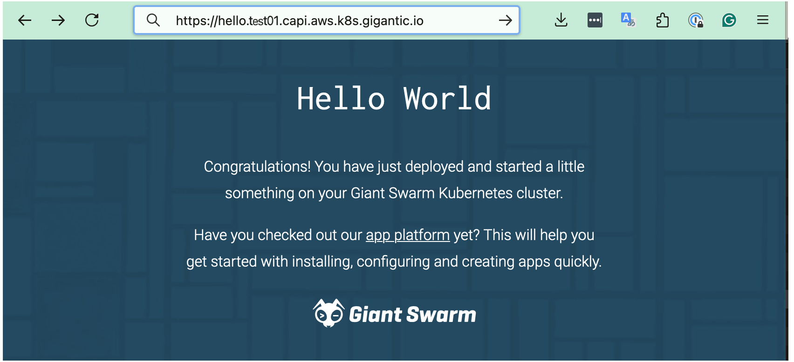

The _Giant Swarm App Platform_ is built on top of [Helm](https://helm.sh/) charts and allows you to manage apps and their configurations represented by `App` custom resources (CRs) for multiple clusters, from a single place: the [Platform API]() on the management cluster.

In this guide, we will install a `hello-world` app together with an Ingress NGINX Controller to serve the web application publicly. We will do this by using kubectl, to create an [App]() CR using the platform API of your management cluster.

In general, you can manage `App` CRs with any tool that can communicate with the Kubernetes API such as Helm or GitOps tools (like Argo CD or Flux CD).

## Requirements

First of all, you need a running workload cluster. If you don't have one, you can create [following the steps describe in the previous post]().

The App CRs are stored in a organization namespace you are part of, together with the cluster resources. You can list the organizations by running the following command:

```nohighlight
kubectl gs get organizations
```

and you will see the organization that you have access to. Make sure you target the right organization where your workload cluster is running. You can switch to the organization namespace before creating the App CR by running:

```nohighlight
kubectl config set-context --current --namespace=org-namespace
```

That way you ensure that the App CR is created in the correct namespace.

## Step 1: Check applications installed in the cluster

First we will take a look to the existing applications already running in the cluster. By default the cluster has some default apps to make the cluster operational. Since you can have more than one cluster in the namespace lets filter the apps by the cluster name.

```nohighlight
kubectl gs -n org-namespace get apps | grep CLUSTER_ID

NAME                                 VERSION          CREATED_AT   LAST_DEPLOYED        STATUS
test01                                 2.0.0               13m          12m             deployed
test01-app-operator                    6.11.0              12m          12m             deployed
test01-aws-ebs-csi-driver-smons        0.1.0               12m          42s             deployed
test01-aws-pod-identity-webhook        1.16.0              12m          117s            deployed
...
test01-observability-bundle            1.5.2               12m          4m28s           deployed
test01-security-bundle                 1.8.0               12m          3m32s           deployed
test01-teleport-kube-agent             0.9.2               12m          4m24s           deployed
test01-vertical-pod-autoscaler         5.2.4               12m          110s            deployed
```

__Note__: We don't enforce cluster prefix but it's a good practice to have it.

As you can see the we're several applications already in the cluster. Most of the apps run directly in the workload cluster itself, but app operator runs in the cluster namespace and it's charge to actually deploy the apps in the workload cluster. Learn more about this process [in this guide]().

## Step 2: Install an ingress nginx controller

Before we install our publicly accessible `hello-world` app, we need to have an ingress controller running in the cluster. The ingress controller is responsible for routing the incoming traffic to the correct service in the cluster and make it available to the public.

To know which applications are available for customers we've extended the platform with two custom resources. First resource is the [`AppCatalog`]() which is a recipient to collect application definitions that are available to install in the workload clusters. The second is the [`AppCatalogEntry`]() which is the representation of the application definition which has a version defined.

By default there is a single catalog in the platform with the applications maintained by us:

```nohighlight
kubectl gs get catalogs
NAME                    CATALOG URL
giantswarm              https://giantswarm.github.io/giantswarm-catalog/
```

__Note__: You can [create your own catalog]() and add your own applications to it.

To browse which applications are available in the catalog you can run the following command:

```nohighlight
kubectl get appcatalogentries -n default -l application.giantswarm.io/catalog=giantswarm
````

In our case we're interested in the ingress nginx controller, so let's check the latest version available in the catalog:

```nohighlight
kubectl get appcatalogentries -n default -l app.kubernetes.io/name=ingress-nginx
NAME                             CATALOG      APP NAME        VERSION   UPSTREAM VERSION   AGE
giantswarm-ingress-nginx-3.9.2   giantswarm   ingress-nginx   3.9.2     1.11.2             2d4h
...
```

The latest version of the ingress nginx controller is `3.9.2`. Now, we can install the controller just by creating an App CR. We can use the `kubectl gs template app` command to generate the App CR using the latest version from the previous command.

```nohighlight
kubectl gs template app \
  --catalog=giantswarm \
  --cluster-name=test01 \
  --organization=giantswarm \
  --app-name=test01-ingress-nginx \
  --name=ingress-nginx \
  --target-namespace=kube-system \
  --version=3.9.2 > ingress-nginx.yaml
```

You can push the generated App CR file to your GitOps pipeline or apply it directly to the cluster with the following command:

```nohighlight
kubectl apply -f ingress-nginx.yaml
```

After few second you should see the ingress controller running in the cluster:

```nohighlight
kubectl get app ingress-nginx
NAME            INSTALLED VERSION   CREATED AT   LAST DEPLOYED   STATUS
test01-ingress-nginx   3.9.2               16s          14s             deployed
```

## Step 3: Deploy hello-world app

The next step is deploying the `hello-world` application using the same approach as we did with the ingress controller.

First we list the versions with:

```nohighlight
kubectl get appcatalogentries -n default -l app.kubernetes.io/name=hello-world
NAME                           CATALOG      APP NAME      VERSION   UPSTREAM VERSION   AGE
...
giantswarm-hello-world-2.3.2   giantswarm   hello-world   2.3.2     0.2.1              72d
```

And later we template the application to target the right organization and cluster:

```nohighlight
kubectl gs template app \
  --catalog=giantswarm \
  --cluster-name=test01 \
  --organization=giantswarm \
  --name=test01-hello-world \
  --target-namespace=default \
  --version=2.3.2 > hello-world.yaml
```

Lets take a look at the `App CR` to learn main fields available:

```yaml
apiVersion: application.giantswarm.io/v1alpha1
kind: App
metadata:
  name: test01-hello-world
  namespace: org-giantswarm
spec:
  catalog: giantswarm
  kubeConfig:
    inCluster: false
  name: hello-world
  namespace: kube-system
  version: 2.3.2
```

The `name` field is the name of the app in the catalog meanwhile `--app-name` designates the name of the app instance installed in the cluster. Keep in mind that the app name is subject to different length limits, depending on how the app is deployed. Using a name under 30 characters is recommended.

After few seconds you will see the deployed status:

```nohighlight
kubectl get app test01-hello-world
NAME                INSTALLED VERSION   CREATED AT   LAST DEPLOYED   STATUS
test01-hello-world   2.3.2               11s          8s              deployed
```

Now you can access your workload cluster and check the app running and see which ingress URL has been generated:

```nohighlight
kubectl get ingress -n default
NAME          CLASS   HOSTS                                        ADDRESS                                                                       PORTS     AGE
hello-world   nginx   cluster.provider.k8s.giantswam.io   ab49484.cn-north-1.elb.amazonaws.com.cn   80, 443   2m29s
```

Sadly the URL isn't accessible because we've not passed the right domain to the ingress controller.

## Step 4: Configuring the right domain

For every workload cluster there is a default wildcard record created automatically by our controllers. The domain is composed by the cluster name and the provider, the region and the base domain.

```nohighlight
kubectl get cm test01-cluster-values -ojsonpath="{.data.values}" | yq .baseDomain
test01.capi.aws.k8s.gigantic.io
```

With that information we can customize our `hello-world` app to use the right domain. Checking the [app values schema](https://github.com/giantswarm/hello-world-app/blob/main/helm/hello-world/values.schema.json) we can see the `host` property should override in `hosts` and `tls` sections.

Lets create a file with the values we want to override:

```nohighlight
cat > hello-world-values.yaml <<EOL
ingress:
hosts:
- host: hello.test01.capi.pek.aws.k8s.adidas.com.cn
  paths:
  - path: /
    pathType: Prefix
tls:
- secretName: hello-world-tls
  hosts:
  - hello.test01.capi.pek.aws.k8s.adidas.com.cn
EOL
```

Now we can template the app again passing the file reference:

```nohighlight
kubectl gs template app \
  --catalog=giantswarm \
  --cluster-name=test01 \
  --organization=giantswarm \
  --name=test01-hello-world \
  --target-namespace=default \
  --user-configmap=hello-world-values.yaml \
  --version=2.3.2 > hello-world.yaml
```

We push the file or apply the changes to the platform API and wait a couple of seconds to see the changes:

```nohighlight
kubectl get app test01-hello-world
NAME                                  INSTALLED VERSION   CREATED AT   LAST DEPLOYED   STATUS
test01-hello-world                     2.3.2               51m          8s             deployed
```

At this point you should be able to access the `hello-world` app using the domain you have configured. Check the `URL` value in the ingress resource has been updated to be sure the changes have been propagated. Now you should be able to see the hello world frontend.



__Note__:You can read more about app platform configuration [here]().

## Step 5: Deleting the hello-world app

The deletion of an app is as simple as creating it. You can delete the app by running:

```nohighlight
kubectl delete -f hello-world.yaml
kubectl delete -f ingress-nginx.yaml
```

## Next step

After learn how to deploy an application in the workload cluster, lets bump into [a different connectivity options you can rely on within the platform]().
