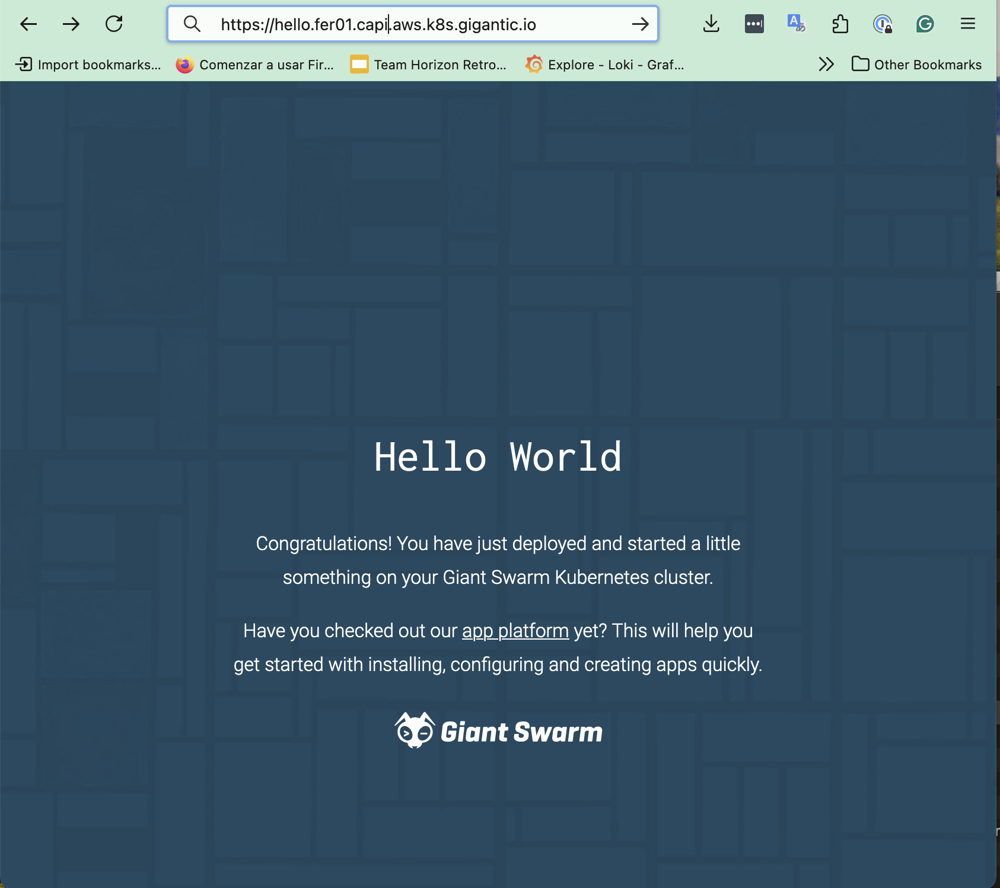

Giant Swarm runs Flux on every management cluster, and Flux HelmRelease is the recommended way to deploy applications to your workload clusters. This guide walks you through installing a hello-world demo and exposing it through Envoy Gateway (the Giant Swarm default for ingress traffic) with a Gateway API `HTTPRoute`.

**Note:** If you have existing deployments using the legacy Giant Swarm `App` custom resource, see [App CR deprecation]() for the migration path. For new deployments, follow this guide.

For a deeper reference covering every Flux flag and option, see [Deploying an application via a Flux HelmRelease]().

## Requirements

You need:

- A running workload cluster. If you don't have one, follow [Provision your first workload cluster]().
- Gateway API and Envoy Gateway installed in that cluster. The quickest way is the Gateway API bundle. See [Installing Gateway API with Envoy Gateway](). Once installed, the bundle creates a default Gateway named `giantswarm-default` that your routes can attach to.
- The [Flux CLI](https://fluxcd.io/flux/cmd/) installed locally.
- Access to the management cluster (see [kubectl gs login]()).
- Access to the organization namespace where your cluster lives.

List the organizations you have access to:

```sh
kubectl gs get organizations
```

Then set environment variables for the org, namespace, and cluster name. We use these in every command below:

```sh
export ORGANIZATION=testing
export NAMESPACE=org-${ORGANIZATION}
export CLUSTER=test01
```

## Step 1: Check what's already installed

Before adding anything, list the HelmReleases already running in your organization namespace, filtered to your cluster:

```sh
flux get helmreleases \
  --namespace ${NAMESPACE} \
  --selector giantswarm.io/cluster=${CLUSTER}
```

You'll see the apps that ship with the cluster (default-apps bundle, observability tooling, and so on). Confirm the Gateway API bundle is among them. If it isn't, install it first using the [Gateway API installation guide]().

You can also confirm the default Gateway is ready, from your workload cluster:

```sh
kubectl get gateway --namespace envoy-gateway-system giantswarm-default
```

The `PROGRAMMED` column should read `True` once the Gateway is reconciled.

## Step 2: Find your cluster's base domain

Every workload cluster comes with a wildcard DNS record, so apps you expose are reachable at `<name>.${CLUSTER}.<base-domain>`. Read the base domain from the cluster values ConfigMap:

```sh
kubectl get configmap \
  --namespace ${NAMESPACE} \
  ${CLUSTER}-cluster-values \
  -o jsonpath="{.data.values}" | grep baseDomain
```

You'll see something like `baseDomain: test01.capi.aws.k8s.gigantic.io`. Save that for the next step.

## Step 3: Deploy the hello-world app

The hello-world chart includes an `Ingress` resource by default. Since we're routing through Gateway API instead, disable that with a small `values.yaml`:

```yaml
ingress:
  enabled: false
```

Create the OCIRepository for the chart:

```sh
flux create source oci ${CLUSTER}-hello-world \
  --url oci://gsoci.azurecr.io/charts/giantswarm/hello-world \
  --tag 2.9.1 \
  --namespace ${NAMESPACE} \
  --interval 60m
```

Then the HelmRelease, pointing at your `values.yaml`:

```sh
flux create helmrelease ${CLUSTER}-hello-world \
  --namespace ${NAMESPACE} \
  --chart-ref OCIRepository/${CLUSTER}-hello-world \
  --values ./values.yaml \
  --kubeconfig-secret-ref ${CLUSTER}-kubeconfig \
  --target-namespace default \
  --label giantswarm.io/cluster=${CLUSTER} \
  --release-name ${CLUSTER}-hello-world \
  --interval 60m
```

What each flag does:

- `--chart-ref` points at the OCIRepository created in the previous command.
- `--kubeconfig-secret-ref` tells Flux which workload cluster to install into. The Secret is created for you alongside the cluster and follows the `<cluster>-kubeconfig` naming convention.
- `--target-namespace` is the namespace in the workload cluster where the chart's resources are created.
- `--label giantswarm.io/cluster=${CLUSTER}` makes the resource show up under the correct cluster in the developer portal.

Wait for the HelmRelease to report `Ready=True`:

```sh
flux get helmrelease \
  --namespace ${NAMESPACE} \
  ${CLUSTER}-hello-world
```

At this point, the hello-world Service is running in the workload cluster but isn't reachable from outside yet.

## Step 4: Create an HTTPRoute

Apply an `HTTPRoute` to the workload cluster that attaches to the default Gateway and routes `hello.<base-domain>` to the hello-world Service. Replace the base domain with yours:

```yaml
apiVersion: gateway.networking.k8s.io/v1
kind: HTTPRoute
metadata:
  name: hello-world
  namespace: default
spec:
  parentRefs:
    - name: giantswarm-default
      namespace: envoy-gateway-system
  hostnames:
    - hello.test01.capi.aws.k8s.gigantic.io
  rules:
    - matches:
        - path:
            type: PathPrefix
            value: /
      backendRefs:
        - name: hello-world
          port: 80
```

Save it as `hello-world-route.yaml` and apply it against the workload cluster:

```sh
kubectl apply -f hello-world-route.yaml
```

Check that the route is accepted by the Gateway:

```sh
kubectl describe httproute --namespace default hello-world
```

Look for `Condition: Accepted, Status: True` in the output.

## Step 5: Try it out

Curl the hello-world endpoint over HTTP:

```sh
curl -Is http://hello.test01.capi.aws.k8s.gigantic.io
```

You should get back `HTTP/1.1 200 OK`. To enable HTTPS, add the `hello` subdomain to your Gateway's HTTPS listener and configure cert-manager for Gateway API. See [Installing Gateway API with Envoy Gateway]().



## Step 6: Clean up

To remove the demo, delete the HTTPRoute from the workload cluster, then the HelmRelease and OCIRepository from the management cluster:

```sh
kubectl delete -f hello-world-route.yaml

flux delete helmrelease --namespace ${NAMESPACE} ${CLUSTER}-hello-world
flux delete source oci  --namespace ${NAMESPACE} ${CLUSTER}-hello-world
```

## Next step

After learning how to deploy an application in the workload cluster, dive into [how networking works in your cluster and how to configure security hardening of your application]().
