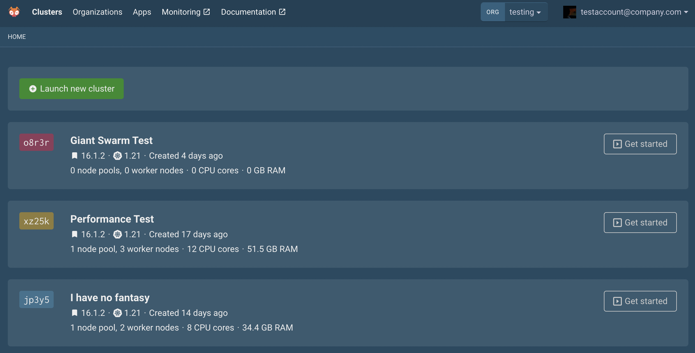
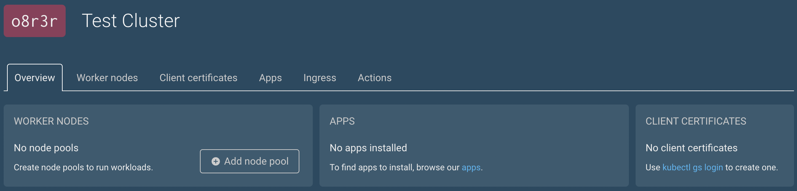
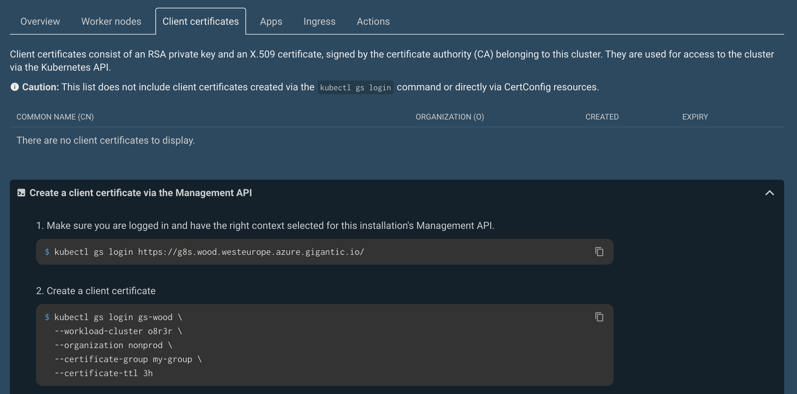
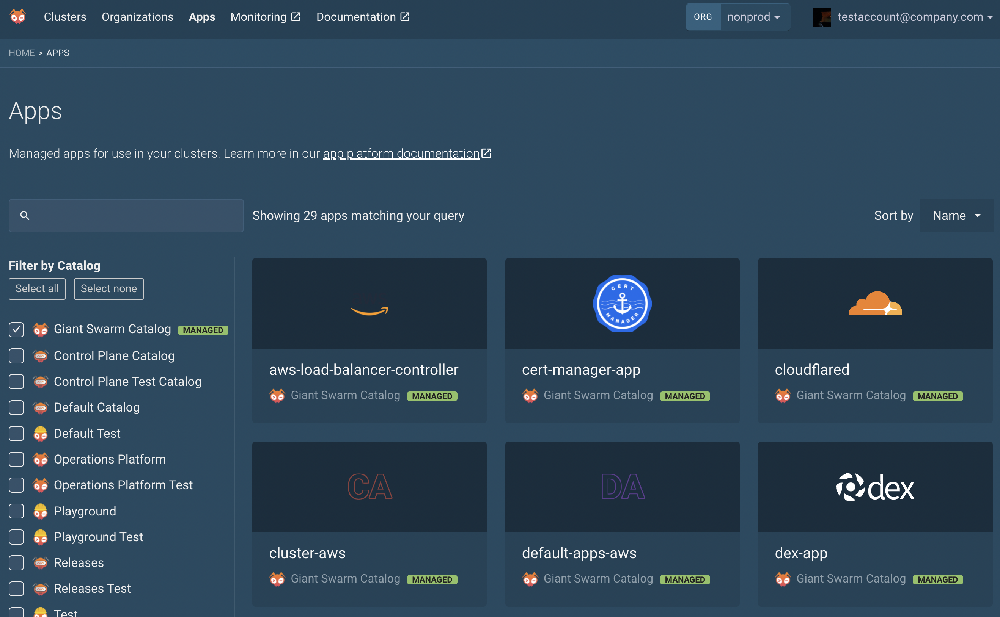
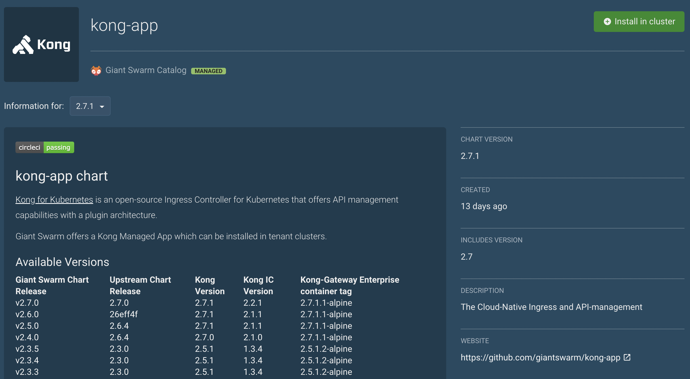

As better explained in the [reference](), kubectl-gs is a CLI and a kubectl plugin (invoked as kubectl gs) for the Giant Swarm Management API. In this guide, you will learn how to use `kubectl-gs` for your daily tasks on the Giant Swarm installation.

## Step 1: Installing the necessary tools

In order to use `kubectl-gs`, you need to have a few tools installed in your computer:

1. install [kubectl](https://kubernetes.io/docs/tasks/tools/#kubectl)
2. install [krew](https://krew.sigs.k8s.io/)
3. install `kubectl-gs` by running: `kubectl krew install gs`

## Step 2: Logging in to your cluster

First of all, for the purpose of this tutorial, we will start from Giant Swarm's web interface, reachable via a URL that we as Giant Swarm provide you when we finish setting up a cluster. The hostname in the URL usually starts with `happa`, which is how we call the web interface. 

After having accessed happa, you will see the clusters belonging to the organization shown in the top-right corner (in this case, `testing`).



What is interesting here is that, by clicking on the "List clusters via the Management API", you will be able to see which command to run for logging in to your cluster. **Run this command in your shell!**

After having run the command, you should see a message similar to the following:

```text
A new kubectl context has been created named 'gs-wombat' and selected. To switch back to this context later, use either of these commands:
  kubectl gs login wombat
  kubectl config use-context gs-wombat
```

## Step 3: Sneaking around the Management Cluster

The command run in the previous step logs the user in the Management Cluster (MC). As the name suggests, this cluster is used for managing all the Workload Clusters (WCs), which are the clusters doing the "actual" work.

Let's run some commands and understand what's happening under the hood.

The first command is `kubectl get nodes`. This will show us the nodes making up our management cluster.

```bash
➜  kubectl get nodes
NAME                                          STATUS   ROLES    AGE   VERSION
ip-10-0-5-103.eu-central-1.compute.internal   Ready    worker   19h   v1.21.9
ip-10-0-5-121.eu-central-1.compute.internal   Ready    master   19h   v1.21.9
ip-10-0-5-14.eu-central-1.compute.internal    Ready    master   19h   v1.21.9
ip-10-0-5-163.eu-central-1.compute.internal   Ready    master   19h   v1.21.9
ip-10-0-5-183.eu-central-1.compute.internal   Ready    worker   19h   v1.21.9
ip-10-0-5-5.eu-central-1.compute.internal     Ready    worker   19h   v1.21.9
ip-10-0-5-53.eu-central-1.compute.internal    Ready    worker   19h   v1.21.9
```

We can see that there are two kinds of roles: `master` and `worker`. Note that this still relates to the Management Cluster. In other words, the MC has some master nodes working on the cluster's "bureaucracy" and some worker nodes doing the actual work needed to manage the Workload Clusters.

The second command we suggest running is `kubectl get orgs`. This will show us the organizations that are defined in our installation.

```bash
➜  kubectl get orgs
NAME                    AGE
production              97d
testing                 97d
giantswarm              97d
```

You can see organizations as "buckets" for different entities. More information can be found [here](), but in general we can say that they are a way to isolate clusters, apps, etc. between different teams or environments.

Finally, run the `kubectl gs get clusters -A` command, which will show you all the clusters managed by your installation. The `-A` flag stands for *all namespaces*.

```bash
➜  kubectl gs get clusters -A
NAMESPACE          NAME    AGE    CONDITION   RELEASE   ORGANIZATION
org-training       rfjh2   84d    UPDATED     16.3.0    training
org-production     jn88t   91d    CREATED     16.0.1    production
```

We can notice two important points:

1. A cluster belonging to an organization called `x` will be represented in the Kubernetes namespace `org-x` in the Management Cluster (that's why we use the `-A` flag to see all the namespaces)
2. Some organizations can have no clusters attached to them. Of course, some clusters can be created in those organizations whenever needed. In other words, an organization can "contain" any number of clusters, including zero.

Finally, you can see the YAML definition of a cluster (in this example, of cluster `rfjh2` in organization `training`) by running:

```bash
➜  kubectl gs get cluster rfjh2  --namespace org-giantswarm-hiring -o yaml
```

## Step 4: A look at the Workload Clusters

In Happa, by clicking on the cluster's name, you can see its details. The string on the top-left (in our case, gh3o2) is the Workload Cluster's name. 

In case the WC has no node pools attached to it, you can easily add one node pool by clicking on the "Add node pool" button.



By clicking on the "Client certificates" tab, conversely, we can create a certificate for logging in the workload cluster using the command line. You just need to copy the command suggested at the *Create a client certificate step*. As far as the `--certificate-group` flag is concerned, you can use `system:masters`. More information about group certificates can be found [here](https://kubernetes.io/docs/reference/access-authn-authz/rbac/#default-roles-and-role-bindings).



In our case, therefore, we will run

```bash
➜  kubectl gs login gs-wombat \
  --workload-cluster gh3o2 \
  --organization giantswarm \
  --certificate-group system:masters \
  --certificate-ttl 3h
```

At this point, you are logged in the Workload Cluster. As a matter of fact, some of the custom resource definitions available in the Management Cluster are not available in the WC because those concepts do not exist in Workload Clusters. 

For instance, if we try to get the organizations, we get an error, because they are a concept that makes sense in the MC but not in the WC:

```
➜  kubectl get orgs
error: the server doesn't have a resource type "organizations"
```

The WCs are where the "actual" work happens, i.e. where applications are deployed. The easiest way to check whether an application is running is to run `kubectl get pods -A | grep APPLICATION_NAME`, for instance: `kubectl get pods -A | grep kong`.


## Step 5: Templating resources

The commands in this section should be run in the Management Cluster's context.

Since you have already logged in the MC, you can simply run:

`➜  kubectl config use-context gs-INSTALLATION_NAME`

For instance: `➜  kubectl config use-context gs-wombat`

In order to go back to the Workload Cluster's context, you can add the `-WC_NAME` suffix to the previous command, for instance: `➜  kubectl config use-context gs-wombat-rfjh2`.

### Templating infrastructure

Most of the resources we create can be templated with `kubectl gs`. In particular, we can use the `kubectl gs template` command.

For instance, we can template a cluster with

```bash
➜  kubectl gs template cluster \
  --provider=azure \
  --organization=giantswarm \
  --release=16.1.2 \
  > cluster.yaml 
```

This will create a `cluster.yaml` file containing all the Custom Resources necessary for the definition of the cluster to be created.

We can also template a node pool to be attached to this cluster:

```bash
➜  kubectl gs template nodepool \
  --provider=azure \
  --cluster-name=${COPY_CLUSTER_NAME_FROM_cluster.yaml} \
  --description="Node pool for previously created cluster" \
  --organization=giantswarm \
  --release=16.1.2 \
  > nodepool.yaml
```

This will create a `nodepool.yaml` file with all the CRs needed for successfully creating a NodePool attached to the cluster created in the previous step.

Learning how to template resources can be useful for a number of reasons. We encourage you to try and get your hands dirty with this.

You can create the resources by running `kubectl apply -f FILENAME.yaml` and delete them by running `kubectl delete -f FILENAME.yaml`

### Templating applications
In addition to Workload Clusters and nodepools, you can also template applications. Apps belong to catalogs. While you can define your own catalogs, we already provide two: `giantswarm` and `giantswarm-playground`. The former contains applications that we know how to manage; the latter contains applications that we have integrated but are not managed by us.

You can easily surf catalogs from the Apps section in Happa:



Let's assume we want to install the Kong app. By clicking on it, we can see its details:



And we are now ready to template it (or simply install it by clicking the green button).

We can now template the app:

``` bash
➜ kubectl gs template app \
  --catalog giantswarm \
  --name kong-app \
  --namespace test-namespace \
  --cluster gh3o2 \
  --version 2.5.0 \
  > kong-app.yaml
```

And deploy it: `➜  kubectl apply -f kong-app.yaml`

Notice that by running `kubectl gs template app -h` you can list all the options that can be useful when templating an app. For instance, the `--user-configmap` and `--user-secret` options allow for adding YAML files containing useful configuration or secrets.

In general, whenever templating and/or installing an application, read its documentation page on happa to be sure you are configuring everything correctly.

## Step 6: Updates

### Updating an application

Updating an application can either be done in Happa, or by using `kubectl gs`.

Beware: before performing any updates, verify that there are no breaking changes! If there are breaking changes, prepare for the upgrade accordingly.

You can update an application by running the following command in the Management Cluster:

```
➜ kubectl gs update app \
  --name APP_NAME \
  --namespace NAMESPACE \
  --version NEW_VERSION
```

For instance:

```
➜ kubectl gs update app \
  --name kong \
  --namespace test-namespace \
  --version 2.6.0
```

### Updating a cluster

Cluster updates can be easily performed straight away or scheduled for a specific moment in time. The latter is a feature that many customers find very useful because it allows them to schedule updates without the need to physically be there to "press the button".

More information on updating a cluster can be found [here](https://docs.giantswarm.io/use-the-api/kubectl-gs/update-cluster/).
