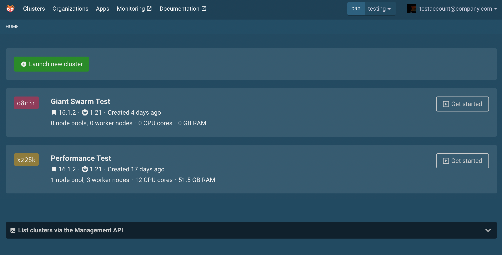

Giant Swarm provides customers with their own _management cluster (MC)_. You can have multiple management clusters, for example if different cloud providers are used. The management Kubernetes cluster runs operators that create and manage all the workload clusters (WCs). On workload Kubernetes clusters, you deploy and run actual business applications.

To create workload clusters – or install managed apps (such as ingress-nginx) on them – you need to access the management cluster. Alternatively, you can also deploy workload clusters or managed apps with GitOps, but we still recommend that you first start out by manually accessing the management cluster since you may need this for manual investigation or deployments.

## Step 1: Install the necessary tools

Select your operating system:




1. Install [kubectl](https://kubernetes.io/docs/tasks/tools/#kubectl)
2. Install [krew](https://krew.sigs.k8s.io/)
3. Install `kubectl-gs` by running: `kubectl krew install gs`




```sh
brew install kubernetes-cli krew
kubectl krew install gs
```




## Step 2: Log in to your management cluster

For the purpose of this tutorial, we will start from Giant Swarm's _Web UI_, reachable via the URL that we provide to customers when we finish setting up a cluster. The hostname in the URL usually starts with `happa` (our internal name of the Web UI).

The web interface shows an overview of the clusters belonging to the organization selected in the top-right corner (in the screenshot: `testing`).



Click "List clusters via the Management API" on the bottom to see which command to run for logging into your cluster.

**Run this command in your shell.** The command performs authentication, creates a kubectl context and prints a message similar to this:

```text
$ kubectl gs login "https://api.<management cluster domain>/"
[...]
A new kubectl context has been created named 'gs-wombat' and selected. To switch back to this context later, use either of these commands:
  kubectl gs login wombat
  kubectl config use-context gs-wombat
```

When logging in, you have to authenticate in your browser using the configured identity provider (for example by signing into an Active Directory or GitHub user account).

## Step 3: View resources on the management cluster

Let's run some commands and understand what's happening under the hood.

The first command is `kubectl get nodes`. This will show us the nodes making up our management cluster.

```bash
$ kubectl get nodes
NAME                                          STATUS   ROLES                  AGE   VERSION
ip-10-0-5-103.eu-central-1.compute.internal   Ready    worker                 19h   v1.24.10
ip-10-0-5-121.eu-central-1.compute.internal   Ready    control-plane,master   19h   v1.24.10
ip-10-0-5-14.eu-central-1.compute.internal    Ready    control-plane,master   19h   v1.24.10
ip-10-0-5-163.eu-central-1.compute.internal   Ready    control-plane,master   19h   v1.24.10
ip-10-0-5-183.eu-central-1.compute.internal   Ready    worker                 19h   v1.24.10
ip-10-0-5-5.eu-central-1.compute.internal     Ready    worker                 19h   v1.24.10
ip-10-0-5-53.eu-central-1.compute.internal    Ready    worker                 19h   v1.24.10
```

There are two kinds of roles: `control-plane` and `worker`. Note that this still relates to the management cluster. None of your business applications should ever run on the management cluster's nodes, unless you want to run custom operators.

The second command we suggest running is `kubectl get orgs`. This will show the organizations that are defined in your management cluster.

```bash
$ kubectl get orgs
NAME                    AGE
production              97d
testing                 97d
giantswarm              97d
```

Organizations are a way to isolate clusters, apps, etc. between different teams or environments. More information can be found in [Organizations]().

Finally, run the `kubectl gs get clusters -A` command, which will show you all the clusters managed by your management cluster. The `-A` flag stands for _all namespaces_.

```bash
$ kubectl gs get clusters -A
NAMESPACE          NAME    AGE    CONDITION   SERVICE PRIORITY  RELEASE   ORGANIZATION  DESCRIPTION
org-testing        rfjh2   84d    UPDATED     lowest            18.4.0    testing       n/a
org-production     jn88t   91d    CREATED     highest           18.0.1    production    n/a
```

You may notice some important points:

1. A cluster belonging to an organization called `x` will be represented in the Kubernetes namespace `org-x` in the management cluster (that's why we use the `-A` flag to see all the namespaces)
2. Organizations may not have any clusters attached to them (yet)
3. There is a `giantswarm` organization in which we define the management cluster and its own configuration. Customers are not supported to make changes in here.

Finally, you can see the YAML definition of a cluster (in this example, cluster `rfjh2` in organization `testing`) by running:

```bash
kubectl gs get cluster rfjh2 -n org-testing -o yaml
```

## Next steps

You can follow along the "Getting started" articles in order. Most likely, you want to [create a workload cluster]() now.
