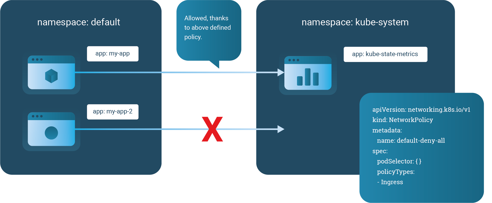

# Limiting Pod Communication with Network Policies

You can limit communication to Pods using the Network Policy API of Kubernetes.

The Kubernetes Network Policy functionality is implemented by different network providers, like Calico, Cilium, Kube-router, etc. Most of these providers have some added functionality that extends the main Kubernetes Network Policy API. Giant Swarm deploys Calico as a provider so users can make use of its functionality out of the box.

In this guide we give an overview and introduction of how to create and use these policies.

## Network Policies Scope

By default, all Pods in a cluster are non-isolated and accept traffic from any source.

As soon as you have a NetworkPolicy that selects a certain group of Pods, those Pods become isolated and reject any traffic that is not allowed by any NetworkPolicy.

Note that Network Policies are additive, so having two Network Policies that select the same Pods will result in allowing both defined policies.

Keep in mind that a NetworkPolicy is applied to a particular Namespace and only selects Pods in that particular Namespace.

## Network Policy syntax

The Network Policy resource is part of the API group `networking.k8s.io`. Currently, it is in version `v1`.

The `spec` of the resource mainly consists of three parts:

- `podSelector`: Use labels to select the group of pods for which the rules will be applied.

- `policyTypes`: Which could be `Ingress`, `Egress` or both. This field will determine if the rules will be applied to incoming and/or outgoing traffic. If it is not defined, then `Ingress` will be enabled by default and `Egress` only when there are rules defined.

- `ingress`/`egress`: these sections allow a list of `from` (Ingress) or `to` (Egress) and `ports` blocks. Each `from`/`to` block contains a range of IPs (`ipBlock`) and/or a list of namespaces selected by label (`namespaceSelector`) and/or a list of pods by label (`podSelector`). That select which IPs, namespaces or pods can talk to our target pod or to which IPs, namespaces or pod our target can talk to. The `ports` block defines which ports are affected by this the rule.

An easy example to clarify the explained concepts

```yaml
apiVersion: networking.k8s.io/v1
kind: NetworkPolicy
metadata:
  name: simple-policy
  namespace: default
spec:
  podSelector:
    matchLabels:
      app: target-app-who-is-applied-the-policy
  policyTypes:
  - Ingress
  - Egress
  ingress:
  - from:
    - ipBlock:
        cidr: 172.17.0.0/16
    - namespaceSelector:
        matchLabels:
          name: namespace-that-can-talk-to-my-app
    - podSelector:
        matchLabels:
          app: pod-that-can-talk-to-my-app
    ports:
    - protocol: TCP
      port: 6379
  egress:
  - to:
    - ipBlock:
        cidr: 10.0.0.0/24
    - namespaceSelector:
        matchLabels:
          name: namespace-my-app-can-talk-to
    - podSelector:
        matchLabels:
          app: pod-my-app-can-talk-to
    ports:
    - protocol: TCP
      port: 5978
```

## Default policies

You can create default policies for a namespace by creating a NetworkPolicy that selects all Pods as follows:

```yaml
apiVersion: networking.k8s.io/v1
kind: NetworkPolicy
metadata:
  name: default-deny
spec:
  podSelector: {}
  policyTypes:
  - Ingress
  - Egress
```

__Warning__: By default Giant Swarm clusters, from version `11.0.0`, contain a `default-deny` policy for sensitive namespaces like `giantswarm` and `kube-system`. To communicate with any pods in that namespace you need to explicitly create a Network Policy that allows it.

Note that the namespace needs to exist before you apply the NetworkPolicy to it.

The default policy shown above will limit ingress and egress traffic in the namespace applied. You can also restrict only for `egress` or `ingress`.

## Applications

### Allowing specific system pod to talk with your pod

As we mentioned before, we harden the clusters restricting the communication with pods in `kube-system` and `giantswarm`. In case you need to allow communication with a running pod in one of those namespaces you have to explicitly declare it. For example:

```yaml
kind: NetworkPolicy
apiVersion: networking.k8s.io/v1
metadata:
  name: ksm-can-be-accessed-by-my-app
  namespace: kube-system
spec:
  podSelector:
    matchLabels:
      app: kube-state-metrics
  ingress:
    - from:
      - podSelector:
          matchLabels:
            app: my-app-that-needs-access-to-ksm
      ports:
        - protocol: TCP
          port: 10301
```

To make it more visual, this is what the communication between namespaces will look like.



### Allowing specific pod to pod access

In the following example, we allow traffic to Pods labeled `role: backend` from Pods with the `role: frontend` label and only on TCP port 6379.

```yaml
kind: NetworkPolicy
apiVersion: networking.k8s.io/v1
metadata:
  name: backend-access
spec:
  podSelector:
    matchLabels:
      role: backend
  ingress:
    - from:
      - podSelector:
          matchLabels:
            role: frontend
      ports:
        - protocol: TCP
          port: 6379
```

You need to apply this policy to the Namespace that the backend Pods live in.

```nohighlight
kubectl -n <namespace> apply -f backend-access.yaml
```

### Allowing pod to pod access within a namespace

In some cases, you may want to allow all intra-namespace communication. For this, you can use open Pod selectors that catch all Pods.

```yaml
kind: NetworkPolicy
apiVersion: networking.k8s.io/v1
metadata:
  name: intra-namespace
  namespace: freeforall
spec:
  podSelector:
  ingress:
    - from:
      - NamespaceSelector:
          matchLabels:
            name: freeforall
```

Note that the namespace you apply this policy to needs to carry a label `name:` similar to the actual name key in its metadata:

```yaml
apiVersion: v1
kind: Namespace
metadata:
  name: freeforall
  labels:
    name: freeforall
```

After creating the namespace, you can then create the `NetworkPolicy`.

```nohighlight
kubectl apply -f freeforall-namespace.yaml
kubectl apply -f intra-namespace-policy.yaml
```

### Allowing traffic from outside the cluster

In case you have publicly exposed a Service through Ingress and you have a default-deny policy in place or just want to limit that traffic to a specific port, you need a Network Policy like the following.

```yaml
kind: NetworkPolicy
apiVersion: networking.k8s.io/v1
metadata:
  name: allow-external
  namespace: default
spec:
  podSelector:
    matchLabels:
      app: web
  ingress:
  - from: []
    ports:
    - port: 80
```

The `allow-external` policy, described above, will allow any traffic (no matter if it's outside or inside your cluster) to the Pods on port 80.

In this guide we discussed different use-cases of limiting Pod communication with network policies, based on our best practices.

## Further reading

- [The Unofficial Guide to Kubernetes Network Policies](https://ahmet.im/blog/kubernetes-network-policy/)
- [Network Policies](https://kubernetes.io/docs/concepts/services-networking/network-policies/)
- [Declare Network Policy](https://kubernetes.io/docs/tasks/administer-cluster/declare-network-policy/)
