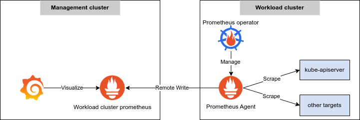

In this article you will learn what is the Prometheus Agent running inside Giant Swarm clusters.

__Note__: The Prometheus Agent is only running in releases starting from:

| Provider      | Release version                    |
|---------------|------------------------------------|
| Vintage AWS   | release v18.2.x                    |
| Vintage Azure | release v19.x.x                    |
| CAPA          | default-apps-aws v0.11.0           |
| CAPG          | default-apps-gcp v0.16.0           |
| CAPVCD        | default-apps-cloud-director v0.3.0 |
| CAPV          | default-apps-vsphere v0.6.0        |
| CAPZ          | default-apps-azure v0.0.8          |

## Introduction to monitoring

Each cluster created on the Giant Swarm platform benefits from our monitoring (a dedicated Prometheus instance) which allows us to provide you with 24/7 support to ensure best quality of service.

## What is the Prometheus Agent?

The **Prometheus Agent** is an in-cluster daemon used to scrape the metrics for all Giant Swarm managed components.
For users aware of what Prometheus is, the [Prometheus Agent](https://prometheus.io/blog/2021/11/16/agent/) is a lightweight version of a Prometheus Server equipped with a subset of Prometheus capabilities (mostly service discovery, metric scraping and remote write).

## Why do we need the Prometheus Agent?

For historical reasons, Giant Swarm monitoring used to only be deployed on the Management cluster (1 dedicated Prometheus per cluster) and the scraping of our targets was going through the `kube-apiserver` acting as a proxy for the service discovery and scraping of the target metrics.

However, with the evolution of Kubernetes and the arrival of CAPI clusters, our approach to scrape metrics from outside the cluster no longer works because:
- in CAPI clusters, workload cluster nodes are not reachable from the management clusters (no peering/no route to host) so `kube-apiserver` behind a load balancer cannot be scraped from outside the cluster
- in Kubernetes 1.22, `kube-scheduler` and `kube-controller-manager` metrics endpoint requires authentication that is stripped by the `kube-apiserver proxy`

Hence, we decided to release a Prometheus Agent alongside Giant Swarm managed [Prometheus operator](https://github.com/giantswarm/prometheus-operator-app)

## Prometheus Agent Architecture

<!-- Source: https://drive.google.com/file/d/1Pr0J1x-nPF1klZEFfwJ3gZhxTRjuI1aM -->
