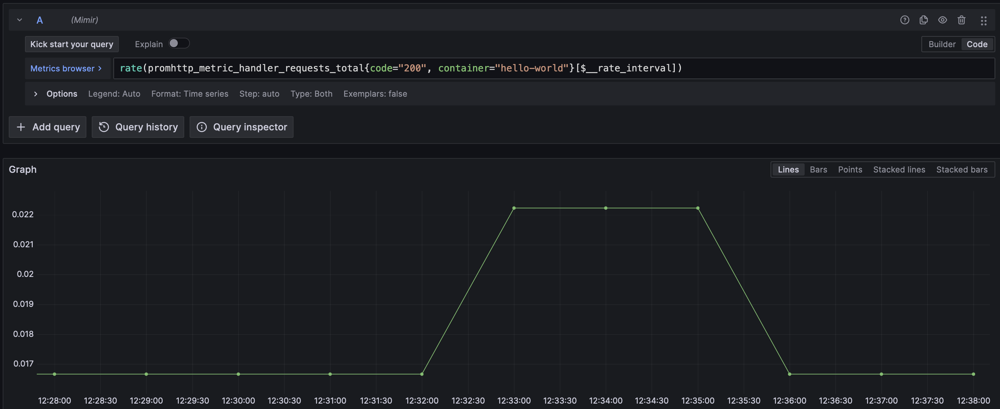
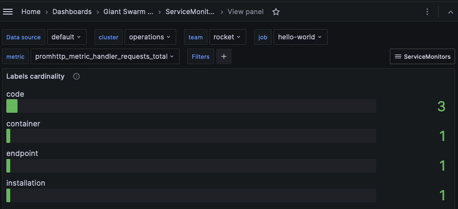
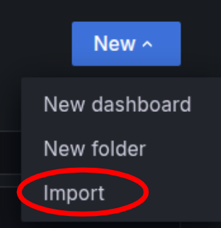
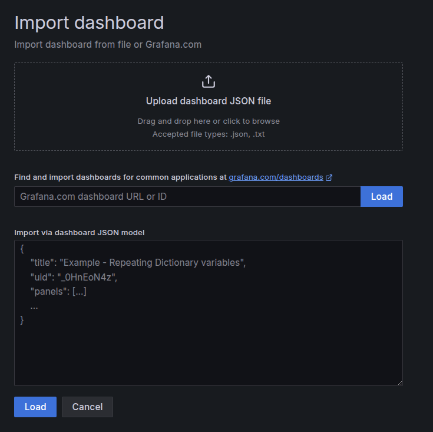
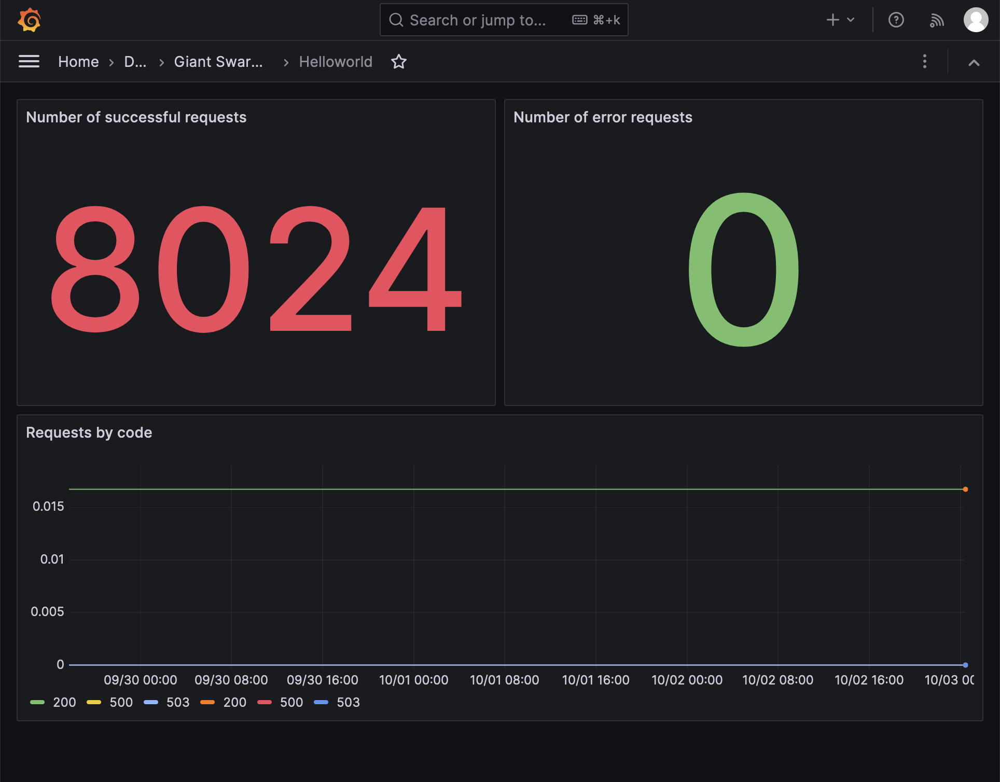

Every cluster benefits from automatic monitoring by default in the Giant Swarm platform. It allows you to observe the cluster health and application behaviour simultaneously with little effort. An in-cluster agent scrapes the metrics and sends them to a central location on the management cluster, where you can interact with them through our managed Grafana instance.

## Requirements

First step, you need a running workload cluster. If you don't have one, please first [create a workload cluster](). Second, you need to deploy the `hello-world` application explained [in the previous step](). Further, make sure you have installed [`jq`](https://jqlang.github.io/jq/download/) on your local machine.

In case you are running your own application, you need to make sure that your application is already [instrumented](https://opentelemetry.io/docs/concepts/instrumentation/) to export metrics.

Also, consider that ingesting new metrics into the platform impacts your costs. The central monitoring system's resource consumption is actually related to the number of metrics it has to handle, so please choose which metrics you want to ingest.

## Step 1: Create a service monitor

In case of running the `hello-world` application, there is a baked-in service monitor that scrapes the metrics from the application. You can enable it by setting `serviceMonitor.enabled` to `true` in the values of the helm chart. If you are running your own application, you need to create a service monitor that scrapes the metrics from your application. This is an example of a service monitor you can use:

```yaml
apiVersion: monitoring.coreos.com/v1
kind: ServiceMonitor
metadata:
  labels:
    application.giantswarm.io/team: team-rocket
    app.kubernetes.io/instance: my-service
  name: my-service
  namespace: my-namespace
spec:
  endpoints:
  - interval: 60s
    path: /metrics
    port: web
  selector:
    matchLabels:
      app.kubernetes.io/instance: my-service
```

An important bit to notice is the `application.giantswarm.io/team` label. This label is necessary as it's required for the `Prometheus` agent to discover the target.

Reading the manifest, the application will be scraped every 60 seconds. It will read the metrics from the `/metrics` endpoint using the [port name](https://kubernetes.io/docs/concepts/services-networking/service/#field-spec-ports) as a regular service does. Also, the `app.kubernetes.io/instance` label is used to identify the application, so it should match the application label.

After applying the service monitor, you can open the `Drilldown` view in the `Grafana` UI and start querying the metrics from your application.



__Note__: The `Grafana` UI is accessible via ingress. To find the address, you can check the ingress resource in the `monitoring` namespace of the platform API. More information in the [access `Grafana` page]()

## Step 2: Inspect the default dashboards

The platform provides a set of default dashboards that you can use to monitor the cluster components and your application. You can access them by opening the `Dashboards` view in the `Grafana` UI and explore different options in `Giant Swarm Public Dashboards` folder.

Below is an example of service monitor metrics filtered to show the `hello-world` application and how many cardinality the `promhttp_metric_handler_requests_total` metric has.



Along with service monitor metrics, you can check metrics for DNS, Ingress, Flux, and many other components. Don't hesitate to provide feedback on the dashboards or suggest new ones.

## Step 3: Create your own dashboard

On some occasions, you may want to create a custom dashboard to visualize the metrics of your application. Once logged into the [platform API](), you can start using the Grafana UI and create your very first dashboard. There, you can create panels with the desired visualizations. Then, export your dashboard by selecting `Share > Export` in the dashboard context menu, or by accessing the JSON Model in the dashboard settings.

Grafana stores its data in a PostgreSQL cluster with regular backups, so your dashboard persists even if you upgrade it later or if the system restarts. For more information on dashboard creation, you can check our [dashboard creation tutorial]().

You can [download our example dashboard](./dashboard.json).

Please note that the recommended way for creating dashboard is to use the `GitOps` approach where you store your dashboards' JSON files into a git repository. For more information, check the [related doc]().

For the UI approach, download the dashboard content and import it into the Grafana UI:

- Open the `Dashboards` view in the `Grafana` UI, click on the `New` button on the top right part of the view and then on the `import`one:



- Upload the dashboard JSON file and click on `Load`:



This will create the dashboard in the organization you are currently logged in:



As you can see in the image above, the dashboard shows some information about the `hello-world` application. You see the number of errors, the number of success requests, and the number of requests by code. Feel free to poke around and create your own panels.

## Next step

After knowing how your application behaves let's explore how security is handled in the platform. Learn more [in the security overview]().
