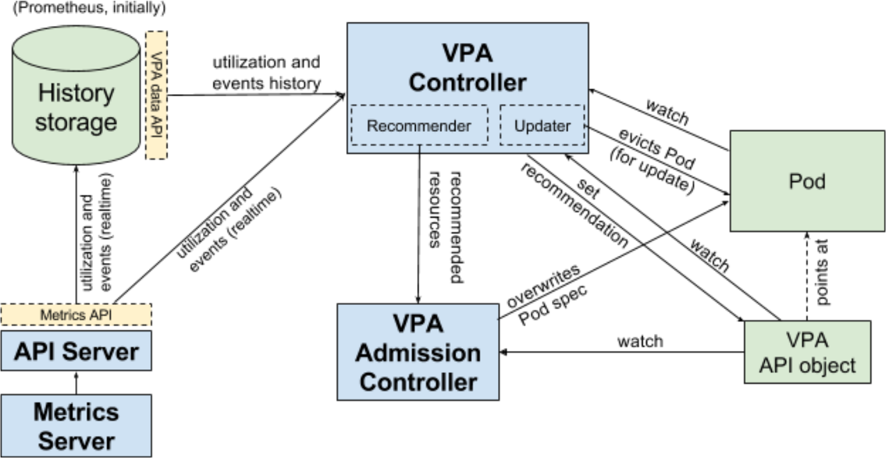

## Introduction

Giant Swarm workload clusters provide the [Vertical Pod Autoscaler](https://github.com/kubernetes/autoscaler/tree/master/vertical-pod-autoscaler) by default, to either recommend or automatically increase or reduce your pods resource requests and limits based on the current resource usage.

## Architecture overview

<!-- Source: https://github.com/kubernetes/design-proposals-archive/blob/main/autoscaling/images/vpa-architecture.png -->

(credit: [upstream design proposal](https://github.com/kubernetes/design-proposals-archive/blob/main/autoscaling/vertical-pod-autoscaler.md#architecture-overview))

## Common pitfalls

### VPA sets the container's requests

The container's limits will be defined according to its original ratio.

Let's see it with an example:
* my original fluentbit pod was set with `requests: 200Mi` and `limits: 300Mi`.
* VPA increases it to `requests: 400Mi`, it also sets `limits: 600Mi`.
* Notice that now the RAM limit is higher than the VPA's `maxAllowed`.

### Containers grow bigger than available resources

There's 2 things that you may aim for with VPA:
- make sure your container has enough resources to work (`requests` management)
- make sure your container fits on your nodes (`limits` management)

When a container uses too much resources, keep in mind that [VPA sets the container's requests](#vpa-sets-the-containers-requests) and `limits` proportionally, keeping the original requests/limits ratio.

When setting `maxAllowed` (max allowed requests) values:
- make sure that the requests won't go over the node's resources, which would make the container unschedulable.
- watch out for the max VPA computed limits. While it won't lead to an unschedulable container it may kill your node.

If you want to make sure your container won't use more resources than `maxAllowed`, set `limits`=`requests` at container creation.

## Further reading

- [Vertical Pod Autoscaler design proposals](https://github.com/kubernetes/design-proposals-archive/blob/main/autoscaling/vertical-pod-autoscaler.md) 
- [Vertical Pod Autoscaler App](https://github.com/giantswarm/vertical-pod-autoscaler-app)
