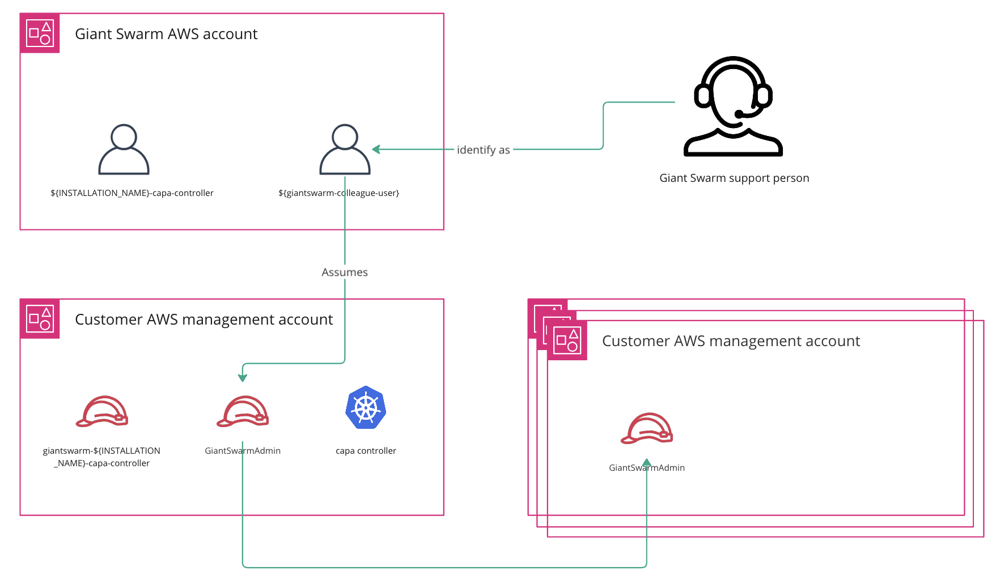
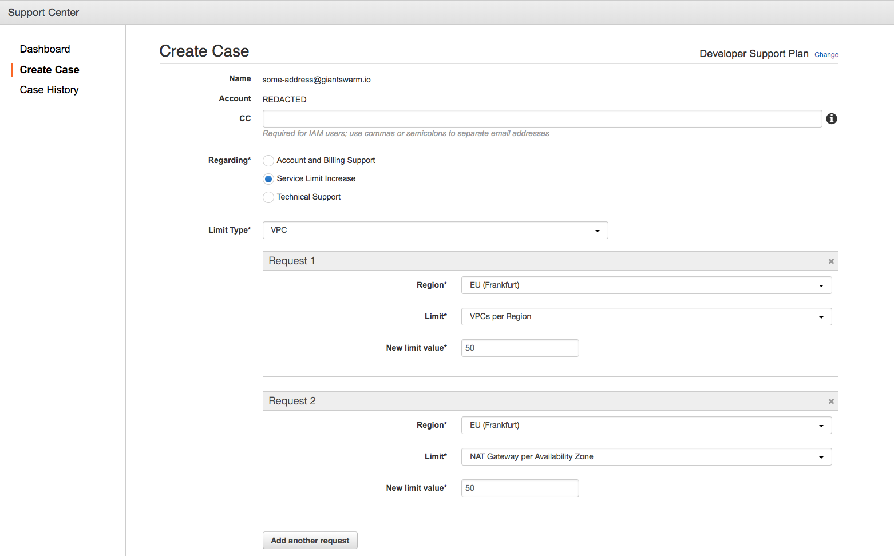
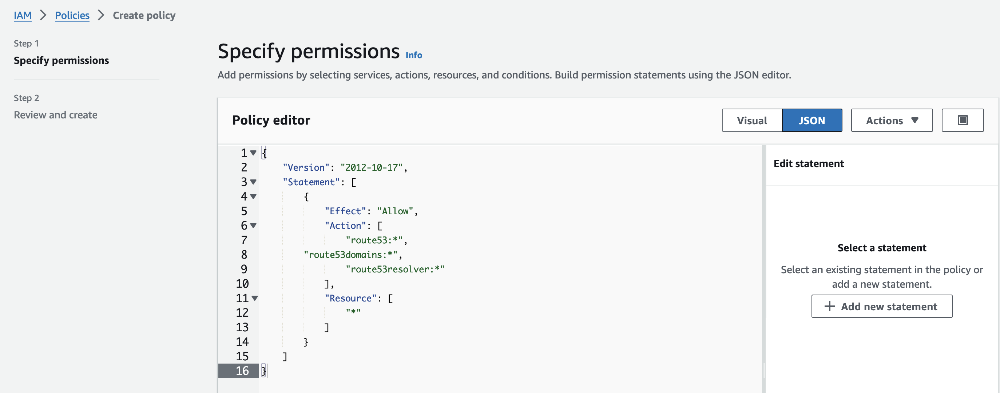
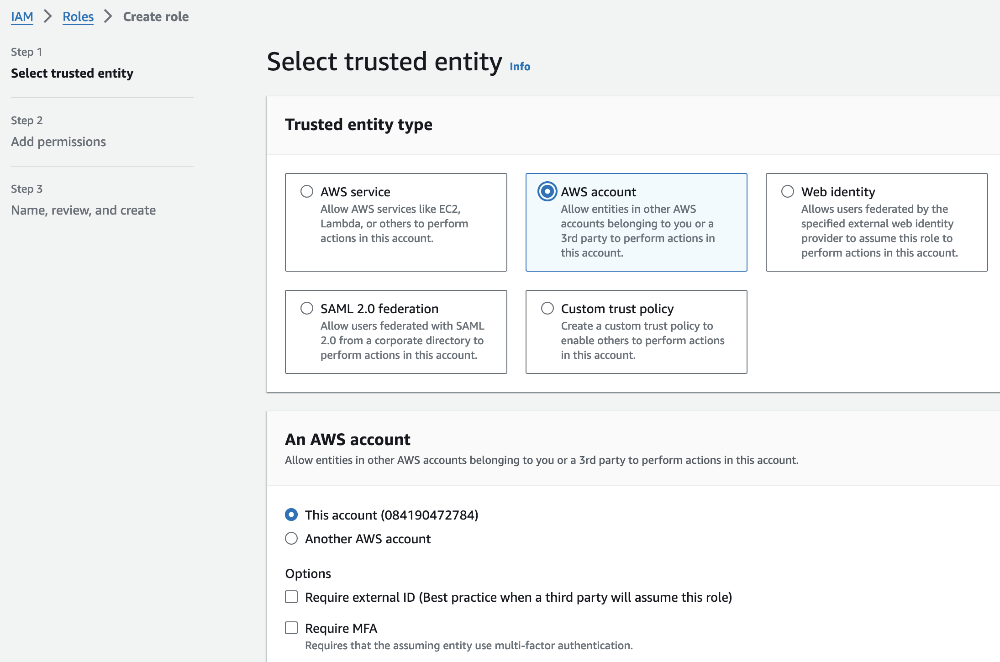
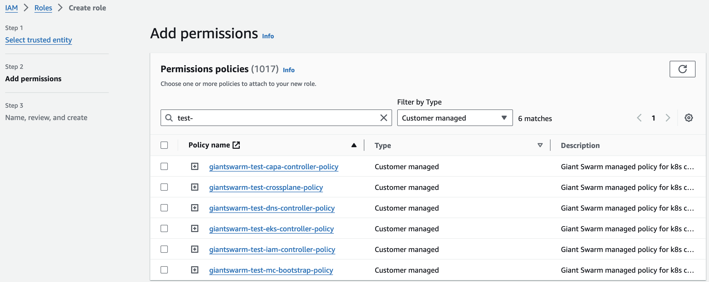
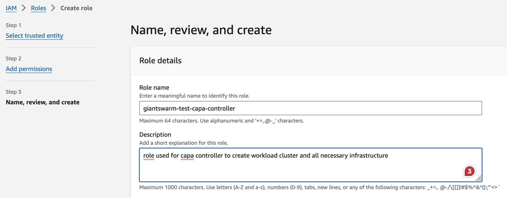

In this guide, you will find the necessary steps to prepare your AWS accounts to run our platform. There are several requirements must be satisfied to support Cluster API Provider for AWS (CAPA).

## Requirements

In AWS environments, you can run the management and workload clusters in the same account or separate accounts. To help you take the decision read our [multi-account article]() where we explain the pros and cons of both approaches. Most requirements are related to configuring _Identity and Access Management (IAM)_ roles and service quotas.



You will need access to AWS console or having AWS CLI installed and pointing to the right account in order to perform the following steps.

## Step 1: Service quotas {#quotas}

AWS establishes default quotas for all your cloud services as described in the [provider documentation](https://docs.aws.amazon.com/general/latest/gr/aws_service_limits.html). The following overview lists the quotas you must adjust to use the account to operate Giant Swarm clusters.

Adjusting a service quota requires issuing a support case in the [AWS Support Center](https://console.aws.amazon.com/support/home), where you will find a specific entry form for each type of case. Each quota type requires a separate case. Log in to the proper account and select the correct region when creating these.

Below is a screenshot of a service quota entry form.



Next, there is the list of quotas to be modified, grouped by type:

```nohighlight
    - VPC
        - VPCs per region: **50**
        - NAT Gateway per Availability Zone per region: **50** (not needed if you are creating a [private cluster]())
        - IPv4 CIDR blocks per VPC: **50**
        - Routes per route table: **200**
    - Route 53 Resolver
        - Endpoints per AWS region: **100** (needed if you are creating a [private cluster]())
    - Elastic IP
        - New VPC Elastic IP Address Limit per region: **50** (not needed if you are creating a [private cluster]())
    - Elastic Load Balancers
        - Application and Classic Load Balancers per region: **100**
    - Auto Scaling
        - Auto Scaling Groups per region: **250**
        - Launch Configurations per region: **500**
    - S3
        - Buckets per Account: **1000**
    - EC2 Spot Instances
        - For every primary instance type you tend to use spot instances with, set the limit according to your needs.
    - EC2 Instances
        - m4.xlarge per region: **250**
        - m4.2xlarge per region: **250**
        - m5.2xlarge per region: **250**
        - other instance types to be used as workers: increase accordingly
```

__Note__: Please extend the list of EC2 instances to contain the frequently needed types.

When requesting a service quota increase, you will be asked for a description of your use case. Use this text for the following purposes:

```nohighlight
We intend to run multiple Kubernetes clusters in this account, potentially used
by various globally distributed teams. We will be creating and deleting new
clusters frequently.

Every cluster needs its own VPC for security/isolation reasons and its own
Elastic IP address for the NAT gateway.

Every cluster has at least 1 Auto Scaling Group, but can contain multiple ASGs if
multiple instance types are requested as cluster nodes. If we count 50
clusters with up to 5 EC2 instances each, as worker nodes, we need up to 250
ASGs. To update the ASGs in a rolling manner, we need to duplicate the ASGs
for a short time during the update, hence the 500 Launch Configurations.

The number of EC2 instances used as worker nodes is supposed to be scaled
dynamically based on traffic, hence the high numbers of EC2 instances requested.
```

## Step 2: Permissions

There are two types of IAM roles that need to be created in the AWS account.

First, the controller role which is used by the CAPA controller in the management cluster to provision all infrastructure to manage workload clusters.

Second, the staff role is used by Giant Swarm engineers to access the AWS account for support purposes.

Here are the mandatory steps to create the required IAM resources but we advocate to follow one of the [automated options](https://github.com/giantswarm/giantswarm-aws-account-prerequisites). There you have Terraform or CloudFormation templates to create the necessary IAM roles and policies. Otherwise, follow the manual steps below.

### Controller permissions {#iam-capa-controller-role}

#### 1. Create all policies for the CAPA controller {#iam-capa-controller-policies}

Open the [IAM section](https://console.aws.amazon.com/iam/home) of the AWS console and go to the [Policies](https://console.aws.amazon.com/iam/home#/policies) subsection.

Our platform needs different permissions to manage various resources on the AWS side. Here is the list of policies that need to be created. Click __Create policy__ and copy the policy content into the JSON editor field. Hit the `Next` button and add the policy name matching the policy link name. Repeat this process for each policy:

- [giantswarm-${INSTALLATION_NAME}-capa-controller-policy](https://github.com/giantswarm/giantswarm-aws-account-prerequisites/raw/master/capa-controller-role/capa-controller-policy.json)
- [giantswarm-${INSTALLATION_NAME}-crossplane-policy](https://github.com/giantswarm/giantswarm-aws-account-prerequisites/raw/master/capa-controller-role/crossplane-policy.json)
- [giantswarm-${INSTALLATION_NAME}-dns-controller-policy](https://github.com/giantswarm/giantswarm-aws-account-prerequisites/raw/master/capa-controller-role/dns-controller-policy.json)
- [giantswarm-${INSTALLATION_NAME}-eks-controller-policy](https://github.com/giantswarm/giantswarm-aws-account-prerequisites/raw/master/capa-controller-role/eks-controller-policy.json)
- [giantswarm-${INSTALLATION_NAME}-iam-controller-policy](https://github.com/giantswarm/giantswarm-aws-account-prerequisites/raw/master/capa-controller-role/iam-controller-policy.json)
- [giantswarm-${INSTALLATION_NAME}-irsa-operator-policy](https://github.com/giantswarm/giantswarm-aws-account-prerequisites/raw/master/capa-controller-role/irsa-operator-policy.json)
- [giantswarm-${INSTALLATION_NAME}-mc-bootstrap-policy](https://github.com/giantswarm/giantswarm-aws-account-prerequisites/raw/master/capa-controller-role/mc-bootstrap-policy.json)
- [giantswarm-${INSTALLATION_NAME}-network-topology-operator-policy](https://github.com/giantswarm/giantswarm-aws-account-prerequisites/raw/master/capa-controller-role/network-topology-operator-policy.json)
- [giantswarm-${INSTALLATION_NAME}-resolver-rules-operator-policy](https://github.com/giantswarm/giantswarm-aws-account-prerequisites/raw/master/capa-controller-role/resolver-rules-operator-policy.json)

__Warning__: Remember to replace the `INSTALLATION_NAME` placeholder with the name of your installation when filling the policy name.



__Note__: All policy names contain the installation name to make easier identifying the policies and avoid conflicts with other installations running within the same account.

#### 2. Create the role metadata {#iam-capa-controller-role-basic}

Now move to the IAM [Roles](https://console.aws.amazon.com/iam/home#/roles) subsection, and hit the __Create role__ button. In the following screen, when asked to _Select the type of trusted entity_, choose _AWS account_.



The __Account ID__ you enter is the ID of the AWS account where the management cluster is running. Could it be the current account in case you are running all your infrastructure in a single account or a different one if you are using separate accounts for management and workload clusters?

It's crucial that the __Require external ID__ and __Require MFA__ options remain unchecked!

Then, please go ahead and proceed to the next step.

#### 3. Attach all policies to role {#iam-capa-controller-role-policy}

Now, you must go through all the policies created before and attach them to the node. Search for the installation name, select the policies and hit the __Next__ button.



#### 4. Name the role {#iam-capa-controller-role-name}

The last step of role creation requires you to set a name for the role. Same as with the policies, please use the name changing the INSTALLATION_NAME placeholder to the name of your installation.

```nohighlight
giantswarm-${INSTALLATION_NAME}-capa-controller
```



__Note__: The role name also contains the installation name to make easier identifying across other roles and avoid conflicts with other installations running within the same account.

### Staff permissions {#iam-staff-role}

Finally, we create an IAM role for Giant Swarm support staff to assume in order to
access both AWS accounts. This role must have Giant Swarm's account as a trusted
entity, and we recommend that it enforces multi-factor authentication.

Giant Swarm staff require access to all accounts, so the following steps must be duplicated in both the management cluster and workload cluster accounts.

#### 1. Create the admin policy {#iam-staff-policy}

Go to the [Policies](https://console.aws.amazon.com/iam/home#/policies) subsection and select __Create policy__ to set the admin permissions. Use the [admin JSON policy](https://github.com/giantswarm/giantswarm-aws-account-prerequisites/raw/master/admin-role/iam-policy.json) file as the policy content. This time, call the policy

```nohighlight
GiantSwarmAdmin
```

#### 2. Create the admin role {#iam-staff-role}

Enter again in the [Roles](https://console.aws.amazon.com/iam/home#/roles) subsection of the AWS console and select __Create role__ When asked to __Select type of trusted entity__ choose __AWS account__.

- In __Account ID__ enter the value `084190472784`.
- Don't enable __Require external ID__.
- It 's strongly recommended to check the option __Require MFA__ (multi factor authentication). This adds an extra authentication step for users to assume the role, which increases security.

#### 3. Attach policy to role {#iam-staff-role-policy}

Attach the newly created `GiantSwarmAdmin` policy to the role you are creating.

#### 4. Name the role {#iam-staff-role-name}

Name this role:

```nohighlight
GiantSwarmAdmin
```

## Step 3: Configure the cluster role identity {#configure-cluster-role-identity}

Remember that `default` AWSClusterRoleIdentity is needed but you can additional add more with specific names. (LETS INCLUDE THIS IN CAPZ TOO)

```need to be updated
When you want to create a new Cluster API workload cluster in a new AWS account you need to create a CR AWSClusterRoleIdentity which will reference the role in the new AWS Account.

apiVersion: infrastructure.cluster.x-k8s.io/v1beta1
kind: AWSClusterRoleIdentity
metadata:
  labels:
    cluster.x-k8s.io/watch-filter: capi
  name: ${ROLE_NAME}
spec:
  allowedNamespaces:
    list: null
    selector: {}
  roleARN: ${ROLE_ARN}
  sourceIdentityRef:
    kind: AWSClusterControllerIdentity
    name: default
Where:

${ROLE_NAME} is a short unique name referencing AWS account (ie: development, sandbox or staging2)
${ROLE_ARN} is full ARN of the role created in previous step with giantswarm-aws-account-prerequisites repository.
This CR needs to be created only once for each AWS Account. It can be then referenced in the cluster-aws repo in the value aws.awsClusterRoleIdentityName.
**Note**: In case you are working with a Giant Swarm partner, you might not have access to the platform API. In that case, please provide the role ARNs values, CAPA controller and staff to your partner contact.

## Next steps

Contact your Giant Swarm account engineer to verify the setup and proceed with the provisioning of the management cluster. In case you have already set up the management cluster and you have just configured a new AWS account, you can proceed with the [creation of the workload cluster]().
