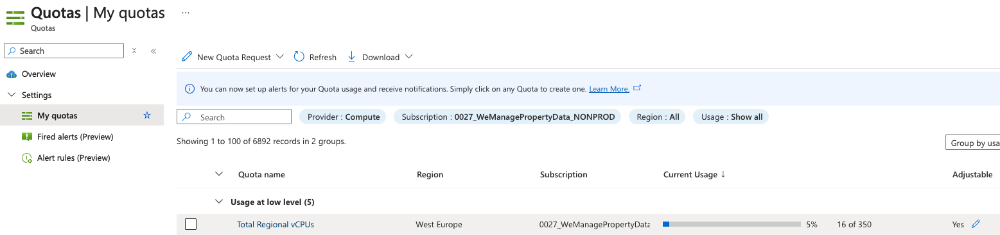
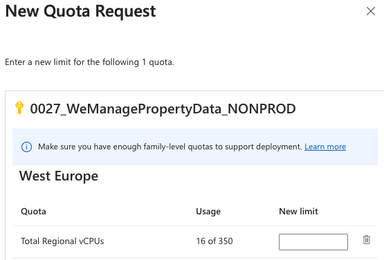

When running the Giant Swarm platform in your Azure subscription, several prerequisites must be satisfied to support Cluster API Provider for Azure (CAPZ). In the current implementation, management and workload clusters must run in the same subscription.

In addition to the following prerequisites, your account engineer will provide you with a pre-installation checklist that you must complete before starting the installation process.

## Requirements

1. The Azure subscription must be chosen from existing ones or created if needed in the customer's Azure account. For security reasons regarding sensitive data stored within customer accounts, the advice is to use a subscription-only designated for Giant Swarm Azure resources management.

2. An individual has to have the following permissions and tools working within the designated Azure subscription:

    * An account with [Owner](https://docs.microsoft.com/en-us/azure/role-based-access-control/built-in-roles#owner) or [User Access Administrator](https://docs.microsoft.com/en-us/azure/role-based-access-control/built-in-roles#user-access-administrator) role.
    * [Azure CLI](https://docs.microsoft.com/en-us/cli/azure/install-azure-cli) installed and configured to point to chosen subscription via [az account set](https://learn.microsoft.com/en-us/cli/azure/account?view=azure-cli-latest#az-account-set) command.

### Service quotas {#quotas}

Azure enforces [service quota through all the cloud services](https://learn.microsoft.com/en-us/azure/azure-resource-manager/management/azure-subscription-service-limits). The following overview lists the usual resources you may adjust depending on number of clusters and their size planned to be deployed:



Access to the [Quotas portal service](https://portal.azure.com/#view/Microsoft_Azure_Capacity/QuotaMenuBlade/~/myQuotas) to check and adjust quotas as required. You can also use the Azure CLI to check quotas like:

```sh
az vm list-usage --location <region>
```

If your current quotas are insufficient, you can request an increase. In the portal, there is no CLI command, follow the steps below:

* Go to the **Quotas** section in the [Azure portal](https://portal.azure.com/#view/Microsoft_Azure_Capacity/QuotaMenuBlade/~/myQuotas).
* Click on pencil button to **request an update**.
* Fill the new limit and submit the request.



You can follow the request status in the **Quotas** section.

### Permissions

There are two permissions roles that need to be created in the Azure subscription. One for the Giant Swarm controller used by the CAPZ controller in the management cluster to provision all infrastructure to manage workload clusters, and the other for Giant Swarm engineers to access the Azure account for support purposes.

### Staff permissions {#iam-staff-role}

Firstly, you need to grant access to Giant Swarm Ops/Support to your Azure subscription. Access to the portal is important for our every day support, where investigation and manual interventions are sometimes necessary.

The easiest way is to create an [Azure Deployment Environment](https://azure.microsoft.com/en-us/products/deployment-environments) to delegate resource management to third parties. In this case, you must allow the Giant Swarm Staff group to manage your resources. This is beneficial as you don't have to manage access for each person separately within your subscription, instead you add a managed group that's kept up to date by Giant Swarm. There is a solution available called [Azure Lighthouse](https://learn.microsoft.com/en-us/azure/lighthouse/overview), which allows to delegate resource managements towards service providers such as Giant Swarm.

The recommendation is to choose Azure's [built-in role `Contributor`](https://docs.microsoft.com/en-us/azure/role-based-access-control/built-in-roles) to give Giant Swarm access and deployment permissions for resources within your subscription.

Alternatively, you can create your own role assignment with restrictions on access to specific Resource Groups. However, it must be kept up to date so that Giant Swarm can provide full support for newly created clusters as well.

#### Create a Deployment Environment

* Download the template file [delegatedResourceManagement.json](https://raw.githubusercontent.com/giantswarm/azure-operator/master/docs/delegatedResourceManagement.json). This file is left unchanged.
* Download the parameters example file [delegatedResourceManagement.parameters.json](https://raw.githubusercontent.com/giantswarm/azure-operator/master/docs/delegatedResourceManagement.parameters.json) and fill in the required fields:

    * Replace `<GiantSwarmTenantID>` and `<GiantSwarmPrincipalID>` with the values provided by Giant Swarm's Account Engineer
    * Keep the value of `roleDefinitionId` if you are fine assigning the `Contributor` role. If a custom role is desired, please replace the value.

* Now you can run this command to create the Deployment Environment:

    ```sh
    az deployment create --name "giantswarm-access" \
                         --location <AzureRegion> \
                         --template-file delegatedResourceManagement.json \
                         --parameters delegatedResourceManagement.parameters.json \
                         --verbose
    ```

    The `--name` value can be freely chosen in case you prefer another name.

### Controller permissions {#iam-azure-operator-role}

On the other hand, the automation requires an [Azure Service Principal](https://learn.microsoft.com/en-us/azure/active-directory/develop/app-objects-and-service-principals?tabs=browser#service-principal-object), let's call it _Giant Swarm Service Principal_, to enable CAPZ controller to control the Azure resources.

#### Step 1 - Create the service principal

The _Giant Swarm Service Principal_ can be created in two different ways: via Azure CLI or Azure Portal.

##### Using az CLI

Please run the following command and keep the output for later usage.

```sh
# Please fill in the details of the management cluster (MC) and Azure subscription
MC_SUBSCRIPTION_ID=XXXX-XXXX-XXXX-XXX
MC_NAME=ZZZZ

az login
az account set -s ${MC_SUBSCRIPTION_ID}
az ad sp create-for-rbac --role contributor --scopes="/subscriptions/${MC_SUBSCRIPTION_ID}" --display-name "${MC_NAME}-bootstrap"
az role assignment create \
    --assignee "<please fill in the app ID from the previous command output>" \
    --role "User Access Administrator" \
    --scope "/subscriptions/${MC_SUBSCRIPTION_ID}"
```

**Note**: Store the output of `az ad sp create-for-rbac`. This needs to be provided to Giant Swarm in step 2.

##### Using Azure Portal

* Login to the [Azure Portal](https://portal.azure.com/)
* Go to the "Azure Active Directory" service
* From the left pane, select the "App registrations" section, then click "New registration" from the menu at the top of the page
* Enter the name `<MC_NAME>-bootstrap`. Replace `<MC_NAME>` with the name of the management cluster
* Select "Accounts in any organizational directory (Any Azure AD directory - Multi-tenant)" as "Supported account types"
* Click "Register"
* Go to the "Certificates & secrets" section. Under the "Client secrets" part, create a new "Client Secret"
* Set expiration to `2 Days` and click "Add"
* Store the new secret's `Value`. Later, this needs to be provided to Giant Swarm.
* Add "RoleAssignment" to the newly created App

    * Select the right "Subscription" where the management cluster should be created
    * Go to "Access control (IAM)"
    * Click "Add Role Assignment" and add the "Contributor" role and the "User Access Administrator" role to the App with the "subscription" Scope

#### Step 2 - Provide generated credentials to Giant Swarm

The following information needs to be provided to Giant Swarm:

* ClientID
* ClientSecret
* SubscriptionID
* TenantID

**Note**: contact to your Account Engineer, who will help you to find a secure way to share this information. Our recommended tool is [Keybase](https://keybase.io/).

#### Step 3 - Post deployment cleanup

Once all necessary information is provided, our engineers create the management cluster. With the provided permissions, they work within your subscription to provision and validate the infrastructure, ensuring a seamless and efficient process.

When Giant Swarm completes the management cluster provision, our engineers can clean up part of the initial setup. The _Giant Swarm Service Principal_ can be deleted as it's used only for the initial bootstrap, during which an [Azure user-assigned managed identity](https://learn.microsoft.com/en-us/azure/active-directory/managed-identities-azure-resources/how-manage-user-assigned-managed-identities?pivots=identity-mi-methods-azp) is created.

### Virtual machine templates

#### Accept legal terms for Flatcar Linux

Giant Swarm deploys [Flatcar Linux](https://www.flatcar-linux.org/) images for Kubernetes cluster nodes. It's developed by Kinvolk and taken from the Azure Marketplace. In order to be able to run the images, it's required by Azure to accept the legal terms.

Please run the following command prior to creating a cluster on a given subscription:

```sh
az vm image terms accept --offer flatcar-container-linux-free --plan stable --publisher kinvolk
```

**Note**: This acceptance needs to be performed only once for a subscription that's used to run Giant Swarm workload clusters.

#### Enable encryption at host

To satisfy security department requirements, there is a possibility to enable [encryption of data stored on a virtual machine host](https://learn.microsoft.com/en-us/azure/virtual-machines/linux/disks-enable-host-based-encryption-cli). The data is be encrypted at rest with platform-managed keys to ensure the security of the data.

Please run the following command prior to creating a cluster on a given subscription:

```sh
az feature register --name EncryptionAtHost  --namespace Microsoft.Compute --subscription $YOUR_SUBSCRIPTION_ID
```

## Next steps

Once the management cluster is ready, you can proceed with the [creation of the workload cluster]().
