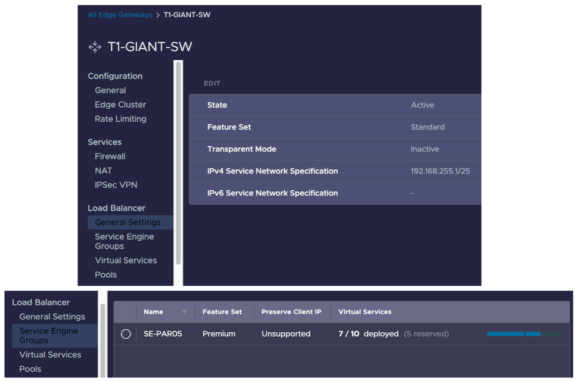

In order to run the Giant Swarm platform in your VMware Cloud Director (VCD) environment, several prerequisites must be satisfied to support Cluster API Provider VMware Cloud Director (CAPVCD).

## Requirements

The solution has some requirements from the VCD environment, and at the same time, the controllers that provision the infrastructure need some permissions again from the VCD API.

### VMware Cloud Director

VMware Cloud Director must run at least with API version v36.0 compatibility (minimum version VCD v10.3). It's highly recommended to run VCD v10.4 or above as it includes shared virtual service IPs.

### Networking

In terms of virtual networking, the following requirements must be met:

- Your Organization Virtual Data Center (oVDC), where the clusters will run, must be backed by VMware NSX-T and NSX Advanced Load Balancer (ALB). The deprecated NSX-V isn't supported.

- The load balancer section must be enabled on the Edge Gateway with a Service Engine Group (SEG). A dedicated SEG is recommended to isolate tenants from each other. A pool of external IPs must be available on the Edge Gateway to create load balancers.

- Though the platform allows multiple networks on the cluster nodes using static routes, at least one network with a static IP pool enabled is required to get an IP.

- The virtual machines (VMs) must have access to the VCD API endpoint for the controllers to work.

- Access to the Internet is required for some of our automation to pull artifacts from the registry or get new certificates from Let's Encrypt. It's possible to configure an egress HTTP proxy to control the traffic. You can check the list of domains that need to be accessible [here]().

### Permissions

The credentials for authentication against the VCD API are configured by cluster. The controller that interacts with the VCD API uses those credentials from a secret provided in the cluster app definition.

__Warning__: Take into account that every user is tied to its own VCD Resource quotas which may affect when deploying the infrastructure.

To obtain the credentials, you need to create a new role by browsing to `Administration > Access Control > Roles > Check vApp Author` and then click `Clone`. The suggestion is to name the role `CAPVCD`. Apart of the default permissions inherit from `vApp Author` role, the controller requires the following permissions:

- `User > Manage user's API token`
- `vApp > Preserve All ExtraConfig Elements During OVF Import and Export`
- `Gateway > View Gateway`
- `Gateway Services > NAT Configure, LoadBalancer Configure`
- `Organization VDC => Create a Shared Disk`
- `User > Manage user's API token`

### Virtual machine templates

To provision the virtual machines (VMs) for the cluster nodes, the necessary `vApp templates` must be provided in the `giantswarm` organization's catalog. The templates use a convention with the Linux distribution and Kubernetes version on the name (for example `flatcar-stable-3815.2.1-kube-v1.25.16`).

__Note__: Our engineers can upload the `vApp templates` to the `giantswarm` catalog or provide you with them, as uploads can fail over a WAN connection in some VCD environments.

### Virtual machine sizing

To define the set of instance types available to the users when deploying clusters, you need to prepare the [virtual machine sizing policies](https://docs.vmware.com/en/VMware-Cloud-Director/10.4/VMware-Cloud-Director-Service-Provider-Admin-Portal-Guide/GUID-F6719175-7A29-42CA-BB00-A6BDC22B3EEC.html). You can choose the name and size of these policies, but we propose the following ones as a recommendation

| Name | vCPU | Memory |
|------|------|--------|
| m1.small | 1 | 2GB |
| m1.medium | 2 | 4GB |
| m1.large | 4 | 8GB |
| m1.xlarge | 8 | 16GB |
| m1.2xlarge | 16 | 64GB |

After all requirements are met, you can [create your first cluster following this guide]().

## Next step

If you are running these steps for the first time and still don't have a management cluster, Giant Swarm will provide it in the next few days.

If you already have a management cluster, you can proceed with the next step and learn how to [access to platform API]().
