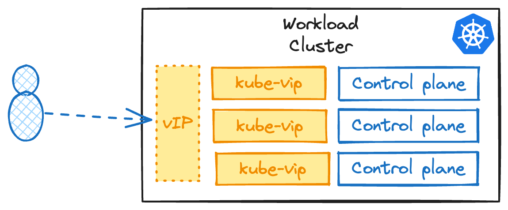
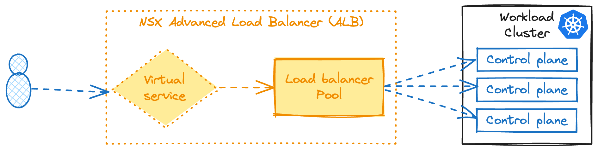

In order to run the Giant Swarm platform in your VMware vSphere environment, several prerequisites must be satisfied to support Cluster API Provider VMware Cloud Director (CAPVCD).

## Requirements

The solution has some requirements from the vCenter side, and at the same time, the controllers that provision the infrastructure need some permissions again from the vCenter server API.

### VMware vSphere

The minimum version of vSphere required is 6.7 Update 3. It's recommended to run vSphere 7.0 or above. That versions support the Cloud Native Storage (CNS) feature needed for PersistentVolumes (PV) in Kubernetes.

| VMware product | Required version |
|------|------|
| VMware virtual hardware | 13 or later |
| vSphere ESXi hosts | 6.7 Update 3 or later |
| vCenter host | 6.7 Update 3 or later |

### Resource pool

It's recommended to create one resource pool across the hosts where the workload cluster virtual machines will run. However, in case of inconvenience, it's possible to run the virtual machines in the implicit root resource pool located at the vSphere cluster level.

## Controller permissions

The Cluster API controller that provisions the infrastructure in the vSphere environment needs a role with a set of permissions. To follow the principle of least privilege, it's recommended that a specific user and role be created for the controller.

<!-- Xavier can we provide a text here to create the user too? -->

Create the user role browsing to `Administration > Access Control > Roles`and clicking `NEW`. The role must have at least the following permissions:

| Category | permissions |
| -------- | -------- |
| `Datastore` | `Allocate space` `Browse datastore` `Low level file operations` |
| `Global` | `Disable methods` `Enable methods` `Licenses` |
| `Network` | `Assign network` |
| `Resource` | `Assign virtual machine to resource pool` |
| `Sessions` | `Message` `Validate session` |
| `Profile` driven storage | `Profile-driven storage view` |
| `vApp` | `Import` |
| `Virtual machine` | `Configuration/Change Configuration` `Configuration/Add existing disk` `Configuration/Add new disk` `Configuration/Add or remove device` `Configuration/Advanced configuration` `Configuration/Change CPU count` `Configuration/Change Memory` `Configuration/Change Settings` `Configuration/Configure Raw device` `Configuration/Extend virtual disk` `Configuration/Modify device settings` `Configuration/Remove disk` `Configuration/Create from existing` `Configuration/Remove` `Interaction/Power off` `Interaction/Power on` `Provisioning/Deploy template` |

Apart of the permissions you need to assign the role to the following objects:

- vCenter Server
- Data centers or data center folders
- Hosts and clusters
- VM templates
- Resource pools (With Propagate to children)
- Distributed Port Group
- Distributed Switch
- VM and Template folders (With Propagate to children).

__Warning__: In case you want to leverage failure domains at the host level where a group of hosts is a failure domain (data centers, racks, PDU distribution, Etcd), Cluster API implementation needs permissions to work with `anti-affinity` rules. As a result the role requires the following permissions: `Host > Edit > Modify cluster`.

## Networking

In the cluster definition, you need to specify a network for the controller to provision the default gateway and connect the virtual machines (VMs). The DHCP service must be enabled on this network to assign IP addresses to the cluster nodes automatically.

A vSphere environment has no concept of the load balancer, which Kubernetes requires to expose services of the type load balancer and the API in a highly available mode. As a result, the Cluster API implementation includes `kube-vip`, a layer-2 load balancer to address all environments. The other option is to use NSX Advanced Load Balancer when available in your environment.



Since vSphere has no concept of load balancers out of the box, Cluster API ships with [kube-vip](), a layer two load balancer that works with [ARP](https://en.wikipedia.org/wiki/Address_Resolution_Protocol) requests. By default, `kube-vip` only handles the Kubernetes API access. Still, at Giant Swarm, we also deploy the `kube-vip` provider to offer the capability to create services of type load balancer.

The ARP layer two protocol informs the network of the location of a new host address. `kube-vip` runs in-cluster as opposed to a more traditional external load-balancer that will forward IP packets to its upstream servers.

Due to the in-cluster operation of `kube-vip`, the cluster network where this component is deployed must have a dedicated subnet range outside of the DHCP scope. To avoid IP conflicts, we recommend having one subnet per management cluster.

When deploying a Cluster API cluster, it automatically selects an IP from the IP pool by default. However, to have available IPs for services of type load balancer in the workload cluster, you must explicitly set a CIDR in the nodes' subnet.

Learn more about how to configure `kube-vip` in the [advanced documentation]().



When using NSX Advanced Load Balancer (NSX ALB), [there are several components](https://docs.vmware.com/en/VMware-vSphere/7.0/vmware-vsphere-with-tanzu/GUID-A247F5F2-AC7E-48E7-B615-F8D361C7292A.html) involved to enable load balancer capabilities in Kubernetes.

The `controller` in NSX ALB plays a pivotal role. It's responsible for communicating the operations requested to the vCenter Server, ensuring the smooth functioning of the load balancer. Additionally, there is a `service engine` to manage virtual IP addresses and a Kubernetes `operator` to reconcile the NSX ALB resources in the clusters.




Network traffic requirements. The cluster nodes must have access to:

- vCenter endpoint on port 443 so that the controllers can manage the cluster's lifecycle.
- Internet on port 443 to pull artifacts from Github, download CVE databases, pull container images, etc. We support authenticated HTTP proxies and we provide a [domain allowlist](https://docs.giantswarm.io/vintage/platform-overview/security/cluster-security/domain-allowlist/) for firewall whitelisting.

## Virtual machine templates

To provision the virtual machines (VMs) for the cluster nodes, Giant Swarm needs permissions to upload `VM templates` to vCenter Server. The templates use a convention with the Linux distribution and Kubernetes version on the name (for example `flatcar-stable-3815.2.1-kube-v1.25.16`).

<!-- Xavier here we dont have to mention anything about the VM sizing? -->
