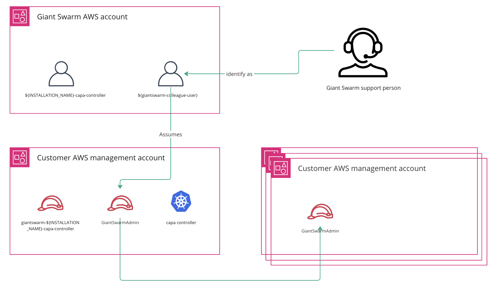

This guide provides the necessary steps to prepare your AWS accounts to run our platform, including Cluster API Provider for AWS (CAPA).

## Requirements

You can run the management and workload clusters in the same account or separate accounts in AWS environments. To help you take the decision, please read our [multi-account article](), where we explain the pros and cons of both approaches. Most requirements are related to configuring initial _Identity and Access Management (IAM)_ roles which are then used by Giant Swarm to automatically configure and update your accounts for full compatibility.



To perform the following steps, you must access the AWS console or have AWS CLI installed and pointed to the right account.

## Step 1: IAM setup{#iam-setup}

There are various IAM resources required to run our platform. To ensure fast and streamlined operations to our customers, these IAM resources are managed by Giant Swarm in an automated system. [Below](#iam-roles) are details of each IAM role we use for informational purposes only.

To onboard a new AWS account to use with the Giant Swarm platform, for both Management and Workload Clusters, follow the instructions in the [`giantswarm-aws-account-prerequisites`](https://github.com/giantswarm/giantswarm-aws-account-prerequisites/blob/main/onboarding/README.md) repository to create [`GiantSwarmAdmin`](#iam-giantswarm-admin) and [`GiantSwarmReadOnly`](#iam-giantswarm-readonly) roles. Additionally prerequisites repository provides the OpenTofu configuration we use to manage the IAM roles.

After that, make sure to notify your Giant Swarm account engineer to provide the new AWS account ID so we can bootstrap the rest of the required IAM resources.

In case you have already set up the management cluster and Giant Swarm has confirmed configuration of the new AWS account, you can [configure cluster role identity](#configure-cluster-role-identity}) for your Workload Cluster. With this in place you can proceed with the [creation of the workload cluster]().

## Step 2: Configure the cluster role identity for Workload Clusters {#configure-cluster-role-identity}

This step involves storing the AWS credentials in the platform to allow the CAPA controller to manage your account's infrastructure. In Cluster API there is a custom resource called `AWSClusterRoleIdentity` that stores the AWS role ARN and the role's name.

By default, the controller uses a `default` configuration, which points to the role in the management cluster account. If you want to create a new workload cluster in a new AWS account, you need to create a new `AWSClusterRoleIdentity` resource that references the role of that AWS account. Example:

```yaml
apiVersion: infrastructure.cluster.x-k8s.io/v1beta2
kind: AWSClusterRoleIdentity
metadata:
  labels:
    cluster.x-k8s.io/watch-filter: capi
  name: <ACCOUNT_NAME>
spec:
  allowedNamespaces:
    list: null
    selector: {}
  roleARN: arn:aws:iam::${ACCOUNT_ID}:role/giantswarm-golem-capa-controller
  sourceIdentityRef:
    kind: AWSClusterControllerIdentity
    name: default
```

The `<ACCOUNT_NAME>` is a short unique name referencing the AWS account (`development`, `sandbox` or `staging2`). We advocate using the same name as the [organization]() to help map the resources and the accounts. The `<ACCOUNT_ID>` is the AWS account ID where the role is created and where the workload cluster will be provisioned.

**Note**: The [official documentation](https://cluster-api-aws.sigs.k8s.io/topics/multitenancy) provides more information about configuring AWS credentials.

In the [next step]() you define which role the `AWSCluster` uses to provision the cluster adjusting the value `aws.awsClusterRoleIdentityName`.

**Note**: In case you are working with a Giant Swarm partner, you might not have access to the platform API. In that case, please provide the role ARNs values, CAPA controller and staff to your partner contact.

**Warning**: If your AWS account is a China account, ensure you follow the [Internet Content Provider (ICP) Filing process](https://www.amazonaws.cn/en/support/icp/).

## IAM roles used by Giant Swarm {#iam-roles}

This is a non-exclusive list of the primary IAM roles used by the Giant Swarm platform. _For informational purposes only_.

### CAPA controller role {#iam-capa-controller-role}

The Cluster API for AWS (CAPA) controller in the management cluster uses the controller role to provision all infrastructure for managing workload clusters.

Each management cluster has its own IAM role in each of the AWS accounts it manages clusters on.

Name pattern: `giantswarm-${installation_name}-capa-controller`

### Giant Swarm staff admin role {#iam-giantswarm-admin}

This IAM role is used by Giant Swarm engineers to access the AWS account for support purposes, specifically when changes need to be made on-the-fly.

It is also used by our account automation to manage the IAM resources.

Name: `GiantSwarmAdmin`

### Giant Swarm staff read-only role {#iam-giantswarm-readonly}

This IAM role is used by Giant Swarm engineers to access the AWS account for support purposes in a view-only capacity.

It is also used by our account automation to plan and validate changes during pull-requests on our infrastructure code.

Name: `GiantSwarmReadOnly`

## Service quotas {#quotas}

AWS establishes default quotas for all your cloud services as described in the [provider documentation](https://docs.aws.amazon.com/general/latest/gr/aws_service_limits.html).

On top of the default quotas, Giant Swarm requires some additional resources for running your clusters. After successful [IAM configuration](#iam-setup) we are fully taking care of managing limits of all necessary services automatically. Full list of all required quotas can be found in our OpenTofu [configuration](https://github.com/giantswarm/giantswarm-aws-account-prerequisites/blob/main/service-quotas/variables.tf)
