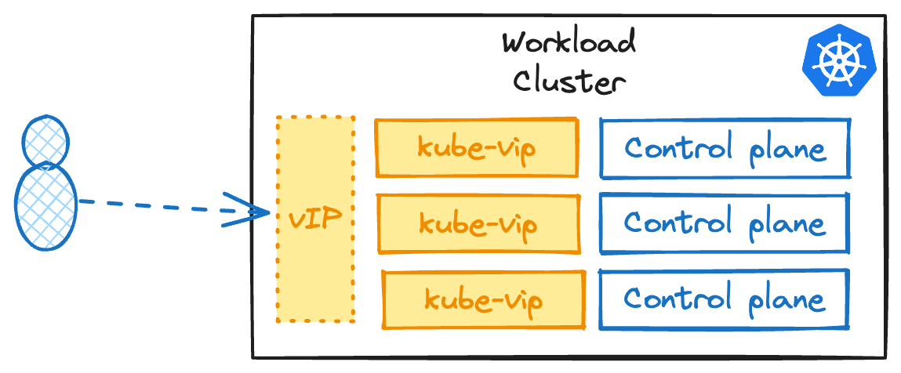

To run the Giant Swarm platform on Proxmox VE, you must satisfy several prerequisites that support the Cluster API Provider for Proxmox (CAPMOX).

## Requirements

### Proxmox VE

Proxmox VE 7.0 or later is required. Proxmox VE 8.0 or later is recommended.

### Step 1: Resource Pools

Giant Swarm recommends creating two dedicated resource pools:

- A **VM pool** (for example, named `capi`) where workload cluster virtual machines will run.
- A **template pool** (for example, named `templates`) containing the VM templates used to provision cluster nodes.

Using dedicated pools allows fine-grained access control and keeps cluster workloads isolated from other Proxmox resources.

You can also ensure even tighter isolation by using separate Proxmox pools for each cluster, however the templates folder is typically shared across clusters to avoid unnecessary duplication of templates.

#### Create resource pools

Follow these steps on your Proxmox VE node, or replicate them via the Proxmox web UI.

```bash
pveum pool add capi
pveum pool add templates
```

## Step 2: Networking

Network requirements include:

- A Proxmox network bridge (for example, `vmbr0`) with an IP range available for cluster VMs.
- Static IP address management — CAPMOX uses an in-cluster IPAM provider rather than DHCP. You must provide Giant Swarm with one or more IP ranges for node addresses.
- Access to the Proxmox VE API endpoint (port 8006) from both the Management Cluster and Workload Clusters.
- Internet access on port 443 for artifact retrieval and container images. You can whitelist the domains in this [domain allow list]({{ relref "/overview/security/domain-allowlist" }}). Note that we also support authenticated HTTP proxies.

**Note:** Contact Giant Swarm support when planning multi-network or VLAN-based cluster configurations, as additional SDN permissions may be required (depending on your configuration).

Since Proxmox has no concept of load balancers out of the box, CAPMOX ships with [kube-vip](), a layer two load balancer which utilises [ARP](https://en.wikipedia.org/wiki/Address_Resolution_Protocol) or [BGP](https://en.wikipedia.org/wiki/Border_Gateway_Protocol).

`kube-vip` uses ARP or BGP to inform the network of the route to the loadbalanced IP. `kube-vip` runs in-cluster as opposed to a more traditional external load-balancer that will forward IP packets to its upstream servers.



Due to the in-cluster operation of `kube-vip`, the cluster network where this component is deployed must have a dedicated subnet range outside of the DHCP scope to issue addresses from. To avoid IP conflicts, we recommend having one subnet per management cluster.


When deploying a Cluster API cluster, it automatically selects an IP from the IP pool by default. However, to have available IPs for services of type load balancer in the workload cluster, you must explicitly set a CIDR in the nodes' subnet.

Learn more about how to configure `kube-vip` in the [advanced documentation]().

## Step 3: Permissions

CAPMOX requires a dedicated Proxmox user and API token with least-privilege access. Follow these steps on your Proxmox VE node, or replicate them via the Proxmox web UI.

### Create custom roles

Proxmox does not include single-privilege roles by default. Create two custom roles used in the ACL assignments below:

```bash
pveum role add CAPMOXAudit -privs "Sys.Audit"
pveum role add CAPMOXDatastoreAlloc -privs "Datastore.AllocateSpace"
```

### Create the user and API token

**Note:** Giant Swarm recommends creating a separate user for each Workload Cluster. This allows you to manage permissions on a per-cluster basis and revoke access if needed without affecting other clusters.

```bash
pveum user add capmox@pve
pveum user token add capmox@pve capi -privsep 0
```

Make a note of the generated token secret — it is only displayed once and will be required when configuring the management cluster.

### Assign permissions

Apply the following ACLs. The paths should be adjusted to match your environment (storage names, pool names, and optional VLAN IDs).

```bash
pveum aclmod / -user capmox@pve -role CAPMOXAudit
pveum aclmod /nodes -user capmox@pve -role CAPMOXAudit -propagate 1
pveum aclmod /pool/capi -user capmox@pve -role PVEVMAdmin
pveum aclmod /pool/templates -user capmox@pve -role PVETemplateUser
pveum aclmod /storage/capi_files -user capmox@pve -role PVEDataStoreAdmin
pveum aclmod /storage/shared_block -user capmox@pve -role CAPMOXDatastoreAlloc
```

The table below summarises each permission and its purpose:

| Path | Role | Propagate | Purpose |
|------|------|-----------|---------|
| `/` | CAPMOXAudit | No | Top-level system visibility |
| `/nodes` | CAPMOXAudit | Yes | Node-level system visibility |
| `/pool/capi` | PVEVMAdmin | No | Full VM management within the cluster pool |
| `/pool/templates` | PVETemplateUser | No | Read and clone VM templates |
| `/storage/capi_files` | PVEDataStoreAdmin | No | Manage cloud-init ISO images |
| `/storage/shared_block` | CAPMOXDatastoreAlloc | No | Allocate space on shared block storage |

**Note:** If you use SDN with VLANs, additionally grant `PVESDNUser` on the relevant SDN zone path, for example `/sdn/zones/localnetwork/vmbr0/1234`.

### TLS configuration

By default, CAPMOX skips TLS verification when communicating with the Proxmox API. For production environments, Giant Swarm recommends enabling TLS verification using a valid certificate or your internal CA. Provide the root certificate path to the CAPMOX controller at deployment time.

## Step 4: Virtual Machine Templates

Giant Swarm uploads VM templates to Proxmox following a naming convention that includes the Linux distribution and Kubernetes version, for example:

```
flatcar-stable-xxxx.y.z-kube-x.yy.zz-tooling-x.yy.1-gs
```

Templates must be placed in the `templates` resource pool created in Step 1 so that the `capmox@pve` user can clone them. Ensure sufficient storage is available on the Proxmox node designated as the template source.

## Step 5: Additional Application Credentials

Two applications run inside workload clusters and require their own access to the Proxmox API: the Proxmox CSI Plugin (for persistent volume management) and the Proxmox Cloud Controller Manager (for node lifecycle integration). Each requires a dedicated user and token with its own minimal set of privileges.

### Proxmox CSI Plugin

The CSI plugin attaches and detaches Proxmox storage volumes to cluster nodes. Create a dedicated role, user, and token.

**Note:** Giant Swarm recommends creating a separate user for each Workload Cluster CSI deployment. This allows you to manage permissions on a per-cluster basis and revoke access if needed without affecting other clusters.

```bash
pveum role add CSI -privs "VM.Audit VM.Config.Disk Datastore.Allocate Datastore.AllocateSpace Datastore.Audit"
pveum user add kubernetes-csi@pve
pveum aclmod / -user kubernetes-csi@pve -role CSI
pveum user token add kubernetes-csi@pve csi -privsep 0
```

The token identifier will be `kubernetes-csi@pve!csi`. Record the generated token secret for use during cluster configuration.

### Proxmox Cloud Controller Manager

The Cloud Controller Manager synchronises Proxmox node metadata with Kubernetes. Create a dedicated role, user, and token.

**Note:** Giant Swarm recommends creating a separate user for each Workload Cluster Cloud Controller Manager deployment. This allows you to manage permissions on a per-cluster basis and revoke access if needed without affecting other clusters.

```bash
pveum role add CCM -privs "VM.Audit VM.GuestAgent.Audit Sys.Audit"
pveum user add kubernetes-ccm@pve
pveum aclmod / -user kubernetes-ccm@pve -role CCM
pveum user token add kubernetes-ccm@pve ccm -privsep 0
```

The token identifier will be `kubernetes-ccm@pve!ccm`. Record the generated token secret for use during cluster configuration.

## Next Steps

For first-time setup without an existing management cluster, Giant Swarm will provide one within a few days. Review the [secret sharing procedures](/overview/security/sharing-secrets/) before sharing your API tokens with Giant Swarm.

With an existing management cluster, proceed to [access the platform API](/getting-started/access-to-platform-api/).
