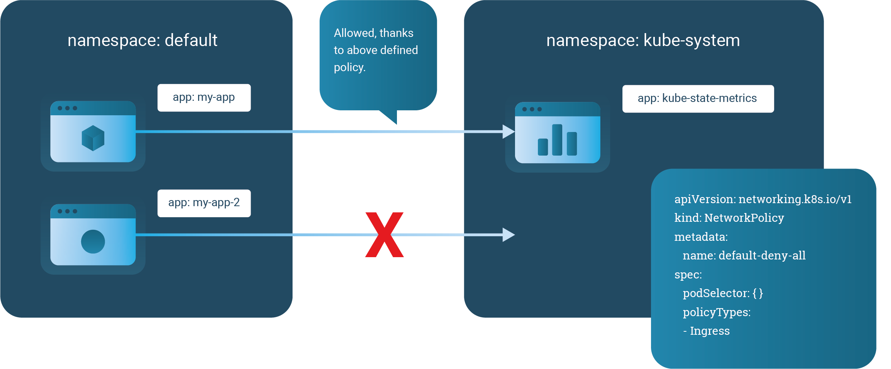

By default, the workload clusters created by the platform expose the Kubernetes API endpoint publicly and the cluster workloads have internet access. It is what we called a `public` cluster. This guide focuses on understanding how these cluster's networking works and which options are available for managing your app's connectivity. In case you want to know more about `private clusters` read [this guide]().

The connectivity within the cluster is managed by the Container Network Interface (CNI) plugin. Our platform uses Cilium as network interface implementation. A part from offering connectivity between the workloads, Cilium also provides network security policies to control traffic between your applications.

In this guide we give an overview and introduction of how to create and use these policies.

## Requirements

First of all, you need a running workload cluster. If you don't have one, please first [create a workload cluster](). Second, you need to deploy `hello-world` application explained [here]().

## Step 1: Understand network policies

By default, a exception of `kube-system` and `giantswarm` namespaces, all pods in the cluster are non-isolated and accept traffic from any source.

As soon as you have a `NetworkPolicy` resource applied that selects a certain group of pods, those pods become isolated and reject any traffic that is not allowed by any other `NetworkPolicy`.

Note that network policies are additive, so having two network policies that select the same pods will result in allowing both defined policies.

Keep in mind that a `NetworkPolicy` is applied to a particular namespace and only selects pods in that particular namespace.

### Network policy syntax

The network policy resource is part of the API group `networking.k8s.io`. Currently, it is in version `v1`.

The `spec` of the resource mainly consists of three parts:

- `podSelector`: Use labels to select the group of pods for which the rules will be applied.

- `policyTypes`: Which could be `Ingress`, `Egress` or both. This field will determine if the rules will be applied to incoming and/or outgoing traffic. If it is not defined, then `Ingress` will be enabled by default and `Egress` only when there are rules defined.

- `ingress`/`egress`: these sections allow a list of `from` (Ingress) or `to` (Egress) and `ports` blocks. Each `from`/`to` block contains a range of IPs (`ipBlock`) and/or a list of namespaces selected by label (`namespaceSelector`) and/or a list of pods by label (`podSelector`). That select which IPs, namespaces or pods can talk to our target pod or to which IPs, namespaces or pod our target can talk to. The `ports` block defines which ports are affected by this the rule.

An easy example to clarify the explained concepts

```yaml
apiVersion: networking.k8s.io/v1
kind: NetworkPolicy
metadata:
  name: simple-policy
  namespace: default
spec:
  podSelector:
    matchLabels:
      app: target-app-who-is-applied-the-policy
  policyTypes:
  - Ingress
  - Egress
  ingress:
  - from:
    - ipBlock:
        cidr: 172.17.0.0/16
    - namespaceSelector:
        matchLabels:
          name: namespace-that-can-talk-to-my-app
    - podSelector:
        matchLabels:
          app: pod-that-can-talk-to-my-app
    ports:
    - protocol: TCP
      port: 6379
  egress:
  - to:
    - ipBlock:
        cidr: 10.0.0.0/24
    - namespaceSelector:
        matchLabels:
          name: namespace-my-app-can-talk-to
    - podSelector:
        matchLabels:
          app: pod-my-app-can-talk-to
    ports:
    - protocol: TCP
      port: 5978
```

## Step 2: Create a default network policy

Since we like to follow the zero trust principle, we recommend creating a default deny policy for all namespaces. This way, you can control the traffic that goes in and out of your pods.

You can create default policies for a namespace by creating a `NetworkPolicy` that selects all pods as follows:

```yaml
apiVersion: networking.k8s.io/v1
kind: NetworkPolicy
metadata:
  name: default-deny
spec:
  podSelector: {}
  policyTypes:
  - Ingress
  - Egress
```

__Warning__: By default all clusters, contain a `default-deny` policy for sensitive namespaces like `giantswarm` and `kube-system`. To communicate with any pods in that namespace you need to explicitly create a network policy that allows it.

Note that the namespace needs to exist before you apply the network policy to it.

The default policy shown above will limit ingress and egress traffic in the namespace applied. You can also restrict only for `egress` or `ingress`.

## Step 3: Allow traffic to your app

As we mentioned before, we harden the clusters restricting the communication with pods in `kube-system` and `giantswarm`. In case you need to allow communication with a running pod in one of those namespaces you have to explicitly declare it. For example:

```yaml
kind: NetworkPolicy
apiVersion: networking.k8s.io/v1
metadata:
  name: ksm-can-be-accessed-by-my-app
  namespace: kube-system
spec:
  podSelector:
    matchLabels:
      app: kube-state-metrics
  ingress:
    - from:
      - podSelector:
          matchLabels:
            app: my-app-that-needs-access-to-ksm
      ports:
        - protocol: TCP
          port: 10301
```

To make it more visual, this is what the communication between namespaces will look like.



### Allowing specific pod to pod access

In the following example, we allow traffic to pods labeled `role: backend` from pods with the `role: frontend` label and only on TCP port 6379.

```yaml
kind: NetworkPolicy
apiVersion: networking.k8s.io/v1
metadata:
  name: backend-access
spec:
  podSelector:
    matchLabels:
      role: backend
  ingress:
    - from:
      - podSelector:
          matchLabels:
            role: frontend
      ports:
        - protocol: TCP
          port: 6379
```

You need to apply this policy to the namespace that the backend pods live in.

```nohighlight
kubectl -n <namespace> apply -f backend-access.yaml
```

### Allowing pod to pod access within a namespace

In some cases, you may want to allow all intra-namespace communication. For this, you can use open Pod selectors that catch all pods.

```yaml
kind: NetworkPolicy
apiVersion: networking.k8s.io/v1
metadata:
  name: intra-namespace
  namespace: freeforall
spec:
  podSelector:
  ingress:
    - from:
      - namespaceSelector:
          matchLabels:
            name: freeforall
```

Note that the namespace you apply this policy to needs to carry a label `name:` similar to the actual name key in its metadata:

```yaml
apiVersion: v1
kind: namespace
metadata:
  name: freeforall
  labels:
    name: freeforall
```

After creating the namespace, you can then create the `NetworkPolicy`.

```nohighlight
kubectl apply -f freeforall-namespace.yaml
kubectl apply -f intra-namespace-policy.yaml
```

## Step 4: Allow traffic to your app from outside the cluster

In case you have publicly exposed a service through ingress and you have a `default-deny` policy in place or just want to limit that traffic to a specific port, you need a network policy like the following:

```yaml
kind: NetworkPolicy
apiVersion: networking.k8s.io/v1
metadata:
  name: allow-external
  namespace: default
spec:
  podSelector:
    matchLabels:
      app: web
  ingress:
  - from: []
    ports:
    - port: 80
```

The `allow-external` policy, described above, will allow any traffic (no matter if it's outside or inside your cluster) to the pods on port 80.

In this guide we discussed different use-cases of limiting Pod communication with network policies, based on our best practices.

## Step 5: Allow DNS traffic from my pod

Once you have a default deny egress policy, the DNS traffic is also blocked. When you want to allow egress traffic for a specific application then you will need to allow DNS traffic too. You can use a network policy that targets just DNS like:

```yaml
apiVersion: networking.k8s.io/v1
kind: NetworkPolicy
metadata:
  name: allow-dns-for-my-app
  podSelector:
    matchLabels:
      app: web
  policyTypes:
    - Egress
  egress:
  - to:
    - namespaceSelector:
        matchLabels:
          name: kube-system
    ports:
    - protocol: UDP
      port: 53
    - protocol: UDP
      port: 1053
```

__Warning__: By default clusters run CoreDNS listening on the port 1053 (due to security reasons). So you will need to include port `1053` on the list of ports.

## Next step

Since you learnt how to configure your application to communicate with other services, now lets dive on how [observe your application]().
