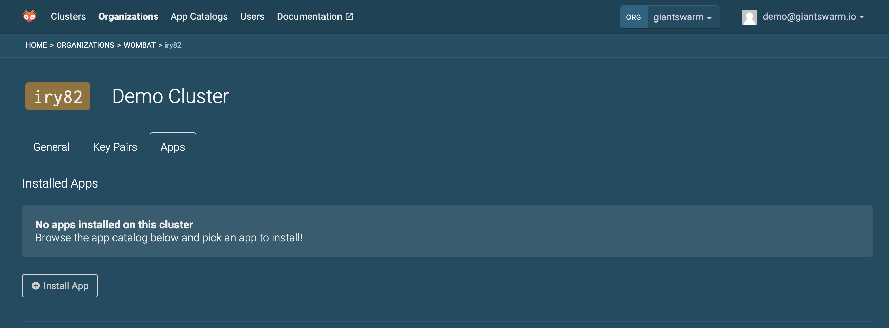
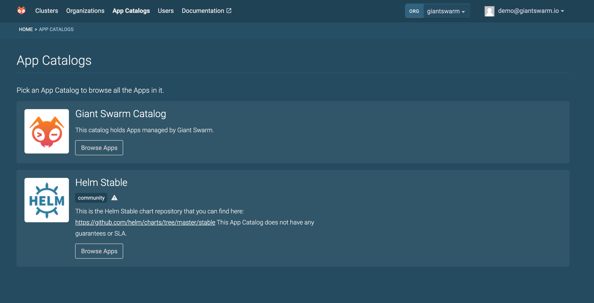
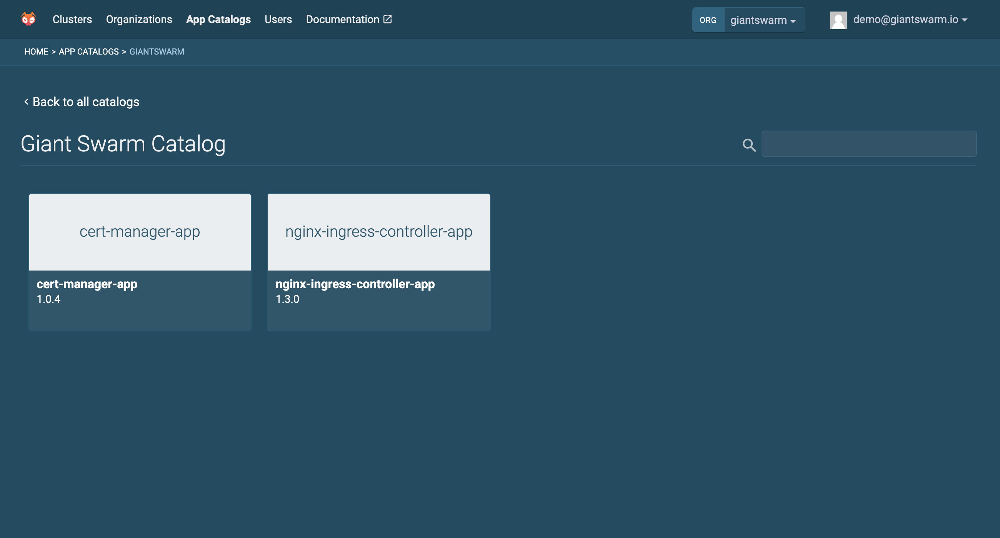

+++
title = "Installing an Ingress Controller"
description = "How to install the nginx-ingress-controller using our Web UI"
date = "2020-02-04"
type = "page"
weight = 50
tags = ["tutorial"]
+++

# Installing an Ingress Controller

An ingress controller helps you expose your services to the outside world.

Not all of our clusters come with an ingress controller pre-installed. We are
currently in a shift where certain releases have a pre-installed ingress controller
and certain releases require you to install one yourself.

Eventually all releases will not ship with a built in ingress controller. That
allows you full control to choose what and how many ingress controllers you
want to run on your cluster.

### Which releases do not ship with an ingress controller?

Currently only clusters on our AWS installations that have a release version
greater than 10.0.0 ship without an ingress controller by default.

Clusters on Azure and KVM (On-premises) continue to include the nginx-ingress-controller
as a default component.

### How do I Install my own Ingress Controller?

Using our Web UI you can install an nginx ingress controller using our App Catalog.

1. Click "Install App" from the "Apps" tab when viewing your cluster
  

2. Click "Browse Apps" from the "Giant Swarm Catalog"
  

3. Click "nginx-ingress-controller-app" from the list of apps.
  

4. Click "Configure & Install"

5. Click "Install App" (No further configuration is required)
  

After a few moments the nginx ingress controller should be running on your cluster.