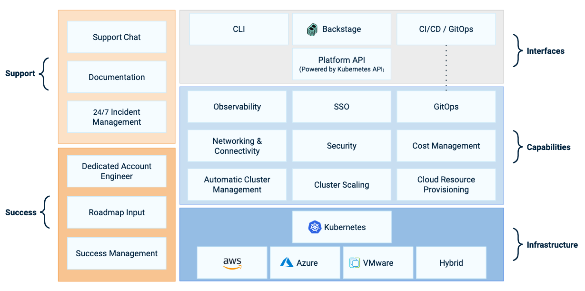

Giant Swarm's cloud-native developer platform integrates open-source components that work together to provide a seamless experience for managing the lifecycle of containerized applications. The platform is based on Kubernetes and designed to be cloud-agnostic, allowing you to deploy your applications on any of the supported cloud providers, including on-premises. The interfaces allow development teams and automations to deploy applications, keep the clusters secure, and use other capabilities that we explain below. On top, you benefit from our strong support model that ensures your long-term success and stability of workloads.

## Platform architecture

The platform architecture consists of the following layers:

- Interfaces: how administrators, developers and automation can access the platform, for example to deploy applications, monitor health of clusters and workloads or use other capabilities.

- Capabilities: features offered by the platform, such as application deployment, auto-scaling, security or observability.

- Infrastructure: the Kubernetes-based platform can manage clusters on several cloud providers. We support AWS, Azure, VMware (on-premises) or a mixture thereof ("hybrid").

Along these layers, Giant Swarm provides a live support channel, incident management, and good documentation to help you get the most out of the platform. Additionally, you have a dedicated account engineer to help create a common roadmap and to provide guidance on how to use the platform for your goals.

## Platform API

The Giant Swarm platform is build on top of `Kubernetes` thanks to [`Cluster API`](https://cluster-api.sigs.k8s.io/), a open source  project that standardize the cluster lifecycle management across different cloud providers or on-premises infrastructure.

The Platform API is the regular Kubernetes API of your central _management cluster_ and is your interface for deploying workload clusters and applications, or to reach other capabilities such as the observability and security dashboards.

In Giant Swarm, the management cluster is also used for enhancing the platform capabilities, such as monitoring, logging, and alerting. The customer platform team uses the management cluster to configure which capabilities are available to the developers, and even to create new capabilities.

Most often, you have a single management cluster that manages multiple workload clusters, but in case of running infrastructure in multiple regions, you can have multiple management clusters. The platform API isn't more than the `Kubernetes` management cluster API, but with some additional resources that allow you to manage the lifecycle of your workloads across multiple clusters or inspect the application metrics of your fleet of clusters.

[Learn how to access the platform API]().

## GitOps

Giant Swarm uses GitOps as first-class citizen to manage the lifecycle of cluster and applications. It's modern operational framework which allow managing our resources using `Git` repositories as the single source of truth. In the platform, GitOps ensures that all changes are version-controlled, auditable, and easily reversible. By leveraging Git’s robust workflows, teams can automate deployments and rollbacks while maintaining consistency and reliability across environments. This capability empowers developers to implement continuous delivery practices, facilitating faster and more secure releases.

[Learn more in our guide about GitOps]().

## Developer portal

Giant Swarm uses [Backstage](https://www.cncf.io/projects/backstage/) as developer portal serving as the central hub for accessing all platform services and resources. It provides an intuitive interface where platform engineers and developers find documentation, manage their projects, and access tools necessary for application development and deployment. By consolidating resources and simplifying access, your developer portal enhances the user experience, reduces onboarding time, and fosters collaboration among teams. It acts as the gateway to the platform’s capabilities, streamlining workflows and promoting productivity.

## Observability

Observability on the Giant Swarm platform is based on the Grafana stack. Collectors store metrics, logs and traces in central storage and you can use them in the managed Grafana instance on your management cluster to get a centralized view, set up alerts and dashboards, or troubleshoot issues. In our tutorial (TODO LINK HERE OR BELOW), you see how easily your developers can start monitoring applications with this stack. Giant Swarm's pre-installed dashboards let you view the infrastructure and cluster health without extra effort.

## Single sign-on

Single Sign-On (SSO) simplifies user authentication across your use of the Giant Swarm platform by authenticating user access with your existing identity provider (for example Google Workspaces or Microsoft Entra / Active Directory). This enhances security and user convenience by centralizing identity management and not requiring a separate password. You can build on top of Kubernetes Role-Based Access Control (RBAC) to define fine-grained access policies and permissions, ensuring which users are authorized to access certain platform resources.

TODO LINK OVERVIEW ARTICLE

## Network and connectivity

The different technologies used in the Giant Swarm platform provide you with a secure and reliable network and connectivity between your applications and services. Platform engineers can create network policies to control traffic flows and enforce security rules, ensuring that data is protected and isolated. Relying on the built-in networking capabilities of `Kubernetes` as well as the extended capabilities of `Cilium CNI`, the platform supports many routing and load balancing strategies, enabling seamless communication between services and applications.

## Runtime security

Runtime security focuses on protecting applications and infrastructure during execution. [Falco](https://www.cncf.io/projects/falco/) provides you with intrusion detection, vulnerability scanning, and automated threat response capabilities. The Giant Swarm platform ensures that security policies are enforced consistently, reducing the attack surface and mitigating risks.

## Cost management

Cost control is becoming increasingly important as organizations seek to optimize their cloud spending. Based on lessons learned from our experience with customers, the platform is built to help you manage costs effectively. Our solution engineers will help you to add visibility and control over your resource usage and expenses, leading to better decision-making and cost savings.

## Automatic cluster management

Based on Cluster API and other operators, the Giant Swarm platform provides automated provisioning, scaling, (planned) upgrading and deletion of clusters, reducing the operational burden on your team. The platform ensures clusters are always running optimally and securely, allowing developers to focus on building and deploying applications without worrying about underlying infrastructure management. In addition, special capabilities such as private clusters and routing are possible, allowing you to integrate the platform in your existing networks.

## Cluster scaling

One of the key features of the Giant Swarm platform is the ability to scale clusters automatically. It allows for dynamic adjustment of resources based on demand, supporting both horizontal and vertical scaling, ensuring applications have the necessary resources to handle varying workloads. By automating the scaling process, the platform helps maintain performance and reliability while optimizing resource utilization and cost.

## Cloud resources provisioning

Most likely, you have already external cloud resources which could be managed by the platform. Thanks to [Crossplane](https://www.cncf.io/projects/crossplane/) included in the management API, you can include all your infrastructure, such as databases, queues or buckets, as part of the platform, relying on the same principles `Kubernetes` offers. Centralizing the management of all the infrastructure in a single place, helps you reduce the operational overhead and offer a self-service experience to your developers.
