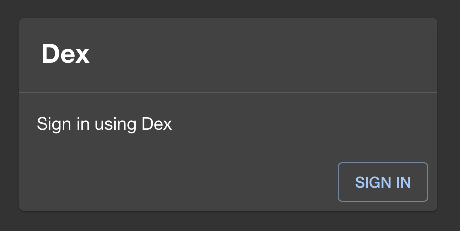
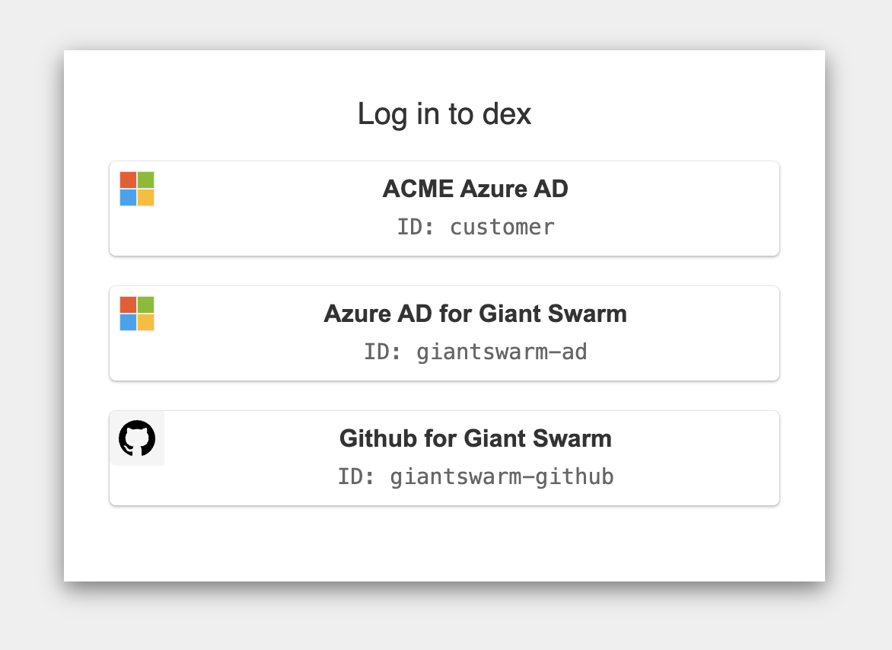

Giant Swarm provides the Backstage developer portal individually for every customer in one of the customer's management clusters.

## Finding the developer portal URL

A Giant Swarm contact will gladly provide you with the URL to access your portal.

By default, the URL is set to `https://backstage.BASE_DOMAIN/`. However, this URL is customizable to match your company's domain and branding preferences. Find out more in the [customizing the developer portal]() section.

## Single sign-on

The developer portal uses the same sign-in mechanism as the Giant Swarm management clusters and other web UIs provided by Giant Swarm, like Grafana. As an end user, you log in with your corporate identity provider (IdP) credentials.

## Logging in

When accessing the developer portal URL for the first time, you should find a login prompt like the one below.

Once you click the SIGN IN button, a popup window will apear. See example below.

Note that **only the option with ID `customer`** will work for you. The other options are for Giant Swarm staff members only.

Once you select the button with ID `customer`, you will be redirected to your corporate identity provider login page. In many cases, you are already logged in there and will immediately be redirected to the developer portal. In other cases, you will have to enter your credentials first, and then reach the developer portal after successful authentication.
