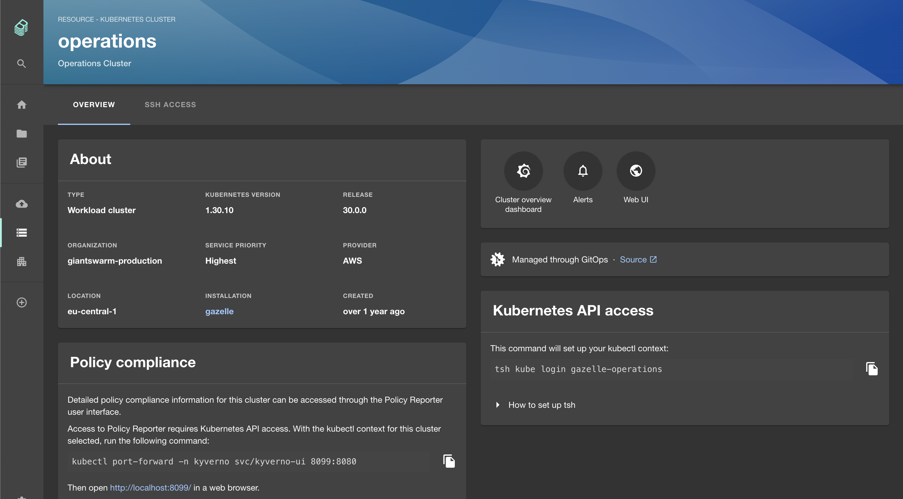

For each cluster, regardless whether workload or management cluster, you find a details page in the developer portal. The URI path of this page has the following schema:

```nohighlight
/clusters/{MC_NAME}/{MC_NAMESPACE}/{CLUSTER_NAME}
```

Here, `MC_NAME` is the name of the management cluster, `MC_NAMESPACE` is the namespace in the management cluster holding the cluster resources, and `CLUSTER_NAME` is the name of the cluster.

## Details

### About

The _About_ panel shows various cluster details.

<!-- TODO: explain in more detail -->

### Tool links

The tools panel in the top right provides direct links to the following tools:

1. **Cluster overview dashboard** in the Grafana instance of this installation, to get an overview of the cluster's health and performance. The dashboard also provides links allowing to drill deeper into workload metrics.

2. **Alerts** is a direct link into the alerting section of this installation's Grafana instance.

3. **Web UI** is a link to the cluster details page in the legacy Giant Swarm web UI.

### GitOps info

For clusters managed by Flux, this panel shows that the cluster is managed through GitOps. If possible, there is also a link shown to the repository location of the GitOps configuration.

<!-- TODO: explain what conditions have to be met. Ideally link to a dedicated article. -->

### Kubernetes API access

The panel explains how to access the Kubernetes API of this cluster using `kubectl` and Giant Swarm's plugin [kubectl-gs]().

Note that Giant Swarm staff members see different information in this panel than customer users.

### Policy compliance

The panel shows how to open the Policy Reporter UI for this cluster. Policy reporter is a tool that helps you understand how workloads comply with your [policies]().

### Labels

Here you can see all labels present on the main cluster resource. In order to display all labels in its original form, toggle the "Display raw labels" switch. With this switch off, you will see a selection of labels represented in a reader-friendly way.

<!--  Related: https://github.com/giantswarm/roadmap/issues/3822 -- please link documentation here once implemented -->

## SSH access tab

This tab is currently available to Giant Swarm staff only, explaining how to access cluster nodes via SSH and Teleport.
