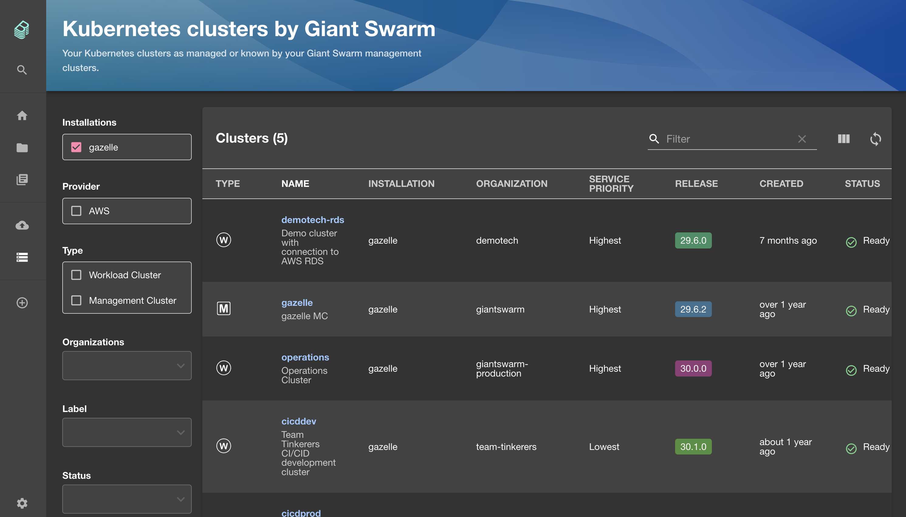

Select the **Clusters** item in the left-hand navigation to access the cluster overview. This overview shows all clusters in all your installations, including management clusters and workload clusters.

## List view

The list shows key details about all your clusters throughout your installations.

Note that **some available columns are hidden by default.** The three rectangles icon in the top right corner of the list view allows to select and deselect columns to be displayed.

Available columns are:

- **Type**: Type of cluster, either `M` for management cluster or `W` for workload cluster.
- **Name**: Name of the cluster. Click the name to open the [details page]() for this cluster.
- **Installation**: Name of the installation the cluster belongs to. Note that the management cluster of an installation has the same name.
- **Organization**: Name of the organization the cluster belongs to.
- **Service priority**: Service priority of the cluster.
- **Release**: Release version of the cluster.
- **Created**: When the cluster was created. Place your pointer on the value to see an accurate date and time.
- **Status**: Current status of the cluster.
- **Cluster app**: Version of the cluster app that deploys this cluster, including a link to the release details.
- **Kubernetes version**: Kubernetes version of the cluster.
- **Region**: Region of the cluster.
- **AWS account ID**: ID of the AWS account the cluster is provisioned in. Only available for clusters on AWS.

## Filters

You can filter the clusters list by a combination of these filters:

- **Installation**: Specify which installation/management cluster to query for resources. For fastest results, select only the installations you are interested in.
- **Provider**: Specify the provider of the cluster.
- **Region**: Specify the region of the cluster.
- **Type**: Specify the type of cluster, either management or workload.
- **Organization**: Specify the organization of the cluster.
- **Label**: Here you can select any label and value combination found in the cluster resources.
- **Status**: Filter by cluster status.
- **App version**: Filter by cluster app version.
- **Release**: Filter by release version.
- **Kubernetes version**: Filter by Kubernetes version.

## Further reading

- For more details about an individual cluster, refer to the [cluster details page]().
