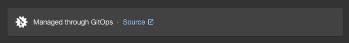

You can set up the developer portal to display links to GitOps source code for resources that [Flux](https://fluxcd.io/) manages. This helps users quickly jump to a resource's source code and check which code version is currently running in their cluster.



The screenshot shows how the GitOps indicator appears in the developer portal. You'll only see the source link if you configure the developer portal as explained in this guide.

## How the developer portal detects GitOps resources

To detect that a cluster is managed by Flux, the developer portal looks for `kustomize.toolkit.fluxcd.io/name` and `kustomize.toolkit.fluxcd.io/namespace` labels in the cluster's defining App resource. This information shows the GitOps indicator in the developer portal, but it doesn't provide enough details for a source code link.

## How the developer portal finds the GitOps source

The name and namespace combination found in the App resource points to a Kustomization (`kustomize.toolkit.fluxcd.io/v1`) resource in the cluster. This Kustomization typically has a `.spec.sourceRef` pointing to a GitRepository (`source.toolkit.fluxcd.io/v1`) resource. The Kustomization also includes a `.spec.path` field showing which part of the Git repository this Kustomization manages.

This GitRepository resource has a `.spec.url` field with the repository address where the source code lives. The GitRepository also provides a commit reference (or a branch or tag) in the `.status.artifact.revision` field.

These details (repository address, path, and commit reference) create a link in the user interface when you set up the configuration correctly.

### Example

Partial example of a Kustomization resource:

```yaml
apiVersion: kustomize.toolkit.fluxcd.io/v1
kind: Kustomization
metadata:
  name: demotech-gitops
  namespace: default
spec:
  path: ./management-clusters/gazelle
  sourceRef:
    kind: GitRepository
    name: demotech-gitops
```

Partial example of a GitRepository resource:

```yaml
apiVersion: source.toolkit.fluxcd.io/v1
kind: GitRepository
metadata:
  name: demotech-gitops
  namespace: default
spec:
  url: ssh://git@github.com/demotechinc/demotech-gitops
status:
  artifact:
    revision: main@sha1:299de19645659b14421992d059b6c2435486694d
```

## Configuration

To provide links that help users navigate to GitOps source code, we need two things:

1. Understand the repository address found in the GitRepository resource. Configure this with the `gitRepositoryUrlPattern` field.
2. Define the address pattern for your source code system UI (like GitHub, GitLab, Bitbucket). Configure this with the `targetUrl` field.

The Giant Swarm Backstage plugin lets you specify multiple combinations of these settings in the `app-config.yaml` file under the `gs.gitopsRepositories` section.

### `gitRepositoryUrlPattern`

With this field, you specify a regular expression (ECMAScript/JavaScript flavour) to capture values from the GitRepository's `.spec.url` property. The capturing group names (like `HOSTNAME`, `PROJECT_NAME`) let you reference these parts when creating links with the `targetUrl` template.

For example, to parse the repository address `ssh://git@github.com/demotechinc/demotech-gitops`, you could configure the following regex:

```nohighlight
^ssh:\/\/git@(?<HOSTNAME>github.+?)\/(?<REPO_PATH>.+?)(\.git)?$
```

[Try this regex in regex101.com](https://regex101.com/r/KGnXQg/1)

As a result, the `HOSTNAME` group will contain `github.com`, and the `REPO_PATH` group will contain `demotechinc/demotech-gitops`.

### `targetUrl`

Use the `targetUrl` field to create a link address based on the parts captured by the regex `gitRepositoryUrlPattern` and additional details (path and revision).

Using the example regex above, you could use `${{HOSTNAME}}` and `${{REPO_PATH}}` in your URL template. You can also use the following details independent of the regex:

- `${{PATH}}`: Directory path in the source repository. This comes from the `.spec.path` field of the corresponding Kustomization resource.
- `${{REVISION}}`: Revision reference. This comes from the `.status.artifact.revision` field of the corresponding GitRepository resource.

As an example, given the `gitRepositoryUrlPattern` regex example, the following `targetUrl` creates a link to the GitHub UI:

```nohighlight
https://${{HOSTNAME}}/${{REPO_PATH}}/blob/${{REVISION}}/${{PATH}}
```

The resulting URL would look like this:

```nohighlight
https://github.com/demotechinc/demotech-gitops/blob/299de19645659b14421992d059b6c2435486694d/management-clusters/gazelle
```

## Default configuration

By default, the system includes two pre-configured GitHub repository patterns. These defaults are built into the system and always apply, even if you don't provide any `gitopsRepositories` configuration in the `app-config.yaml` file. The default entries are:

- **Default GitHub (SSH):**

  ```yaml
  gitRepositoryUrlPattern: '^ssh:\/\/git@(ssh\.)?(?<HOSTNAME>github.+?)(:443)?\/(?<REPO_PATH>.+?)(\.git)?$'
  targetUrl: 'https://${{HOSTNAME}}/${{REPO_PATH}}/blob/${{REVISION}}/${{PATH}}'
  ```

- **Default GitHub (HTTPS):**

  ```yaml
  gitRepositoryUrlPattern: '^https:\/\/(?<HOSTNAME>github.+?)\/(?<REPO_PATH>.+?)$'
  targetUrl: 'https://${{HOSTNAME}}/${{REPO_PATH}}/blob/${{REVISION}}/${{PATH}}'
  ```

These default patterns ensure that links to GitHub repositories work out of the box without requiring any additional configuration.

When you add custom `gitopsRepositories` entries to the `app-config.yaml` file, the system adds them after the default GitHub configurations. The system checks all entries (default and custom) in their defined order and uses the first match to create the link.

## Full example

In this section we demonstrate how a complete configuration could look like, covering a variety of cases and different source code management systems.

Backstage `app-config.yaml` snippet, configuring two additional pairs of `gitRepositoryUrlPattern` and `targetUrl`:

```yaml
gs:
  gitopsRepositories:
    # BitBucket
    - gitRepositoryUrlPattern: '^https:\/\/(?<HOSTNAME>bitbucket.+?)\/scm\/(?<PROJECT_NAME>.+?)\/(?<REPO_NAME>.+?)(\.git)?$'
      targetUrl: 'https://${{HOSTNAME}}/projects/${{PROJECT_NAME}}/repos/${{REPO_NAME}}/browse/${{PATH}}?at=${{REVISION}}'

    # GitLab
    - gitRepositoryUrlPattern: '^ssh:\/\/git@(?<HOSTNAME>gitlab.+?)\/(?<REPO_PATH>.+?)(\.git)?$'
      targetUrl: 'https://${{HOSTNAME}}/${{REPO_PATH}}/-/tree/${{REVISION}}/${{PATH}}'
```

Note that with multiple entries, the first matching entry is used to create a link, so the order of the entries is important. In this case, the system will first evaluate the default GitHub configurations, followed by the custom Bitbucket and GitLab configurations.

See below how this applies to different repository URLs.

### Bitbucket

Given a repository address of `https://bitbucket.example.net/scm/some-project/gitops-repo.git`, a path `dir/subdir`, and a revision of `1234567890`, the resulting link is:

```nohighlight
https://bitbucket.example.net/projects/some-project/repos/gitops-repo/browse/dir/subdir?at=1234567890
        --------------------           ------------       -----------        ----------    ----------
             HOSTNAME                  PROJECT_NAME        REPO_NAME           PATH        REVISION
```

### Using GitLab

With a repository address `ssh://git@gitlab.example.com/myorg/gitops-repo.git`, a path `dir/subdir`, and a revision of `1234567890`, the resulting link is:

```nohighlight
https://gitlab.example.com/myorg/gitops-repo/-/tree/1234567890/dir/subdir
        ------------------ -----------------        ---------- ----------
             HOSTNAME          REPO_PATH             REVISION     PATH
```

### Using GitHub

With repository addresses such as

- `ssh://git@github.example.com:443/myorg/gitops-repo.git`
- `ssh://git@github.example.com/myorg/gitops-repo`
- `https://github.example.com/myorg/gitops-repo`  

and a path `dir/subdir`, and a revision of `1234567890`, the URL becomes:

```nohighlight
https://github.example.com/myorg/gitops-repo/blob/1234567890/dir/subdir
        ------------------ -----------------      ---------- ----------
             HOSTNAME          REPO_PATH           REVISION     PATH
```
