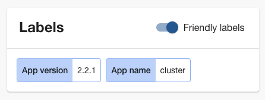
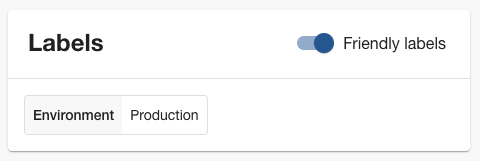

The use of labels and [annotations]() on Kubernetes resources like Cluster API clusters is highly individual. With the Giant Swarm developer portal, you can configure which labels get displayed by default as _friendly labels_, and how they get displayed. You can customize:

- Order of labels displayed
- Text displayed for the key and for values
- Color, either independent of the value, or depending on the value

Currently, we only display resource labels in the context of clusters. In the future, we will expand this to other resource types.

All customization applies as long as the user has the _friendly labels_ toggle set to active. Once you deactivate this switch, the UI displays all labels in their raw form.

You customize labels via the Backstage app configuration. Giant Swarm staff will assist you with the implementation.

## Example {#example1}

Let's start with an example. The following YAML snippet shows a valid configuration block a Giant Swarm customer may use.

```yaml
gs:
  friendlyLabels:
    - selector: app.kubernetes.io/version
      key: App version
      variant: blue
    - selector: app.kubernetes.io/name
      key: App name
      variant: blue
```

In the user interface, in the context of a cluster, the labels may appear like this:



## Order

The `gs.friendlyLabels` configuration item is an array. The order of labels displayed depends on the order of the according label's configuration. To have a certain label displayed first, bring its configuration to the top of the array.

In the [example](#example1), the order of the two configuration items reverses the order that would otherwise be alphabetical.

## Label key and value matching

The `selector` directive specifies the label to apply to. The [example](#example1) shows how the configuration matches an exact label key. You can make the matching more general by using wildcards or make it more specific by including certain label values.

### Wildcards

Using the asterisk `*` as a wildcard, the `selector` directive supports matching a group of labels. Here we provide an example that would result in coloring pink all labels that contain `kubernetes.io/` in the key:

```yaml
gs:
  friendlyLabels:
    - selector: '*kubernetes.io/*'
      variant: pink
```

You can use the wildcard several times within one `selector` directive. It matches any character, even an empty string. For example, the pattern `*kubernetes.io/*` would also match a label key `kubernetes.io/foo`.

### Value matching

To apply a display configuration to a label only in case it bears a certain value, use the `selector` directive with a combination of key and value. Use the colon `:` sign as a separator. Example:

```yaml
gs:
  friendlyLabels:
    - selector: 'giantswarm.io/service-priority:highest'
      variant: red
    - selector: 'giantswarm.io/service-priority:medium'
      variant: orange
```

This configuration will color the `giantswarm.io/service-priority` label red if the value is `highest` and orange if the value is `medium`.

**Note:** You cannot combine value matching with wildcard use.

## Text displayed

You can customize both the label's key and the value that appears in the user interface. In our [first example](#example1), we already show how to configure the label's display name using the `key` directive.

To specify the label name shown, use the `key` directive. For specifying the values to display, use the `valueMap` directive. You can use each independently. However, here is an example combining both:

```yaml
gs:
  friendlyLabels:
    - selector: 'foo.io/env'
      key: Environment
      valueMap:
        DEV: Development
        PROD: Production
        STG: Staging
```

For a label like `foo.io/env=PROD`, the user interface will display the following:



## Color

You can highlight labels in one of nine colors, to make it easier to spot them among others. The directive to use here is `variant`. The available color values are:

- `blue`
- `brown`
- `green`
- `orange`
- `pink`
- `purple`
- `red`
- `teal`
- `yellow`

The actual color value displayed depends on the theme (light or dark) selected, to guarantee good readability in both modes.

## Related

- [Friendly display of annotations]()
