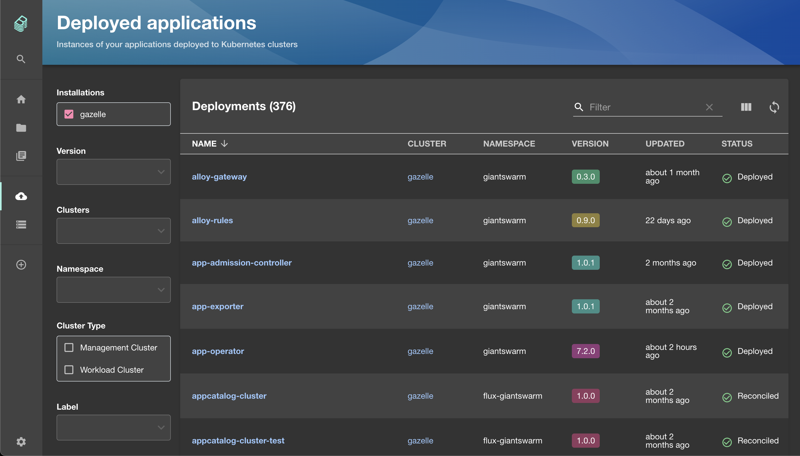

The Giant Swarm developer portal is connected with all your installations and the management clusters in them. Even if your workloads are distributed globally, in the portal you find information about apps deployed in all your clusters in one place.

Select the **Deployment** item in the left-hand navigation to access the app deployments overview.

## List view

The list shows key details about each app deployed to any of your clusters, either via an [App]() or a [HelmRelease](https://fluxcd.io/flux/components/helm/helmreleases/) in a management cluster.

Note that **some available columns are hidden by default.** The three rectangles icon in the top right corner of the list view allows to select and deselect columns to be displayed.

Available columns are:

- **Name**: name of the App or HelmRelease resource. Click the name to open the details panel.
- **Chart name**: name of the app/helm chart deployed.
- **Cluster type**: type of cluster the workload is deployed to, either `M` for management cluster or `W` for workload cluster.
- **Cluster**: name of the cluster deployed to.
- **Installation**: name of the installation the cluster belongs to. Note that the management cluster of an installation has the same name.
- **Namespace**: namespace the App or HelmRelease resource is in, within the management cluster.
- **Source**: either an app catalog name or a HelmRepository, depending on the type of deployment.
- **Status**: deployment condition. "Ready" (App) or "Reconciled" (HelmRelease) for a successfully deployed application. "Failed" or else for a failed deployment.
- **Type**: type of deployment resource, either App or HelmRelease.
- **Updated**: when this deployment was last updated. Place your pointer on the value to see an accurate date and time.
- **Version**: the version of the application deployed. Note that each version is displayed in a different color, to highlight version differences between deployments of the same app.

## Filters

You can filter the deployments list by a combination of these filters:

- **Installation**: Specify which installation/management cluster to query for resources. For fastest results, select only the installations you are interested in.
- **Version**: Specify the application versions to display.
- **Clusters**: Specify the cluster to display applications for. Note that in this context, this specifies the target cluster of the deployed workload, not the management cluster the deployment is defined in. For differentiation, the management cluster name is given as a prefix here.
- **Cluster type**: Allows to narrow down deployments only to management or only to workload clusters. Again, since all deployment resources are defined in management clusters, this filter applies to the target cluster of the deployed workload.
- **Label**: Here you can select any label and value combination found in the App or HelmRelease resources.
- **Status**: Filter by deployment status.
- **Deployment type**: Filter by deployment type, either Giant Swarm App or Flux HelmRelease.

## Details panel

The details panel shows all details that are also available in table columns of the list view, plus some additional information. Particularly important here:

- **Revision last applied** and **Revision last attempted**: for a healthy deployment, these two values should be the same. In a failed deployment, this can help you understand which version failed, and which one is still running instead.
- Deployment time: tells you when the current version has been deployed.
- Errors details in case of a failed deployment: help to save time when troubleshooting a failed deployment. Note that these panels can be expanded and may be collapsed by default.
