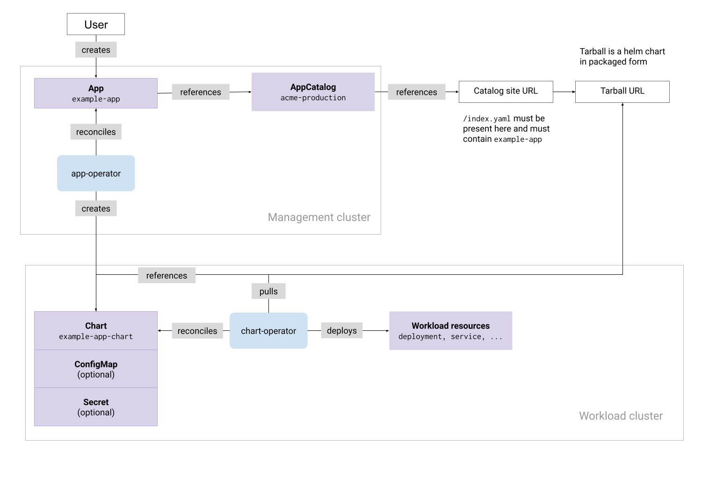

The _Giant Swarm App Platform_ is the set of features that help you browse, install, and manage applications across your clusters. It covers both curated Giant Swarm-managed apps (such as `prometheus`, `ingress-nginx`, or `cert-manager`) and your own internal services.

Applications are packaged as [Helm](https://helm.sh/) charts. You deploy them by creating Flux [HelmRelease](https://fluxcd.io/flux/components/helm/helmreleases/) resources on the management cluster, which Flux reconciles into the target workload cluster. Every Giant Swarm management cluster runs Flux out of the box, so there's nothing extra to install.

**Note**: The proprietary `App` custom resource (`application.giantswarm.io/v1alpha1`) is still fully supported, but is being phased out in favor of Flux HelmRelease. See [App CR deprecation]() for the timeline and migration path.

## How you deploy apps

A typical deployment uses two Flux resources:

- An **[OCIRepository](https://fluxcd.io/flux/components/source/ocirepositories/)** points Flux at a Helm chart in an OCI registry (for example, Giant Swarm's public registry at `gsoci.azurecr.io`). It pins a version or a SemVer range and controls how often Flux checks for updates.
- A **[HelmRelease](https://fluxcd.io/flux/components/helm/helmreleases/)** references the OCIRepository, declares the target namespace and configuration values, and points at the workload cluster's kubeconfig Secret so Flux can install the chart in the right place.

Here's what a minimal pair looks like for deploying `ingress-nginx` to a workload cluster called `dev01` from the `acmedev` organization:

```yaml
apiVersion: source.toolkit.fluxcd.io/v1
kind: OCIRepository
metadata:
  name: dev01-ingress-nginx
  namespace: org-acmedev
spec:
  url: oci://gsoci.azurecr.io/charts/giantswarm/ingress-nginx
  ref:
    tag: "3.9.2"
  interval: 60m
---
apiVersion: helm.toolkit.fluxcd.io/v2
kind: HelmRelease
metadata:
  name: dev01-ingress-nginx
  namespace: org-acmedev
  labels:
    giantswarm.io/cluster: dev01
spec:
  chartRef:
    kind: OCIRepository
    name: dev01-ingress-nginx
  kubeConfig:
    secretRef:
      name: dev01-kubeconfig
  targetNamespace: kube-system
  releaseName: dev01-ingress-nginx
  interval: 60m
```

For a step-by-step guide, see [Deploying an application via a Flux HelmRelease]().

### Key features

A few features customers tell us matter most:

- **Standard upstream API.** The same resources Giant Swarm uses internally and the same controllers thousands of teams already run elsewhere. No proprietary CRD to learn.
- **Automatic version updates.** Pin a SemVer range on the OCIRepository and Flux rolls out new patches or minors as they ship.
- **Layered configuration.** `valuesFrom` references ConfigMaps and Secrets with explicit merge order, so there's no surprise about which value wins.
- **Dependency ordering.** Use `dependsOn` to install resources in a specific sequence (for example, install `cert-manager` before anything that needs a certificate).
- **Drift detection.** If something or someone edits the deployed resources manually, Flux brings them back in line.
- **Post-renderers.** Apply a Kustomize patch over a chart's rendered output without forking the chart.
- **Operational controls.** Suspend a release for a maintenance window with `flux suspend`, then `flux resume` when you're ready. Force an immediate reconciliation with `flux reconcile`.

## The Giant Swarm app catalog

Giant Swarm publishes a catalog of cloud-native applications that we operate and pre-configure. The charts live in our public OCI registry at `gsoci.azurecr.io/charts/giantswarm/`. You can browse the catalog through the [developer portal]() or pull charts directly with any OCI-aware tool.

The maturity levels of apps in this catalog are expressed through semantic versioning:

- **`-alpha` or `-beta` suffix.** Basic maturity. No stable release. Best-effort support.
- **`-rc*` suffix.** Preview maturity. Lets you preview a new release and evaluate new features. Best-effort support.
- **Version `>= v1.0.0`, no suffix.** Stable maturity. Available as a managed offering with support and SLA.

### Managed app definition

A _managed app_ is an app in our Giant Swarm catalog that comes with:

- **Safe and tested deployment.** The Helm chart is ready to use and tested. We [build apps a common way](https://github.com/giantswarm/app-build-suite) and validate them through a [testing framework](https://github.com/giantswarm/app-test-suite) that checks deployability, basic functionality, security, and upgrade viability.
- **Monitoring.** Giant Swarm makes sure the main components of the app run and that the app behaves as expected. Our automation sets up monitoring and alerting on the metrics needed to honor our SLAs. When an alert fires, the operations team performs root cause analysis to determine whether the issue is on Giant Swarm's side or originates from customer configuration.
- **Configurations and plugins.** You can configure and extend the app freely. Configurations that deviate from the defaults are your responsibility to test and maintain. We're always happy to help validate them against best practices, but rolling them out is your call. Giant Swarm tests upgrades only against default values; if you've customized configuration, validate the upgrade in a lower environment first.
- **Upgrades.** We follow semantic versioning:

  1. Patch releases (for example, `2.1.1 → 2.1.2`) roll automatically; we log them and communicate the changes.
  2. Minor releases ship the same way, with changelogs and customer communication.
  3. Major releases are customer-triggered. As with our managed Kubernetes, we support one major version back.

  All changes land in the changelogs and we communicate them weekly. You decide when to upgrade, so changes happen inside your maintenance windows. If you'd like Flux to roll new versions on a schedule, see [automatic chart updates with Flux](https://fluxcd.io/flux/guides/image-update/).

- **Dependencies.** When a managed app needs secondary apps to function, we adapt the chart to run a standard deployment of the secondary app. Those secondary apps aren't managed under the same terms as primary apps.

## Hosting your own catalog

You don't need a Giant Swarm-specific catalog mechanism to host your own charts. Publish them to any OCI registry your management cluster and workload clusters can reach. Once they're there, point an OCIRepository at the registry and reference it from a HelmRelease. The same applies to HTTP-based Helm repositories: Flux supports those via the [HelmRepository](https://fluxcd.io/flux/components/source/helmrepositories/) source.

If you'd like Giant Swarm to host your charts alongside ours, ask your account engineer.

## How to interact with the app platform

Manage HelmRelease and OCIRepository resources with whatever tool fits your workflow:

- **`kubectl`**: apply manifests directly to the management cluster's [platform API]().
- **The [Flux CLI](https://fluxcd.io/flux/cmd/)**: `flux create source oci`, `flux create helmrelease`, `flux get helmreleases`, `flux suspend`, `flux reconcile`.
- **GitOps**: store your HelmRelease YAML in a Git repository and let Flux apply changes when you commit. See [FluxCD]() for an introduction and [continuous deployment tutorials]() for end-to-end workflows.
- **The [developer portal]()**: browse catalogs, inspect deployed releases, and view their status from a web UI.

## Legacy App custom resource

Deployments managed via the Giant Swarm `App` CR continue to work without changes. The conceptual model is similar to the Flux-based one (an App CR points at a chart in a `Catalog` and Helm installs it), but the underlying API is Giant Swarm-specific. For example:

```yaml
apiVersion: application.giantswarm.io/v1alpha1
kind: App
metadata:
  name: my-kong
  namespace: x7jwz
spec:
  catalog: giantswarm
  config:
    configMap:
      name: x7jwz-cluster-values
      namespace: x7jwz
  name: kong-app
  namespace: kong
  version: 0.7.2
  kubeConfig:
    inCluster: false
  userConfig:
    configMap:
      name: kong-user-values
      namespace: x7jwz
```

The diagram below shows the components and resources that make up the Giant Swarm app platform when using App CRs:


<!-- Original version: https://docs.google.com/drawings/d/1V3KcUImxRdrrb2v_nIQnkapHiRkRM6t8PoYGCqWebYY/edit -->

We're building a migration CLI that converts an App CR (together with its associated ConfigMaps and Secrets) into an equivalent HelmRelease and OCIRepository bundle. For the timeline and reasoning, see [App CR deprecation](). For the legacy guide, see [Getting started deploying an app with the App Platform]() and [the App CRD reference]().
