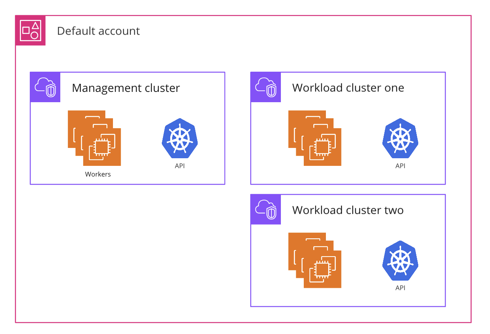
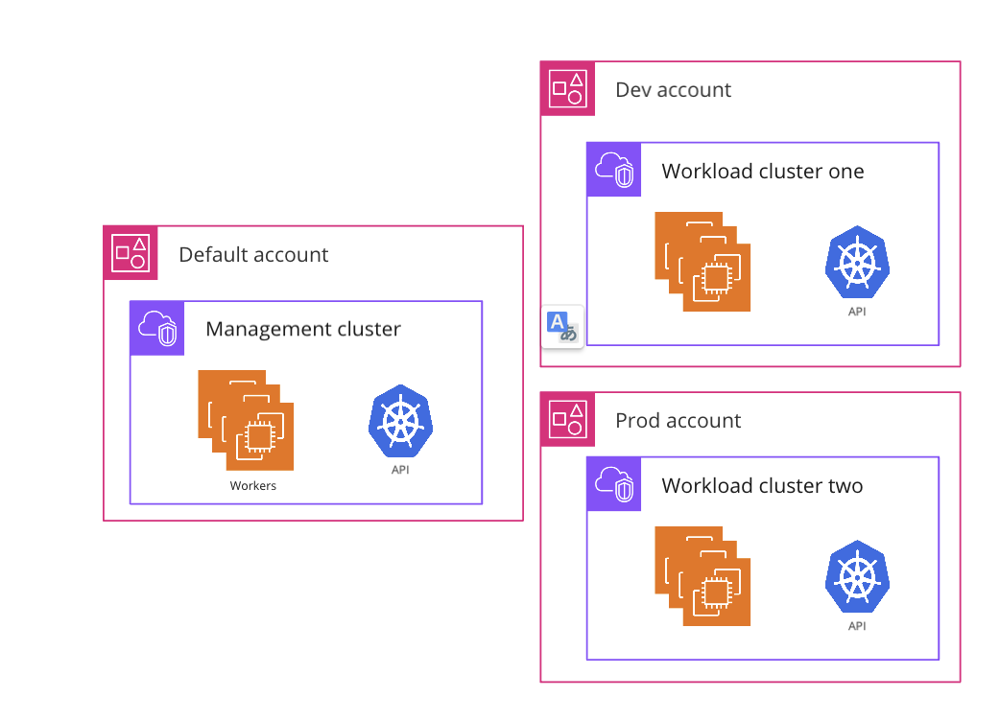

The Giant Swarm architecture distinguishes between the management cluster and workload clusters. The management cluster enables the creation and operation of workload clusters, and the workload clusters run your Kubernetes workloads.

## How does multi-account support help? {#benefits}

Both on Cluster API for AWS (CAPA) and Azure (CAPZ), workload cluster resources usually exist in an account (or in Azure terms: a subscription) separate from the one hosting the management cluster resources. The default configuration provisions all workload clusters in the same installation. Both accounts, the one for the management cluster and the default one for workload clusters, are under the customer's jurisdiction.

__Note__: Some customers use the same account/subscription for both management cluster and workload clusters. This choice doesn't affect the capabilities described below.

With multi-account support you can have more fine-grained control over the accounts used by workload clusters. Every Giant Swarm [organization]() in an installation may be mapped to an individual configuration for a single account.

The following two schemas illustrate the difference:

This enables use cases such as

- Several teams, business units, or profit centers sharing an installation, where many or all of them run workload clusters in their own cloud provider account, separate from each other.

- An ISV, being the Giant Swarm customer, creating and giving access to workload clusters in the name of a third party, in the third party's cloud provider account. The third party in this scenario has no relationship with Giant Swarm and needs no access to the Giant Swarm REST API or management cluster.

In both cases, customers benefit from simpler usage and cost allocation, plus a higher level of security through isolation. It can also help to make use of credits available in certain accounts.

## Provider-specific mechanisms {#provider-specific}

Details of the implementation differ between AWS and Azure.

- On CAPA, Giant Swarms needs some role configuration in order to act in the workload cluster account: one for use by automation, one for technical support staff. Details on the exact permissions required can be found in our guide on [preparing an AWS account to run Giant Swarm workload clusters]().

- On CAPZ, one service principal is configured for Giant Swarm, used by automation and technical support staff. Details can be found in our guide on [preparing an Azure subscription to run Giant Swarm workload clusters]().

## Additional information {#details}

- Cloud provider account/subscription credentials are recommended to be configured by Giant Swarm _organization level_. You can create clusters within the same organization in different cloud provider accounts but separating by organization will make it easier to manage.

- Cloud provider credentials are _immutable_. Once defined in a namespace and used by the controller, cloud provider credentials can't be modified or deleted. In order to switch to new cloud provider credentials, it is recommended to create a new organization and migrate to new clusters owned by that organization.

- If an organization doesn't yet have provider credentials configured but already has workload clusters, these clusters are run in the default account, which is the one the management cluster is running. Setting credentials for this organization doesn't affect the workload clusters created already.

## Get started

To create clusters in a new cloud provider account, you first need to provide the credentials to the organization you'd like to use for this purpose. You are free to create a new organization for this purpose if you like.

To prepare your credentials, either as AWS account roles or as an Azure service principle, please follow our specific guides:

- [Prepare an AWS account to run Giant Swarm workload clusters]()
- [Prepare an Azure subscription to run Giant Swarm workload clusters]()

Then when creating a cluster, you can specify the organization that should be used for the cluster. This can be done:

- In CAPA using the `AWSClusterRoleIdentity` like it is explained [here]().
- In CAPZ using the `AzureClusterIdentity` like it is explained [here]() command
