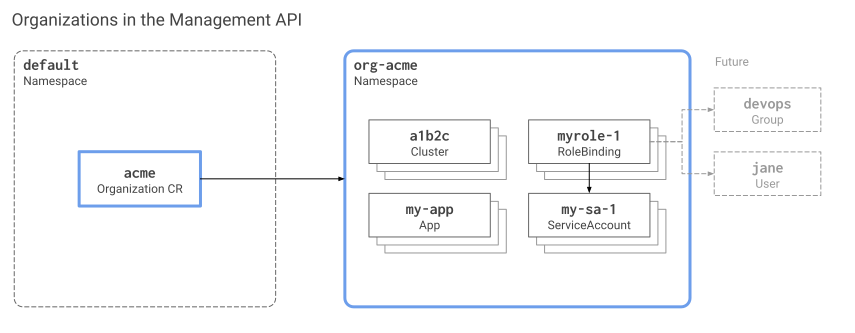

In Giant Swarm, the concept of organization empowers you to enable multi-tenancy. Organizations serve as a flexible means of organizing resources like clusters and apps, ensuring isolation between different entities. You have the freedom to use organizations to separate resources for various projects, business units, teams, etc., all within the same Giant Swarm management cluster.

The organization concept makes use of some well-known building blocks of Kubernetes in the [platform API](), such as:

- Namespaces
- Role-based access control (RBAC)
- Specific custom resources (CRs) that tie things together and make organizations easy to manage
- Operators which automate some management tasks

Typical use cases for organizations are:

- Separating clusters for development, experimentation, and testing from those used for staging and production purposes.

- Isolating teams, business units, or even legal entities.

At Giant Swarm, for example, we run several shared installations where we allow different customers access to only one organization, usually before they get their installation. This way, we can ensure that each customer, while using the same management cluster, can only access their workload clusters and resources.

## Visual overview {#intro-visual}

[](organizations-management-api.svg)

<!-- Source for above image: https://docs.google.com/drawings/d/1PDve3HoE7br_6npe0RSCw8ddt-H7pFztPlSDiQbNabs/edit -->

## Organization CRD and CRs {#organization-crd-cr}

If the concept of custom resources (CR) and custom resource definitions (CRD) is new to you, Kubernetes allows you to define [arbitrary objects](https://kubernetes.io/docs/concepts/extend-kubernetes/api-extension/custom-resources/) handled via the Kubernetes API. A custom resource definition specifies the schema of such an object. The actual objects are called the custom resources.

Giant Swarm management clusters provide a CRD named `Organization` (long form: `organizations.security.giantswarm.io`, [schema documentation]()). An organization is defined simply by a custom resource using that CRD, which we'll call an "organization CR" here for brevity.

The single most crucial aspect of an organization's CR is its name. Therefore, the CR looks as simple as this:

```text
$ kubectl gs template organization --name e-commerce
apiVersion: security.giantswarm.io/v1alpha1
kind: Organization
metadata:
 name: e-commerce
# [...]
```

Once an organization CR is created, our automation ([organization-operator](https://github.com/giantswarm/organization-operator), to be precise) ensures that a namespace `org-<name of organization>` exists for the organization.

## Naming conventions {#naming-conventions}

Organization names (technically, organization CR names) must follow these rules:

- Must be unique within the management cluster
- Must contain at most 59 characters.
- Has to conform to the same convention as Kubernetes namespaces additionally (i. e. the [DNS label names convention](https://kubernetes.io/docs/concepts/overview/working-with-objects/names/#dns-label-names)), which means:
    - contain only lowercase alphanumeric characters or '-'
    - start with an alphanumeric character
    - end with an alphanumeric character

Since each organization has a namespace created prefixed with `org-`, we recommend against using the same `org-` prefix in the organization name to avoid confusion.

## Organization namespace {#namespace}

The management cluster creates a namespace for each organization. The namespace is named after the organization CR name, prefixed with `org—'.

For example, for an organization `acme`, there is the defining organization CR named `acme`. In addition, the organization-operator ensures the existence of the namespace `org-acme` in the management cluster.

We recommend placing all resources belonging to an organization into the organization's namespace. Our user interfaces and admission controllers support this as a default.

Learn how to control organizations by taking a look at [platform API access page]().
