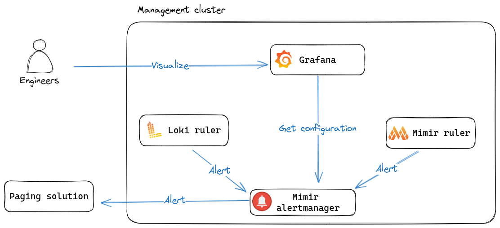
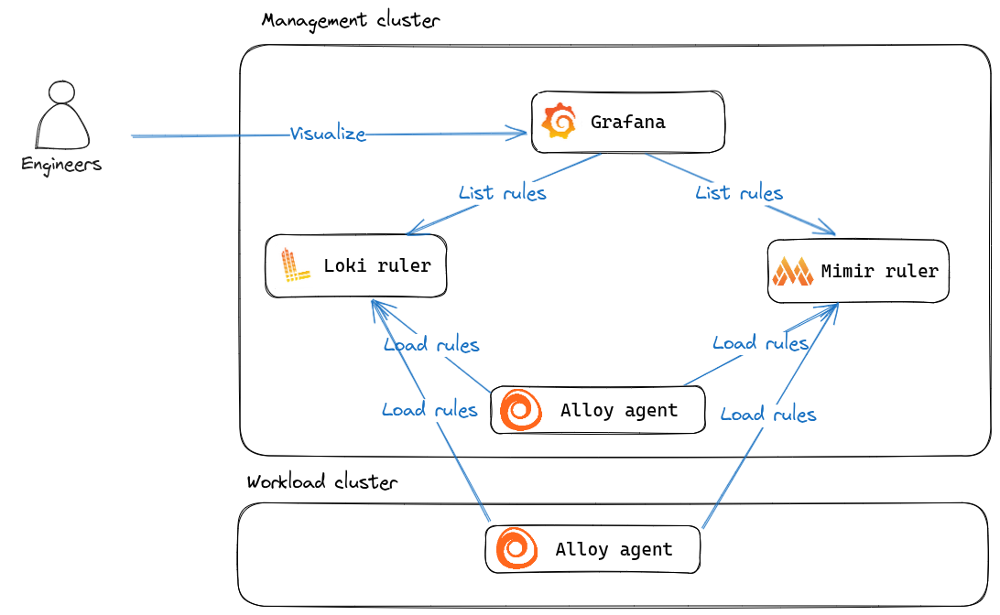
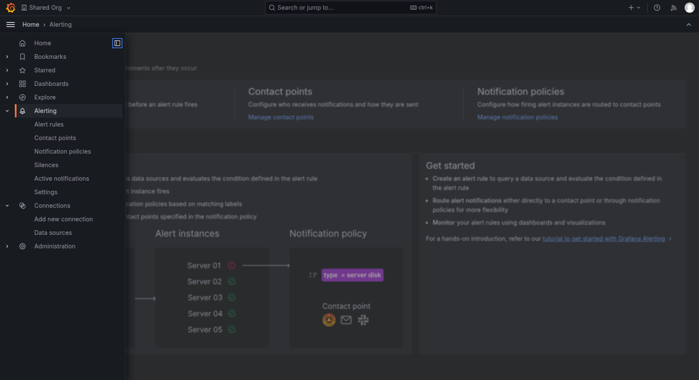

Alert management is crucial for any observability solution. The Giant Swarm Observability Platform provides comprehensive alerting capabilities that help you monitor your infrastructure and applications proactively.

Alerting consists of two main concepts: the **alerting pipeline** (how to send alerts, to whom, and what to send) and **[alert rules]()** (what to alert on).

For detailed information about alerting, visit the [official Grafana documentation](https://grafana.com/docs/grafana/latest/alerting/).

## How alerting works

The alerting pipeline supports multi-tenancy, so we recommend getting familiar with our [multi-tenancy]() concept first.

### The alerting pipeline

The alerting pipeline is straightforward. The Loki and Mimir rulers evaluate alerting rules and send alerts to the Mimir Alertmanager. The Mimir Alertmanager (a multi-tenant aware Alertmanager) routes those alerts to configured receivers.

Configure Alertmanager for your tenants using our [alert routing documentation]().

### Understanding alerting and recording rules

The platform supports two types of rules that power your monitoring strategy:

#### Alerting rules

**Alerting rules** define conditions that trigger notifications when specific issues occur in your infrastructure or applications. They use Prometheus (PromQL) or Loki (LogQL) expressions to evaluate your data and fire alerts when thresholds are met.

Key characteristics:

- **Metric-based alerts**: Monitor infrastructure metrics like CPU usage, memory consumption, or response times
- **Log-based alerts**: Watch for specific patterns, errors, or anomalies in application logs
- **Flexible conditions**: Set duration requirements before alerts fire to reduce noise
- **Rich context**: Include labels for routing and annotations for human-readable information

#### Recording rules

**Recording rules** pre-compute frequently needed or expensive expressions, saving the results as new time series. This improves query performance and enables you to create custom business metrics by combining multiple data sources.

Use recording rules to:

- Improve dashboard performance by pre-calculating complex aggregations
- Create custom metrics that combine multiple sources into business indicators
- Simplify complex queries by breaking them into manageable components

### Loading alerting and recording rules

The platform lets you create and load both types of rules into:

- **Mimir ruler**: For metric-based alerts and recording rules
- **Loki ruler**: For log-based alerts

You can deploy rules from both management clusters and workload clusters through our Grafana Alloy agents. The system automatically handles multi-tenant isolation and provides scoping mechanisms to prevent conflicts across clusters.

All rules must include the `observability.giantswarm.io/tenant` label to specify which [tenant]() they belong to.

Learn how to create and deploy your own rules using our [alert rules documentation]().

## Alerting features in Grafana

Access alerting configuration and monitoring in the **Alerting** section of your [installation's Grafana]().

The alerting section provides:

- **Alert rules**: All alerting and recording rules currently available, filterable by state (firing, pending). Use the "see graph" link to jump to an explore page with the alert's expression pre-filled
- **Contact points**: Configured integrations (like Opsgenie or Slack) for sending alerts, including notification templates for formatting
- **Notification policies**: Alert routing that defines how alerts reach contact points based on matching criteria
- **Silences**: Current silences and their states, along with affected alerts. Create immediate silences through the UI or manage them via CRDs for GitOps workflows
- **Active notifications**: Currently firing alerts with notification states
- **Settings**: General Alertmanager instance settings and current configuration

## Alert management components

The platform supports comprehensive alert management through:

- **[Alert rules]()**: Define conditions that trigger notifications when issues occur
- **[Alert routing]()**: Configure how alerts are delivered to different teams and channels through Alertmanager
- **[Silence management]()**: Temporarily suppress alerts during maintenance or known issues using both CRD-based and Grafana UI approaches

## Multi-tenant alerting

Each [tenant]() manages their own alerting configuration independently, ensuring:

- Isolated alert rules and routing per team
- Secure access to notification channels
- Independent alerting policies
- Customizable alert templates

## Best practices

- Use meaningful alert names and descriptions
- Set appropriate severity levels for proper routing
- Include runbook links in alert annotations
- Test alerts in non-production environments first
- Review and update alert rules regularly
- Configure silences for planned maintenance using CRDs for better auditability
- Use specific silence matchers to avoid over-silencing alerts
- Document silence reasons with meaningful comments

## Getting started

1. **Set up your tenant**: Ensure you have a [Grafana Organization]() configured
2. **Create alert rules**: Define [alert rules]() for your applications and infrastructure
3. **Configure routing**: Set up [alert routing]() to route alerts to your team
4. **Test and monitor**: Use Grafana's alerting interface to monitor rule performance and alert delivery

Next, explore the individual alert management components to build a comprehensive monitoring strategy.

## Related observability features

Alert management works best when integrated with other observability capabilities:

- **[Data management]()**: Explore and analyze the data that drives your alerts through advanced querying and visualization tools
- **[Logging]()**: Create log-based alerts using Loki's powerful LogQL query language to monitor application and system events
- **[Multi-tenancy configuration]()**: Understand how tenant isolation ensures your alerts and configurations remain secure and properly scoped
- **[Observability Platform API]()**: Integrate external systems with your alerting pipeline by ingesting logs and events from sources outside your clusters
