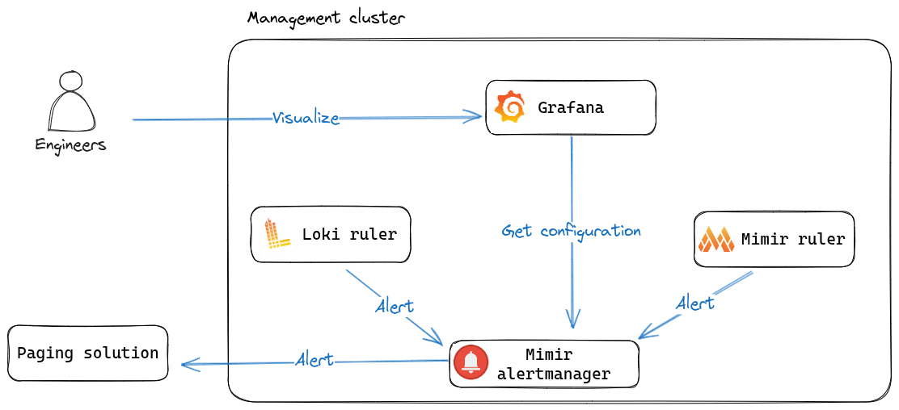
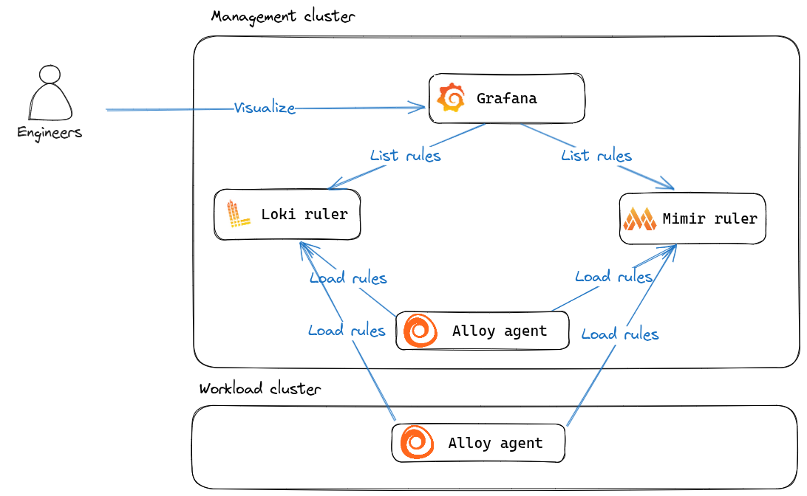
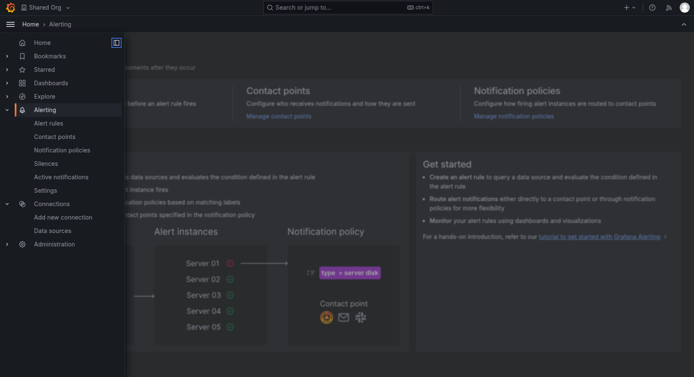

Alerting is an important concept of any observability solution and it's thus only natural that it is available as part of the Giant Swarm Observability Platform. For more details and information on alerting please visit the [official documentation page](https://grafana.com/docs/grafana/latest/alerting/).

Alerting is usually divided into two distinct concepts, the alerting pipeline (how to send alerts, to who and what to send) and alerting/recording rules (what to alert on). This documentation will cover how those two topics work in the Observability Platform.

## How alerting works

As our alerting pipeline supports multi-tenancy, we strongly advocate that you first familiarize yourself with our [multi-tenancy]() concept.

### The alerting pipeline

As you can see on the image above, the alerting pipeline is quite straightforward. The Loki and Mimir rulers evaluates alerting rules and send alerts to the Mimir Alertmanager. The Mimir Alertmanager (a multi-tenant aware Alertmanager) routes those alerts to configured receivers.

If you want to learn how to configure Alertmanager for your tenants, please, refer to our [dedicated documentation]().

### Loading alerting and recording rules

The Observability Platform allows you to create and load both alerting and recording rules into the rules. It support both *metric-based* alerts via the Mimir ruler and *log-based* alerts via the Loki ruler.
Alerting and recording rules can be loaded from both management cluster and workload clusters alike via our Grafana Alloy agents.

If you want to learn how to configure your own alerts, please, refer to our [dedicated documentation]().

## Access to the alerting pipeline

If you want to see how your alerting pipeline and your rules are configured for a tenant, you should access the *Alerting* section of your [installation's Grafana]()

In this section, you have access to various features such as:

- __Alerts rules__: all (alerts and recording) rules currently available, which can be filtered by state (e.g. firing, pending). When unfolding an alert rule you can use the *see graph* link to jump to an explore page with the alert’s expression pre-filled.
- __Contact points__: configured integrations (e.g. opsgenie, slack) to send alerts to, along with notification templates used to format alerts when sent out.
- __Notification policies__: alerts routing which defines how alerts are sent to contact points based on matching criteria (e.g. severity=page).
- __Silences__: silences currently loaded and their state along with the affected alerts.
- __Active notifications__: currently firing alerts. It might be confusing with the *Alerts rules* page at first, but this page differs in the fact that it only shows alert currently firing, along with this it shows the notification state (e.g. unprocessed, suppressed, active).
- __Settings__: general settings for the Alertmanager instance, also show the currently loaded configuration
