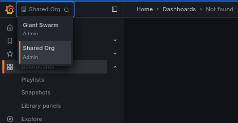

This guide walks you through creating and configuring Grafana organizations to implement [multi-tenancy]() in your observability platform.

## Prerequisites

Before creating your organization, make sure you have:

- [Access to the management cluster](), where you can create custom resources
- Identified the [tenant names]() you want to use
- Configured groups for RBAC in your identity provider

## Understanding default organizations

Before creating your own organizations, it's helpful to know about the two that already exist:

- **Shared Org**: Your starting point with system dashboards and platform metrics (uses `giantswarm` tenant)
- **Giant Swarm**: Internal organization for platform operations (Giant Swarm staff only)

Your organizations will appear alongside the `Shared Org` in the organization dropdown. Learn more about these in our [multi-tenancy overview]().

## Creating a Grafana organization

Create a [`GrafanaOrganization`]() custom resource in the management cluster:

### Basic example

This example shows a simple organization for a single application with role-based access for different teams:




```yaml
apiVersion: observability.giantswarm.io/v1alpha2
kind: GrafanaOrganization
metadata:
  name: myonlineshop
spec:
  displayName: MyOnlineShop
  rbac:
    admins:
    - customer:platform-admin
    - customer:ops-team
    editors:
    - customer:development-team
    - customer:devops-team
    viewers:
    - customer:marketing-team
    - customer:business-analysts
  tenants:
  - name: myonlineshop
    types:
    - data
    - alerting
```




> **Deprecated**: v1alpha1 is deprecated. Please use v1alpha2 for new resources.

```yaml
apiVersion: observability.giantswarm.io/v1alpha1
kind: GrafanaOrganization
metadata:
  name: myonlineshop
spec:
  displayName: MyOnlineShop
  rbac:
    admins:
    - customer:platform-admin
    - customer:ops-team
    editors:
    - customer:development-team
    - customer:devops-team
    viewers:
    - customer:marketing-team
    - customer:business-analysts
  tenants:
  - myonlineshop
```




### Configuration options

| Field | Description | Required |
|-------|-------------|----------|
| `metadata.name` | Kubernetes resource name (follows DNS naming rules) | Yes |
| `spec.displayName` | Human-readable name shown in Grafana UI | Yes |
| `spec.rbac.admins` | Groups with full organization access | Yes |
| `spec.rbac.editors` | Groups that can create/edit dashboards and alerts | No |
| `spec.rbac.viewers` | Groups with read-only access | No |
| `spec.tenants` | List of tenant configurations this organization can access | Yes |

### Advanced examples

**Multi-environment organization:**

This example demonstrates an organization that manages multiple environments with hierarchical access control:




```yaml
apiVersion: observability.giantswarm.io/v1alpha2
kind: GrafanaOrganization
metadata:
  name: engineering-team
spec:
  displayName: Engineering Team
  rbac:
    admins:
    - customer:engineering-leads
    editors:
    - customer:senior-engineers
    - customer:devops-team
    viewers:
    - customer:junior-engineers
    - customer:qa-team
  tenants:
  - name: prod-frontend
    types:
    - data
    - alerting
  - name: prod-backend
    types:
    - data
    - alerting
  - name: staging-frontend
    types:
    - data
  - name: staging-backend
    types:
    - data
```




> **Deprecated**: v1alpha1 is deprecated. Please use v1alpha2 for new resources.

```yaml
apiVersion: observability.giantswarm.io/v1alpha1
kind: GrafanaOrganization
metadata:
  name: engineering-team
spec:
  displayName: Engineering Team
  rbac:
    admins:
    - customer:engineering-leads
    editors:
    - customer:senior-engineers
    - customer:devops-team
    viewers:
    - customer:junior-engineers
    - customer:qa-team
  tenants:
  - prod-frontend
  - prod-backend
  - staging-frontend
  - staging-backend
```




**Production-only organization:**

This example shows a restricted organization with access only to production data:




```yaml
apiVersion: observability.giantswarm.io/v1alpha2
kind: GrafanaOrganization
metadata:
  name: production-monitoring
spec:
  displayName: Production Monitoring
  rbac:
    admins:
    - customer:sre-team
    - customer:platform-admin
    viewers:
    - customer:engineering-team
    - customer:support-team
  tenants:
  - name: production
    types:
    - data
    - alerting
```




> **Deprecated**: v1alpha1 is deprecated. Please use v1alpha2 for new resources.

```yaml
apiVersion: observability.giantswarm.io/v1alpha1
kind: GrafanaOrganization
metadata:
  name: production-monitoring
spec:
  displayName: Production Monitoring
  rbac:
    admins:
    - customer:sre-team
    - customer:platform-admin
    viewers:
    - customer:engineering-team
    - customer:support-team
  tenants:
  - production
```




**Granular access control (v1alpha2 only):**

With `v1alpha2`, you can specify different access types for fine-grained control:

```yaml
apiVersion: observability.giantswarm.io/v1alpha2
kind: GrafanaOrganization
metadata:
  name: mixed-access-org
spec:
  displayName: Mixed Access Organization
  rbac:
    admins:
    - customer:platform-admin
    editors:
    - customer:ops-team
    viewers:
    - customer:read-only-team
  tenants:
  # Full access (data and alerting)
  - name: critical-services
    types:
    - data
    - alerting
  # Data access only (no alerting)
  - name: development-metrics
    types:
    - data
  # Alerting access only
  - name: alerting-management
    types:
    - alerting
```

## RBAC configuration

The RBAC section maps identity provider groups to [Grafana organization roles](https://grafana.com/docs/grafana/latest/administration/roles-and-permissions/#organization-roles):

| Role | Permissions |
|------|-------------|
| **Admin** | Full organization access: manage users, datasources, dashboards, and settings |
| **Editor** | Create and edit dashboards, alerts, and folders (cannot manage users) |
| **Viewer** | Read-only access to dashboards and data |

### Group format

Most Giant Swarm installations use Dex as the identity provider. Specify groups using the format `{dex-connector-id}:{group-name}`:

```yaml
rbac:
  admins:
  - customer:platform-admin        # Maps 'platform-admin' group from 'customer' connector
  - customer:ops-team
  editors:
  - customer:development-team
  viewers:
  - customer:support-team
```

**Finding your connector ID:** Check your cluster's Dex configuration for the connector ID (usually `customer`).

**Required fields:** `admins` is mandatory; `editors` and `viewers` are optional.

## Migrating from v1alpha1 to v1alpha2

The `v1alpha2` API version introduces enhanced tenant configuration with granular access control. While `v1alpha1` resources continue to work through automatic conversion, we recommend migrating to `v1alpha2` to take advantage of the new features.

### Key differences

| Aspect | v1alpha1 | v1alpha2 |
|--------|----------|----------|
| **Tenant format** | Simple strings | Structured objects with name and types |
| **Access control** | All-or-nothing | Granular (data vs alerting) |
| **Migration** | Manual updates needed | Automatic conversion available |

### Migration examples

**Basic tenant migration:**

```yaml
# v1alpha1 format
spec:
  tenants:
  - "my-app"
  - "production"
  - "staging"

# v1alpha2 equivalent (full access)
spec:
  tenants:
  - name: "my-app"
    types:
    - data
    - alerting
  - name: "production"
    types:
    - data
    - alerting
  - name: "staging"
    types:
    - data
    - alerting
```

**Taking advantage of granular access control:**

```yaml
# v1alpha2 with different access levels
spec:
  tenants:
  # Production: full access (data and alerting)
  - name: "production"
    types:
    - data
    - alerting
  # Development: metrics and logs only (no alerting)
  - name: "dev-metrics"
    types:
    - data
  # Staging: metrics and logs only
  - name: "staging"
    types:
    - data
  # Alert management: alerting functionality only
  - name: "alert-config"
    types:
    - alerting
```

### Access types explained

- **`data`**: Provides access to metrics and logs data sources (Mimir and Loki) in Grafana
- **`alerting`**: Provides access to alerting functionality and alert management (Alertmanager) in Grafana

You can specify both types for full access, or use them separately for restricted access based on your security requirements.

### Automatic migration behavior

When you update existing `v1alpha1` resources, they are automatically converted to `v1alpha2`:

- Each tenant string is converted to a `TenantConfig` object
- The `name` field is set to the original tenant string  
- The `types` field defaults to `["data", "alerting"]` (full access)

### Migration best practices

1. **Test first**: Validate your v1alpha2 configuration in a non-production environment
2. **Review access**: Use the migration as an opportunity to review and refine tenant access permissions
3. **Gradual rollout**: Migrate one organization at a time to ensure smooth transitions
4. **Monitor impact**: Verify that users retain appropriate access after migration
5. **Use granular access**: Take advantage of the new access types to implement the principle of least privilege

## What happens when you create an organization

Creating a `GrafanaOrganization` resource automatically provisions:

1. **New Grafana organization** with your specified display name
2. **Tenant-scoped datasources** for Loki, Mimir, and Alertmanager
3. **User role assignments** based on your RBAC configuration
4. **Data collection** of alerts, logs, metrics, and traces

## Verification steps

After creating your organization:

1. **Check organization status:**

```bash
kubectl get grafanaorganization myonlineshop -o yaml
2. [**Log in to Grafana**]() and verify:


- The organization dropdown menu on the top-left corner shows all expected organizations



- You can [explore and query data]() for each of your tenants
- Logged-in users have appropriate role assignments under the `Administration / Users and access / Users` section
