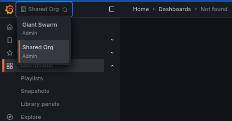

This tutorial walks you through creating and configuring Grafana organizations to implement your [multi-tenancy strategy]() in the observability platform.

## Prerequisites

Before creating Grafana organizations, ensure you have:

- [Access to the management cluster]() where you can create custom resources
- Identified your [tenant names]() based on your organizational strategy
- Your RBAC groups defined in your identity provider
- Reviewed [multi-tenancy concepts]() to understand how organizations and tenants work together

## Creating a Grafana organization

Create a [`GrafanaOrganization`]() custom resource in your management cluster:

### Basic organization

This example creates a simple organization for a single team with role-based access:

```yaml
apiVersion: observability.giantswarm.io/v1alpha1
kind: GrafanaOrganization
metadata:
  name: frontend-team
spec:
  displayName: Frontend Team
  rbac:
    admins:
    - customer:platform-admin
    - customer:frontend-leads
    editors:
    - customer:frontend-developers
    - customer:devops-team
    viewers:
    - customer:qa-team
  tenants:
  - frontend-prod
  - frontend-staging
```

### Multi-environment organization

This example demonstrates an organization managing multiple environments:

```yaml
apiVersion: observability.giantswarm.io/v1alpha1
kind: GrafanaOrganization
metadata:
  name: platform-engineering
spec:
  displayName: Platform Engineering
  rbac:
    admins:
    - customer:platform-admin
    - customer:sre-team
    editors:
    - customer:platform-engineers
    - customer:devops-team
    viewers:
    - customer:engineering-team
    - customer:support-team
  tenants:
  - production
  - staging
  - development
  - platform-services
```

### Service-focused organization

This example shows an organization organized around specific services:

```yaml
apiVersion: observability.giantswarm.io/v1alpha1
kind: GrafanaOrganization
metadata:
  name: payment-services
spec:
  displayName: Payment Services
  rbac:
    admins:
    - customer:payment-team-leads
    editors:
    - customer:payment-developers
    - customer:security-team
    viewers:
    - customer:finance-team
    - customer:compliance-team
  tenants:
  - payment-service
  - billing-service
  - fraud-detection
```

## Configuration reference

### Required fields

| Field | Description | Example |
|-------|-------------|---------|
| `metadata.name` | Kubernetes resource name (DNS-1123 compliant) | `frontend-team` |
| `spec.displayName` | Human-readable name shown in Grafana UI | `Frontend Team` |
| `spec.rbac.admins` | Groups with full organization access | `["customer:platform-admin"]` |
| `spec.tenants` | List of tenant names this organization can access | `["frontend-prod", "frontend-staging"]` |

### Optional fields

| Field | Description | Default |
|-------|-------------|---------|
| `spec.rbac.editors` | Groups that can create/edit dashboards and alerts | None |
| `spec.rbac.viewers` | Groups with read-only access | None |

### RBAC roles and permissions

The RBAC configuration maps your identity provider groups to [Grafana organization roles](https://grafana.com/docs/grafana/latest/administration/roles-and-permissions/#organization-roles):

| Role | Capabilities |
|------|-------------|
| **Admin** | • Manage organization users and settings<br>• Create, edit, and delete dashboards<br>• Configure datasources and alerts<br>• Full access to all organization features |
| **Editor** | • Create, edit, and delete dashboards<br>• Create and manage alerts<br>• Cannot manage users or organization settings |
| **Viewer** | • View dashboards and explore data<br>• Read-only access to all content<br>• Cannot create or edit any resources |

### Group naming format

For most Giant Swarm installations using Dex as the identity provider, specify groups using the format `{connector-id}:{group-name}`:

```yaml
rbac:
  admins:
  - customer:platform-admin        # 'platform-admin' group from 'customer' connector
  editors:
  - customer:development-team      # 'development-team' group from 'customer' connector
  viewers:
  - customer:support-team          # 'support-team' group from 'customer' connector
```

**Note**: The connector ID is usually `customer`, but check your cluster's Dex configuration to confirm.

## What happens during creation

When you create a `GrafanaOrganization` resource, the platform automatically:

1. **Creates a new Grafana organization** with your specified display name
2. **Provisions tenant-scoped datasources** for Loki (logs), Mimir (metrics), and Alertmanager
3. **Configures user access** based on your RBAC groups and roles
4. **Enables data collection** for the specified tenants

The organization becomes immediately available in Grafana with proper access controls and datasource configuration.

## Verification and testing

After creating your organization, verify the setup:

### 1. Check resource status

```bash
kubectl get grafanaorganization frontend-team -o yaml
```

Look for successful status conditions in the output.

### 2. Test Grafana access

1. **[Log in to Grafana]()**
2. **Switch organizations** using the dropdown in the top-left corner
3. **Verify your new organization** appears in the list



### 3. Verify permissions

1. **Check user roles** in `Administration > Users and access > Users`
2. **Test datasource access** by exploring data for your tenants
3. **Verify create/edit permissions** based on assigned roles

### 4. Test data access

1. **Use the Explore tab** to query data from your tenants
2. **Verify tenant isolation** - you should only see data from assigned tenants
3. **Test dashboard creation** if you have editor or admin permissions

## Managing organizations

### Updating organizations

Modify the `GrafanaOrganization` resource to:

- Add or remove tenants
- Update RBAC group assignments
- Change role permissions

Example of adding a new tenant:

```yaml
apiVersion: observability.giantswarm.io/v1alpha1
kind: GrafanaOrganization
metadata:
  name: frontend-team
spec:
  displayName: Frontend Team
  rbac:
    admins:
    - customer:platform-admin
    - customer:frontend-leads
    editors:
    - customer:frontend-developers
    viewers:
    - customer:qa-team
  tenants:
  - frontend-prod
  - frontend-staging
  - frontend-dev        # New tenant added
```

### Removing organizations

Delete the `GrafanaOrganization` resource:

```bash
kubectl delete grafanaorganization frontend-team
```

**Important**: This removes the organization from Grafana but doesn't delete the underlying tenant data.

## Best practices

### Organization design

- **Align with team structure**: Create organizations that match your team boundaries
- **Consider data access patterns**: Group tenants that teams need to access together
- **Plan for growth**: Design organization structure that scales with team expansion

### Security considerations

- **Principle of least privilege**: Assign minimum necessary permissions
- **Regular access review**: Periodically review and update RBAC assignments
- **Clear role separation**: Use distinct groups for different permission levels

### Operational efficiency

- **Consistent naming**: Use clear, descriptive names for organizations and tenants
- **Documentation**: Document organization purpose and access patterns
- **Monitoring**: Track organization usage and access patterns

## Next steps

After creating your organizations:

1. **Configure data ingestion**: Set up [metrics]() and [log collection]() for your tenants
2. **Create custom dashboards**: Build [dashboards]() tailored to your team's needs
3. **Set up alerting**: Configure [alerting rules]() and [notification routing]()
4. **Explore your data**: Use [Grafana's exploration tools]() to analyze your observability data

For additional help with identity provider configuration or complex RBAC setups, contact your Giant Swarm account engineer.
