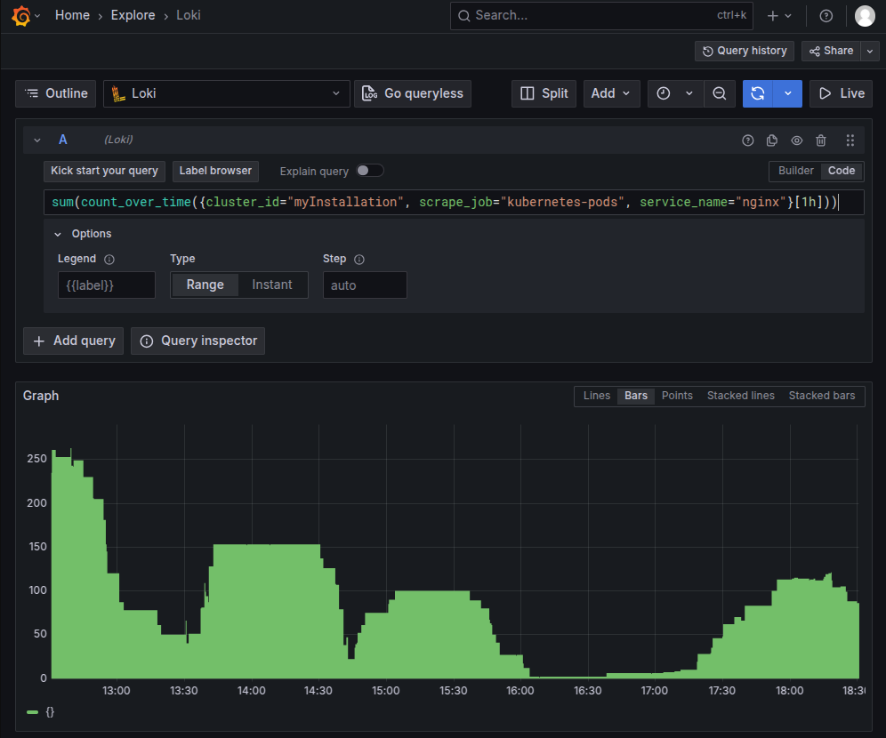

This tutorial covers advanced LogQL techniques for analyzing logs in the Giant Swarm Observability Platform. Building on basic log exploration, you'll learn to craft sophisticated queries for complex troubleshooting scenarios and log analysis.

## Prerequisites

Before proceeding, ensure you have:

- Basic understanding of LogQL syntax (refer to the [Grafana - Log queries](https://grafana.com/docs/loki/next/query/log_queries))
- Familiarity with Kubernetes concepts and Giant Swarm cluster architecture

## Access to logs

Once you have [access to your management cluster's Grafana](), you should:

1. Go to `Explore` item in the `Home` menu
2. Select `Loki` as data source on the top left corner
3. Choose how you prefer to build your queries:
   - `builder` and use the dropdown-menus to build your query
   - `code` to write your query using [LogQL](https://grafana.com/docs/loki/latest/logql/)

## Query examples with results

Here are real LogQL queries executed against a Giant Swarm cluster with their actual results:

### Multi-label filtering

Query logs from a specific cluster and service:

**Query:**

```promql
{cluster_id="myCluster", scrape_job="kubernetes-pods", service_name="nginx"}
```

**Sample Result:**

```text
100.64.193.223 - - [01/Jul/2025:15:30:06 +0000]  400 "POST /loki/api/v1/push HTTP/1.1" 2459 "-" "Alloy/v1.9.0 (linux; helm)" "3.9.58.214"
100.64.193.223 - - [01/Jul/2025:15:30:05 +0000]  400 "POST /loki/api/v1/push HTTP/1.1" 2458 "-" "Alloy/v1.9.0 (linux; helm)" "3.9.58.214"
100.64.192.119 - - [01/Jul/2025:15:30:05 +0000]  400 "POST /loki/api/v1/push HTTP/1.1" 2458 "-" "Alloy/v1.9.0 (linux; helm)" "3.9.58.214"
```

This is also called a **log stream selector**, regex can also be used to match labels, see the [Grafana - Log stream selector](https://grafana.com/docs/loki/next/query/log_queries/#log-stream-selector) for more details.

### Error and warning detection

Filter logs for specific error patterns across a cluster:

**Query:**

```promql
{cluster_id="myCluster", scrape_job="kubernetes-pods", service_name="nginx"} |~ `(?i)error|failed|warning`
```

**Sample Results:**

```text
100.64.106.205 - - [01/Jul/2025:14:38:17 +0000]  499 "GET /loki/api/v1/query_range?direction=backward&end=1751380695823000000&query=xxxxxxxxxx&start=1751380395000000000&step=1000ms HTTP/1.1" 0 "-" "Grafana/12.0.0+security-01" "-"
100.64.106.205 - - [01/Jul/2025:14:38:15 +0000]  499 "GET /loki/api/v1/query_range?direction=backward&end=1751380692390000000&query=xxxxxxxxxx&start=1751359080000000000&step=60000ms HTTP/1.1" 0 "-" "Grafana/12.0.0+security-01" "-"
```

This query uses a **regex** to match log lines containing `error`, `failed`, or `warning`. The `(?i)` makes the regex case-insensitive. See the [Grafana - Line filter expression](https://grafana.com/docs/loki/next/query/log_queries/#line-filter-expression) for more details.

### Log volume metrics

**Query:**

```promql
sum(count_over_time({cluster_id="myCluster", scrape_job="kubernetes-pods", service_name="nginx"}[1h]))
```

**Sample Results:**



This shows the volume of logs per hour helping identify spikes or drops in log activity. More details can be found in the [Grafana - LogQL](https://grafana.com/docs/loki/latest/query/).

## Advanced filtering techniques

### Extracting patterns from application logs

Parse and filter on any pattern structures found in application logs, here Nginx access logs:

**Query:**

```promql
{cluster_id="myInstallation", scrape_job="kubernetes-pods", container="nginx"}
| pattern `<ip> - - [<_>]  <status> "<method> <uri> <_>" <size> <_> "<agent>" <_>`
| status < 200 or status > 299
```

**Sample Results:**

```text
100.12.345.67 - - [01/Jul/2025:15:11:16 +0000]  400 "GET /nonexistent HTTP/1.1" 58 "-" "curl/8.14.1" "-"
100.12.345.67 - - [01/Jul/2025:15:11:14 +0000]  400 "GET /dummy HTTP/1.1" 58 "-" "curl/8.14.1" "-"
100.12.345.67 - - [01/Jul/2025:15:08:35 +0000]  101 "GET /loki/api/v1/tail?query=%7Bstream%3D%22stdout%22%2Cpod%3D%22loki-canary-86b869b45c-2t68n%22%7D+ HTTP/1.1" 959409 "-" "Go-http-client/1.1" "-"
100.12.345.67 - - [01/Jul/2025:14:58:20 +0000]  101 "GET /loki/api/v1/tail?query=%7Bstream%3D%22stdout%22%2Cpod%3D%22loki-canary-86b869b45c-92bxq%22%7D+ HTTP/1.1" 960163 "-" "Go-http-client/1.1" "-"
```

Different **parsers** can be used to extract structured data from logs, such as `json`, `logfmt`, `regex`, or `unpack`. The choice depends on the log format and your specific needs. See the [Grafana Loki LogQL documentation](https://grafana.com/docs/loki/next/query/log_queries/#parser-expression) for more details.

### Dynamic field extraction with line formatting

Extract specific fields and create custom log output formats:

**Query:**

```promql
{cluster_id="myCluster", pod=~"observability-operator-.*"}
| json
| controller="cluster"
| line_format "{{.ts}} [{{.level}}] {{.namespace}}/{{.name}}: {{.msg}}"
```

**Sample Results:**

```text
2025-07-01T14:02:29Z [info] monitoring/myInstallation: alloy-service - ensured alloy is configured
2025-07-01T14:02:29Z [info] monitoring/myInstallation: alloy-service - current number of shards
2025-07-01T14:02:29Z [info] monitoring/myInstallation: alloy-service - ensuring alloy is configured
2025-07-01T14:02:29Z [info] monitoring/myInstallation: application is configured successfully
2025-07-01T14:02:29Z [info] monitoring/myInstallation: configure application
```

This allows you to **format log lines** for better readability and focus on relevant information. The `line_format` function is powerful for customizing log output. See the [Grafana - Line format expression](https://grafana.com/docs/loki/next/query/log_queries/#line-format-expression) for more details.

## Performance monitoring with log metrics

### Error rate calculation

Generate metrics to track error rates across services:

**Query:**

```promql
sum(rate({cluster_id="myInstallation", service_name="kube-apiserver"}[5m] |~ `(?i)error|exception|failed`)) by (service, namespace)
/
sum(rate({cluster_id="myInstallation", service_name="kube-apiserver"}[5m])) by (service, namespace)
```

**Sample Results:**


### Request latency analysis from access logs

Extract latency metrics from application access logs:

**Query:**

```promql
quantile_over_time(0.95,
  {cluster_id="myInstallation", pod=~"kube-apiserver-.+"}
  |= `Request completed`
  | pattern `Trace[<trace_id>]:  ---"Request completed" <duration>ms (<_>)`
  | unwrap duration [10s]
)
```

**Sample Results:**


## System-level troubleshooting

### Node resource monitoring

Analyze system logs for resource pressure indicators:

**Query:**

```promql
{cluster_id="myCluster", scrape_job="system-logs"}
| json
| SYSLOG_IDENTIFIER="kernel"
|~ `Out of memory|oom-kill|Memory cgroup out of memory`
| line_format `{{.node}} - {{.MESSAGE}}`
```

**Sample Results:**

```text
ip-10-0-204-71 - kube-state-metr invoked oom-killer: gfp_mask=0xcc0(GFP_KERNEL), order=0, oom_score_adj=994
ip-10-0-204-71 - Memory cgroup out of memory: Killed process 105294 (kube-state-metr) total-vm:1159412kB, anon-rss:429324kB, file-rss:27104kB, shmem-rss:0kB, UID:65534 pgtables:996kB oom_score_adj:994
```

## Best practices for advanced LogQL

- **Use specific label selectors** to reduce query scope and improve performance
- **Leverage regex filtering** with `|~` before applying expensive operations like `json`
- **Combine log stream selectors** strategically to balance specificity and coverage
- **Apply time ranges** appropriate to your use case to optimize query performance
- **Use line formatting** to create readable output for complex queries

## Next steps

For comprehensive LogQL syntax and additional functions, refer to:

- [Log queries](https://grafana.com/docs/loki/next/query/log_queries/)
- [LogQL: Log query language](https://grafana.com/docs/loki/latest/query/)

Enhance your observability skills further:

- [Dashboard creation guide]() for visualizing your log queries
